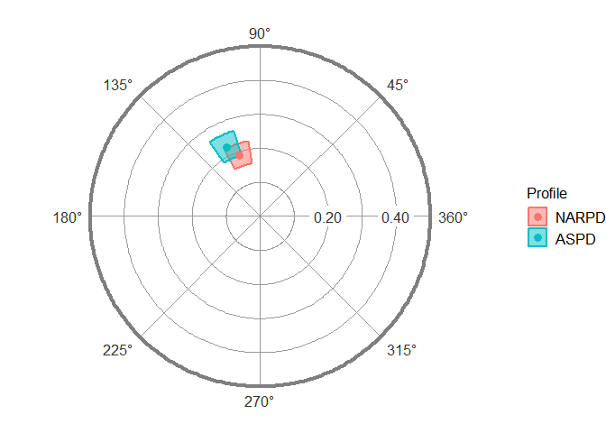
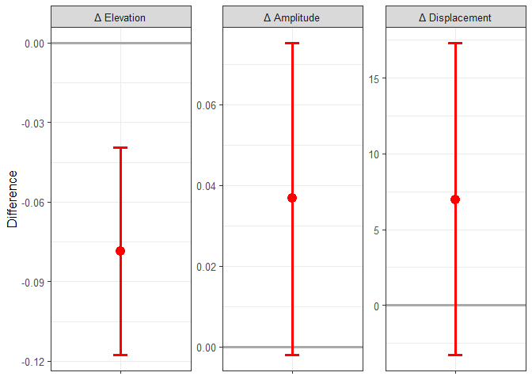

<!-- README.md is generated from README.Rmd. Please edit that file -->
circumplex
==========

[](https://travis-ci.org/jmgirard/circumplex) [](https://codecov.io/github/jmgirard/circumplex?branch=master) [](http://www.repostatus.org/#active)

Overview
--------

The goal of *circumplex* is to provide a powerful, flexible, and user-friendly way to analyze and visualize circumplex data. It was created and is maintained by [Jeffrey Girard](https://jmgirard.com/), and was inspired by work from and was developed in conjunction with [Johannes Zimmermann](https://psychologische-hochschule.de/prof-dr-johannes-zimmermann/) and [Aidan Wright](https://personalityprocesses.com/).

References
----------

Girard, J. M., Zimmermann, J., & Wright, A. G. C. (2018). New tools for circumplex data analysis and visualization in R. *Meeting of the Society for Interpersonal Theory and Research.* Montreal, Canada.

Zimmermann, J., & Wright, A. G. C. (2017). Beyond description in interpersonal construct validation: Methodological advances in the circumplex Structural Summary Approach. *Assessment, 24*(1), 3–23.

Wright, A. G. C., Pincus, A. L., Conroy, D. E., & Hilsenroth, M. J. (2009). Integrating methods to optimize circumplex description and comparison of groups. *Journal of Personality Assessment, 91*(4), 311–322.

Installation
------------

You can install the development version from [GitHub](https://github.com/) with:

``` r
# install.packages("devtools")
devtools::install_github("jmgirard/circumplex")
```

Examples of the Structural Summary Method (SSM)
-----------------------------------------------

### Calculate correlation-based SSM parameters for multiple measures

``` r
data("jz2017")
results <- ssm_analyze(jz2017, PA:NO, octants(), measures = c(NARPD, ASPD))
```

``` r
ssm_table(results, xy = FALSE)
```

<table class="gmisc_table" style="border-collapse: collapse; margin-top: 1em; margin-bottom: 1em;">
<thead>
<tr>
<td colspan="5" style="text-align: left;">
Correlation-based Structural Summary Statistics with 95% CIs
</td>
</tr>
<tr>
<th style="border-bottom: 1px solid grey; border-top: 2px solid grey; text-align: left;">
Profile
</th>
<th style="border-bottom: 1px solid grey; border-top: 2px solid grey; text-align: left;">
Elevation
</th>
<th style="border-bottom: 1px solid grey; border-top: 2px solid grey; text-align: left;">
Amplitude
</th>
<th style="border-bottom: 1px solid grey; border-top: 2px solid grey; text-align: left;">
Displacement
</th>
<th style="border-bottom: 1px solid grey; border-top: 2px solid grey; text-align: left;">
Fit
</th>
</tr>
</thead>
<tbody>
<tr>
<td style="padding-right: 1em; min-width: 3em; white-space: nowrap; text-align: left;">
NARPD
</td>
<td style="padding-right: 1em; min-width: 3em; white-space: nowrap; text-align: left;">
0.20 [0.17, 0.24]
</td>
<td style="padding-right: 1em; min-width: 3em; white-space: nowrap; text-align: left;">
0.19 [0.16, 0.22]
</td>
<td style="padding-right: 1em; min-width: 3em; white-space: nowrap; text-align: left;">
109.0 [99.5, 118.2]
</td>
<td style="padding-right: 1em; min-width: 3em; white-space: nowrap; text-align: left;">
0.957
</td>
</tr>
<tr>
<td style="padding-right: 1em; min-width: 3em; white-space: nowrap; border-bottom: 2px solid grey; text-align: left;">
ASPD
</td>
<td style="padding-right: 1em; min-width: 3em; white-space: nowrap; border-bottom: 2px solid grey; text-align: left;">
0.12 [0.09, 0.16]
</td>
<td style="padding-right: 1em; min-width: 3em; white-space: nowrap; border-bottom: 2px solid grey; text-align: left;">
0.23 [0.19, 0.26]
</td>
<td style="padding-right: 1em; min-width: 3em; white-space: nowrap; border-bottom: 2px solid grey; text-align: left;">
115.9 [107.1, 124.4]
</td>
<td style="padding-right: 1em; min-width: 3em; white-space: nowrap; border-bottom: 2px solid grey; text-align: left;">
0.964
</td>
</tr>
</tbody>
</table>
``` r
ssm_plot(results)
```



### Calculate correlation-based SSM parameter contrast for two measures

``` r
data("jz2017")
results <- ssm_analyze(jz2017, PA:NO, octants(), measures = c(NARPD, ASPD),
  contrast = "test")
```

``` r
ssm_table(results, xy = FALSE)
```

<table class="gmisc_table" style="border-collapse: collapse; margin-top: 1em; margin-bottom: 1em;">
<thead>
<tr>
<td colspan="5" style="text-align: left;">
Correlation-based Structural Summary Statistic Contrasts with 95% CIs
</td>
</tr>
<tr>
<th style="border-bottom: 1px solid grey; border-top: 2px solid grey; text-align: left;">
Contrast
</th>
<th style="border-bottom: 1px solid grey; border-top: 2px solid grey; text-align: left;">
Δ Elevation
</th>
<th style="border-bottom: 1px solid grey; border-top: 2px solid grey; text-align: left;">
Δ Amplitude
</th>
<th style="border-bottom: 1px solid grey; border-top: 2px solid grey; text-align: left;">
Δ Displacement
</th>
<th style="border-bottom: 1px solid grey; border-top: 2px solid grey; text-align: left;">
Δ Fit
</th>
</tr>
</thead>
<tbody>
<tr>
<td style="padding-right: 1em; min-width: 3em; white-space: nowrap; border-bottom: 2px solid grey; text-align: left;">
ASPD - NARPD
</td>
<td style="padding-right: 1em; min-width: 3em; white-space: nowrap; border-bottom: 2px solid grey; text-align: left;">
-0.08 [-0.12, -0.04]
</td>
<td style="padding-right: 1em; min-width: 3em; white-space: nowrap; border-bottom: 2px solid grey; text-align: left;">
0.04 [-0.00, 0.08]
</td>
<td style="padding-right: 1em; min-width: 3em; white-space: nowrap; border-bottom: 2px solid grey; text-align: left;">
7.0 [-3.7, 17.5]
</td>
<td style="padding-right: 1em; min-width: 3em; white-space: nowrap; border-bottom: 2px solid grey; text-align: left;">
0.007
</td>
</tr>
</tbody>
</table>
``` r
ssm_plot(results, xy = FALSE)
```


