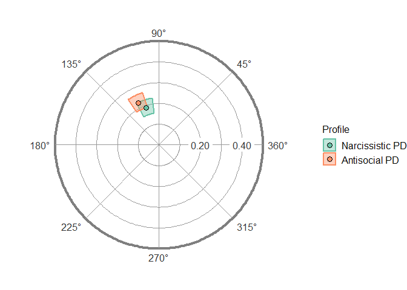

<!-- README.md is generated from README.Rmd. Please edit that file -->

# circumplex 

[](https://cran.r-project.org/package=circumplex)
[](https://travis-ci.org/jmgirard/circumplex)
[](https://codecov.io/github/jmgirard/circumplex?branch=master)
[](http://www.repostatus.org/#active)
[](https://www.tidyverse.org/lifecycle/#maturing)

The goal of *circumplex* is to provide a powerful, flexible, and
user-friendly way to analyze and visualize circumplex data. It was
created and is maintained by [Jeffrey Girard](https://jmgirard.com/),
and was inspired by work from and was developed in conjunction with
[Johannes
Zimmermann](https://psychologische-hochschule.de/prof-dr-johannes-zimmermann/)
and [Aidan Wright](https://personalityprocesses.com/). You can learn
more about using this package through the vignette articles available on
the [package website](https://circumplex.jmgirard.com/) or through
`?circumplex`.

## Installation

``` r
# Install release version from CRAN
install.packages("circumplex")

# Install development version from GitHub
devtools::install_github("jmgirard/circumplex")
```

## Usage

``` r
data("jz2017")
results <- ssm_analyze(
  .data = jz2017, 
  scales = c(PA, BC, DE, FG, HI, JK, LM, NO), 
  angles = c(90, 135, 180, 225, 270, 315, 360, 45), 
  measures = c(NARPD, ASPD)
)
```

``` r
ssm_table(results)
```

<table class="table" style="font-size: 12px; margin-left: auto; margin-right: auto;">

<caption style="font-size: initial !important;">

Correlation-based Structural Summary Statistics with 95% CIs

</caption>

<thead>

<tr>

<th style="text-align:left;">

Profile

</th>

<th style="text-align:left;">

Elevation

</th>

<th style="text-align:left;">

X-Value

</th>

<th style="text-align:left;">

Y-Value

</th>

<th style="text-align:left;">

Amplitude

</th>

<th style="text-align:left;">

Displacement

</th>

<th style="text-align:left;">

Fit

</th>

</tr>

</thead>

<tbody>

<tr>

<td style="text-align:left;">

NARPD

</td>

<td style="text-align:left;">

0.20 \[0.17, 0.24\]

</td>

<td style="text-align:left;">

\-0.06 \[-0.09, -0.03\]

</td>

<td style="text-align:left;">

0.18 \[0.15, 0.21\]

</td>

<td style="text-align:left;">

0.19 \[0.16, 0.22\]

</td>

<td style="text-align:left;">

109.0 \[99.2, 118.9\]

</td>

<td style="text-align:left;">

0.957

</td>

</tr>

<tr>

<td style="text-align:left;">

ASPD

</td>

<td style="text-align:left;">

0.12 \[0.09, 0.16\]

</td>

<td style="text-align:left;">

\-0.10 \[-0.13, -0.06\]

</td>

<td style="text-align:left;">

0.20 \[0.17, 0.24\]

</td>

<td style="text-align:left;">

0.23 \[0.19, 0.26\]

</td>

<td style="text-align:left;">

115.9 \[107.4, 124.4\]

</td>

<td style="text-align:left;">

0.964

</td>

</tr>

</tbody>

</table>

``` r
ssm_plot(results)
```

<!-- -->

## Code of Conduct

Please note that this project is released with a [Contributor Code of
Conduct](.github/CODE_OF_CONDUCT.md).

By contributing to this project, you agree to abide by its terms.

## References

Girard, J. M., Zimmermann, J., & Wright, A. G. C. (2018). New tools for
circumplex data analysis and visualization in R. *Meeting of the Society
for Interpersonal Theory and Research.* Montreal, Canada.

Zimmermann, J., & Wright, A. G. C. (2017). Beyond description in
interpersonal construct validation: Methodological advances in the
circumplex Structural Summary Approach. *Assessment, 24*(1), 3–23.

Wright, A. G. C., Pincus, A. L., Conroy, D. E., & Hilsenroth, M. J.
(2009). Integrating methods to optimize circumplex description and
comparison of groups. *Journal of Personality Assessment, 91*(4),
311–322.
