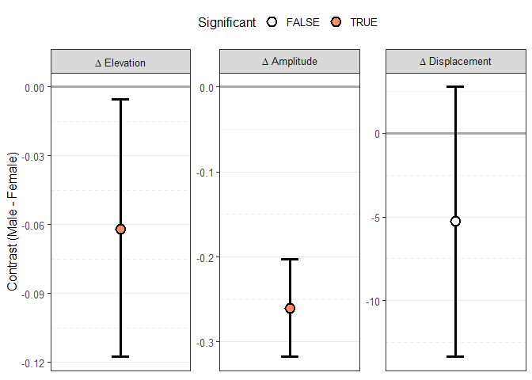

<!-- README.md is generated from README.Rmd. Please edit that file -->

# circumplex 

<!-- badges: start -->

[](https://CRAN.R-project.org/package=circumplex)
[](https://github.com/jmgirard/circumplex/actions/workflows/R-CMD-check.yaml)
[](https://app.codecov.io/gh/jmgirard/circumplex)
[](https://github.com/jmgirard/circumplex/actions/workflows/test-coverage.yaml)
[](https://github.com/jmgirard/circumplex/actions/workflows/pkgdown.yaml)

<!-- badges: end -->

The goal of *circumplex* is to provide a powerful, flexible, and
user-friendly way to analyze and visualize circumplex data. It was
created and is maintained by [Jeffrey
Girard](https://affcom.ku.edu/girard/); it was inspired by work from and
was developed under advisement from [Johannes
Zimmermann](https://www.uni-kassel.de/fb01/institute/institut-fuer-psychologie/fachgebiete/differentielle-psychologie/prof-dr-johannes-zimmermann)
and [Aidan Wright](https://sites.lsa.umich.edu/aidangcw-lab/). You can
learn more about using this package through the vignette articles
available on the [package website](https://circumplex.jmgirard.com/) or
through `?circumplex`.

## Installation

``` r
# Install release version from CRAN
install.packages("circumplex")

# Install development version from GitHub
devtools::install_github("jmgirard/circumplex")
```

## Usage

### Example 1

``` r
data("jz2017")
results <- ssm_analyze(
  data = jz2017, 
  scales = c("PA", "BC", "DE", "FG", "HI", "JK", "LM", "NO"), 
  angles = c(90, 135, 180, 225, 270, 315, 360, 45), 
  measures = c("NARPD", "ASPD"),
  measures_labels = c("Narcissistic PD", "Antisocial PD")
)
summary(results)
#> 
#> Statistical Basis:    Correlation Scores 
#> Bootstrap Resamples:  2000 
#> Confidence Level:     0.95 
#> Listwise Deletion:    TRUE 
#> Scale Displacements:  90 135 180 225 270 315 360 45 
#> 
#> 
#> # Profile [Narcissistic PD]:
#> 
#>                Estimate   Lower CI   Upper CI
#> Elevation         0.202      0.169      0.238
#> X-Value          -0.062     -0.094     -0.029
#> Y-Value           0.179      0.145      0.213
#> Amplitude         0.189      0.154      0.227
#> Displacement    108.967     98.633    118.537
#> Model Fit         0.957                      
#> 
#> 
#> # Profile [Antisocial PD]:
#> 
#>                Estimate   Lower CI   Upper CI
#> Elevation         0.124      0.087      0.158
#> X-Value          -0.099     -0.133     -0.064
#> Y-Value           0.203      0.170      0.239
#> Amplitude         0.226      0.191      0.264
#> Displacement    115.927    107.327    124.188
#> Model Fit         0.964
```

``` r
ssm_table(results, drop_xy = TRUE)
```

<table class="table" style="font-size: 12px; margin-left: auto; margin-right: auto;">

<caption style="font-size: initial !important;">

Correlation-based Structural Summary Statistics with 95% CIs
</caption>

<thead>

<tr>

<th style="text-align:left;">

Profile
</th>

<th style="text-align:left;">

Elevation
</th>

<th style="text-align:left;">

Amplitude
</th>

<th style="text-align:left;">

Displacement
</th>

<th style="text-align:left;">

Fit
</th>

</tr>

</thead>

<tbody>

<tr>

<td style="text-align:left;">

Narcissistic PD
</td>

<td style="text-align:left;">

0.20 (0.17, 0.24)
</td>

<td style="text-align:left;">

0.19 (0.15, 0.23)
</td>

<td style="text-align:left;">

109.0 (98.6, 118.5)
</td>

<td style="text-align:left;">

0.957
</td>

</tr>

<tr>

<td style="text-align:left;">

Antisocial PD
</td>

<td style="text-align:left;">

0.12 (0.09, 0.16)
</td>

<td style="text-align:left;">

0.23 (0.19, 0.26)
</td>

<td style="text-align:left;">

115.9 (107.3, 124.2)
</td>

<td style="text-align:left;">

0.964
</td>

</tr>

</tbody>

</table>

``` r
ssm_plot_circle(results)
```

<!-- -->

``` r
ssm_plot_curve(results)
```

<!-- -->

### Example 2

``` r
results2 <- ssm_analyze(
  data = jz2017, 
  scales = PANO(), 
  angles = octants(), 
  grouping = "Gender",
  contrast = TRUE
)
summary(results2)
#> 
#> Statistical Basis:    Mean Scores 
#> Bootstrap Resamples:  2000 
#> Confidence Level:     0.95 
#> Listwise Deletion:    TRUE 
#> Scale Displacements:  90 135 180 225 270 315 360 45 
#> 
#> 
#> # Profile [Female]:
#> 
#>                Estimate   Lower CI   Upper CI
#> Elevation         0.946      0.909      0.984
#> X-Value           0.459      0.421      0.498
#> Y-Value          -0.310     -0.355     -0.267
#> Amplitude         0.554      0.511      0.598
#> Displacement    325.963    322.182    330.063
#> Model Fit         0.889                      
#> 
#> 
#> # Profile [Male]:
#> 
#>                Estimate   Lower CI   Upper CI
#> Elevation         0.884      0.843      0.923
#> X-Value           0.227      0.192      0.262
#> Y-Value          -0.186     -0.225     -0.148
#> Amplitude         0.294      0.257      0.329
#> Displacement    320.685    313.462    327.843
#> Model Fit         0.824                      
#> 
#> 
#> # Contrast [Male - Female]:
#> 
#>                  Estimate   Lower CI   Upper CI
#> Δ Elevation        -0.062     -0.118     -0.005
#> Δ X-Value          -0.232     -0.283     -0.181
#> Δ Y-Value           0.124      0.067      0.183
#> Δ Amplitude        -0.261     -0.318     -0.202
#> Δ Displacement     -5.278    -13.353      2.755
#> Δ Model Fit        -0.066
```

``` r
ssm_table(results2, drop_xy = TRUE)
```

<table class="table" style="font-size: 12px; margin-left: auto; margin-right: auto;">

<caption style="font-size: initial !important;">

Correlation-based Structural Summary Statistics with 95% CIs
</caption>

<thead>

<tr>

<th style="text-align:left;">

Contrast
</th>

<th style="text-align:left;">

Elevation
</th>

<th style="text-align:left;">

Amplitude
</th>

<th style="text-align:left;">

Displacement
</th>

<th style="text-align:left;">

Fit
</th>

</tr>

</thead>

<tbody>

<tr>

<td style="text-align:left;">

Female
</td>

<td style="text-align:left;">

0.95 (0.91, 0.98)
</td>

<td style="text-align:left;">

0.55 (0.51, 0.60)
</td>

<td style="text-align:left;">

326.0 (322.2, 330.1)
</td>

<td style="text-align:left;">

0.889
</td>

</tr>

<tr>

<td style="text-align:left;">

Male
</td>

<td style="text-align:left;">

0.88 (0.84, 0.92)
</td>

<td style="text-align:left;">

0.29 (0.26, 0.33)
</td>

<td style="text-align:left;">

320.7 (313.5, 327.8)
</td>

<td style="text-align:left;">

0.824
</td>

</tr>

<tr>

<td style="text-align:left;">

Male - Female
</td>

<td style="text-align:left;">

-0.06 (-0.12, -0.01)
</td>

<td style="text-align:left;">

-0.26 (-0.32, -0.20)
</td>

<td style="text-align:left;">

-5.3 (-13.4, 2.8)
</td>

<td style="text-align:left;">

-0.066
</td>

</tr>

</tbody>

</table>

``` r
ssm_plot_contrast(results2, drop_xy = TRUE)
```

<!-- -->

## Code of Conduct

Please note that the ‘circumplex’ project is released with a
[Contributor Code of
Conduct](https://circumplex.jmgirard.com/CODE_OF_CONDUCT.html). By
contributing to this project, you agree to abide by its terms.

## References

Girard, J. M., Zimmermann, J., & Wright, A. G. C. (2018). New tools for
circumplex data analysis and visualization in R. *Meeting of the Society
for Interpersonal Theory and Research.* Montreal, Canada.

Zimmermann, J., & Wright, A. G. C. (2017). Beyond description in
interpersonal construct validation: Methodological advances in the
circumplex Structural Summary Approach. *Assessment, 24*(1), 3–23.

Wright, A. G. C., Pincus, A. L., Conroy, D. E., & Hilsenroth, M. J.
(2009). Integrating methods to optimize circumplex description and
comparison of groups. *Journal of Personality Assessment, 91*(4),
311–322.
