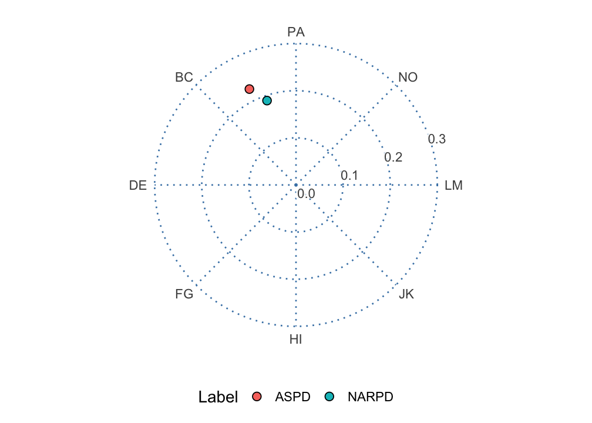

# Advanced Circumplex Visualization

``` r

library(circumplex)
library(ggplot2)
```

**Level:** Advanced. Read “Structure Tests and Ipsatization” first.

## 1. Overview

The
[`ssm_plot_circle()`](http://circumplex.jmgirard.com/reference/ssm_plot_circle.md),
[`ssm_plot_curve()`](http://circumplex.jmgirard.com/reference/ssm_plot_curve.md),
[`ssm_plot_contrast()`](http://circumplex.jmgirard.com/reference/ssm_plot_contrast.md),
and
[`ssm_plot_trajectory()`](http://circumplex.jmgirard.com/reference/ssm_plot_trajectory.md)
functions cover the most common circumplex figures. But they each
produce a finished plot with a fixed set of layers. Sometimes you want
more control. You may want to overlay individual respondents on a group
profile, or to zoom in on a band of amplitudes. Or you may want to
restyle the points, or to place several circumplex panels side by side.
[`vignette("introduction-to-ssm-analysis")`](http://circumplex.jmgirard.com/articles/introduction-to-ssm-analysis.md)
defines the SSM terms used here, such as amplitude and displacement.

To make that possible, `circumplex` exposes the building blocks that the
built-in plots are themselves made of. These are ordinary
[`ggplot2`](https://ggplot2.tidyverse.org/) components, so you compose
them with `+` and combine them freely with any other `ggplot2` layers,
scales, and themes:

- [`coord_circumplex()`](http://circumplex.jmgirard.com/reference/coord_circumplex.md)
  is the **coordinate system**. It maps the `displacement` aesthetic
  (degrees) onto the angle and the `amplitude` aesthetic onto the
  radius. It also owns the amplitude-to-radius scaling for the whole
  plot.
- [`ggcircumplex()`](http://circumplex.jmgirard.com/reference/ggcircumplex.md)
  assembles the empty circular **canvas**: the coordinate system plus
  the amplitude rings, displacement spokes, and scale labels.
- [`geom_ssm_point()`](http://circumplex.jmgirard.com/reference/geom_ssm_point.md)
  and
  [`geom_ssm_arc()`](http://circumplex.jmgirard.com/reference/geom_ssm_arc.md)
  are the **layers** that place profile points and their confidence
  regions in the circle, taking amplitude and displacement directly as
  aesthetics.
- [`theme_circumplex()`](http://circumplex.jmgirard.com/reference/theme_circumplex.md)
  is the **theme** the canvas is drawn with. The rings and spokes are
  ordinary panel gridlines, so further theming restyles them.
- [`scale_x_circumplex()`](http://circumplex.jmgirard.com/reference/scale_x_circumplex.md)
  is a **scale** for the angle axis of linear circumplex plots. An
  example is the score-by-angle curve, with scale angle on a straight
  x-axis and score on the y-axis.

This vignette works through each of these and then combines them.
Section 2, “The circular canvas”, draws the empty canvas with
[`ggcircumplex()`](http://circumplex.jmgirard.com/reference/ggcircumplex.md).
Section 3, “The coordinate system”, builds a figure from scratch with
[`coord_circumplex()`](http://circumplex.jmgirard.com/reference/coord_circumplex.md).
Section 4, “Placing SSM results in the circle”, adds profiles with
[`geom_ssm_point()`](http://circumplex.jmgirard.com/reference/geom_ssm_point.md)
and
[`geom_ssm_arc()`](http://circumplex.jmgirard.com/reference/geom_ssm_arc.md).
Section 5, “Restyling the canvas”, themes it. Section 6, “Composing
custom layers”, adds respondents behind a group profile with
[`ssm_score()`](http://circumplex.jmgirard.com/reference/ssm_score.md).
Section 7, “Trajectories across occasions”, draws profiles estimated at
several occasions. Section 8, “The angle axis for linear plots”, labels
a linear axis with
[`scale_x_circumplex()`](http://circumplex.jmgirard.com/reference/scale_x_circumplex.md).
Section 9, “Relationship to the built-in plots”, says how the built-in
plots use these parts. The Wrap-up lists what the page covered and names
the next page, and the References list the sources cited.

## 2. The circular canvas

[`ggcircumplex()`](http://circumplex.jmgirard.com/reference/ggcircumplex.md)
returns a `ggplot2` object containing just the circular backdrop, with
no data drawn on it yet. By default it uses octant scales (eight scales
placed 45° apart), labeled by their angular position in degrees:

``` r

ggcircumplex()
```


You can label the scales however you like. Passing a character vector
labels the spokes in the order of the angles:

``` r

ggcircumplex(octants(), labels = PANO())
```


The labels need not be abbreviations. The octant scales also have full
interpersonal names, which you can put on the spokes instead:

``` r

ggcircumplex(octants(), labels = csip$Scales$Label)
```


You may be working with one of the instruments bundled with the package.
If so, you can pass it directly with `ggcircumplex(instrument = csip)`.
Its scale angles and abbreviations are then taken from the instrument
rather than typed by hand.

Throughout, displacement runs counterclockwise from the right, and the
0/360 degree position is labeled 360.

## 3. The coordinate system

[`ggcircumplex()`](http://circumplex.jmgirard.com/reference/ggcircumplex.md)
is a convenience wrapper. Underneath it, the piece that makes a
circumplex plot circular is
[`coord_circumplex()`](http://circumplex.jmgirard.com/reference/coord_circumplex.md).
You can add that to a bare
[`ggplot()`](https://ggplot2.tidyverse.org/reference/ggplot.html)
yourself when you want to build a figure from scratch. On top of the
coordinate system you supply three things: an x-scale carrying the spoke
breaks and labels, a data layer, and the theme.

``` r

results <- ssm_analyze(
  jz2017,
  scales = PANO(),
  measures = c("NARPD", "ASPD")
)
```

The table below shows five columns of `results$results`: the profile
label, the amplitude and displacement estimates, and the amplitude
interval. (The code that selects these columns is omitted.)

    #>   Label    a_est    d_est     a_lci     a_uci
    #> 1 NARPD 0.189244 108.9667 0.1537900 0.2271848
    #> 2  ASPD 0.226159 115.9267 0.1905403 0.2640428

``` r

ggplot(results$results) +
  coord_circumplex(amax = 0.3) +
  scale_x_continuous(breaks = octants(), labels = PANO()) +
  geom_ssm_point(aes(amplitude = a_est, displacement = d_est, fill = Label)) +
  theme_circumplex()
```


The
[`scale_x_continuous()`](https://ggplot2.tidyverse.org/reference/scale_continuous.html)
line is the one that tells the coordinate system where the scale angles
are. Without it, the spokes would fall on `ggplot2`’s default breaks
rather than on the octants. Supplying those breaks and labels, along
with the theme, is what
[`ggcircumplex()`](http://circumplex.jmgirard.com/reference/ggcircumplex.md)
does on top of the coordinate system. Build from the parts when you want
to vary one of those pieces. Reach for
[`ggcircumplex()`](http://circumplex.jmgirard.com/reference/ggcircumplex.md)
when you do not.

The coordinate system owns the amplitude-to-radius mapping. So `amax` is
set exactly once per plot, and the canvas and the data layers cannot
disagree about what a given radius means. (Earlier versions of the
package took an `amax` argument on each layer. Those arguments are now
deprecated and ignored, with a one-time note.) Leaving `amax = NULL`
trains it from the data, as
[`ssm_plot_circle()`](http://circumplex.jmgirard.com/reference/ssm_plot_circle.md)
does.

### Moving the center

By default, the center of the circle is amplitude 0. So radial distance
is proportional to amplitude, and the origin means “no differentiation
among the scales.” The `center` argument moves that inner limit. This is
useful when every profile sits in a narrow band of amplitudes and the
interesting variation is squeezed against the rim:

``` r

ggplot(results$results) +
  coord_circumplex(amax = 0.28, center = 0.15) +
  scale_x_continuous(breaks = octants(), labels = PANO()) +
  geom_ssm_point(aes(amplitude = a_est, displacement = d_est, fill = Label)) +
  theme_circumplex()
```


This is a zoom, and it changes how the figure should be read. With a
nonzero center, radial distance is no longer proportional to amplitude.
The origin no longer represents zero amplitude. So differences in radius
are exaggerated relative to the default view. The amplitude ring labels
still report the true amplitudes, and they are what the reader should be
directed to. Use a nonzero center to resolve closely spaced profiles,
and say so in the caption.

### Moving the amplitude axis

The amplitude (radial) axis and its tick labels are placed automatically
in the widest gap between the displacement spokes. So they never collide
with a spoke label.
[`ssm_plot_circle()`](http://circumplex.jmgirard.com/reference/ssm_plot_circle.md)
and [`plot()`](https://rdrr.io/r/graphics/plot.default.html) for a CPM
fit go one step further and use the widest gap that holds no plotted
point. You can override the placement with `r_axis_angle`, given as a
displacement in degrees:

``` r

ggplot(results$results) +
  coord_circumplex(amax = 0.3, r_axis_angle = 67.5) +
  scale_x_continuous(breaks = octants(), labels = PANO()) +
  geom_ssm_point(aes(amplitude = a_est, displacement = d_est, fill = Label)) +
  theme_circumplex()
```


Note that these examples build the canvas from its parts: the coordinate
system, an x-scale carrying the spoke breaks and labels, and the theme.
They do not add a second coordinate system on top of
[`ggcircumplex()`](http://circumplex.jmgirard.com/reference/ggcircumplex.md).
If they did, `ggplot2` would replace the existing coordinate system and
print a message.

## 4. Placing SSM results in the circle

Let’s draw the two-measure profile from above on a labeled canvas
ourselves, rather than calling
[`ssm_plot_circle()`](http://circumplex.jmgirard.com/reference/ssm_plot_circle.md).

[`geom_ssm_point()`](http://circumplex.jmgirard.com/reference/geom_ssm_point.md)
places a point for each profile at its amplitude (`a_est`) and
displacement (`d_est`).
[`geom_ssm_arc()`](http://circumplex.jmgirard.com/reference/geom_ssm_arc.md)
draws a wedge for each profile. The wedge spans the profile’s amplitude
confidence interval radially and its displacement confidence interval
angularly. Both take the SSM parameters directly as aesthetics and
handle the conversion into circular coordinates internally. That
includes wrap-around when a displacement interval crosses the 0/360
degree boundary.

``` r

ggcircumplex(octants(), labels = PANO(), amax = 0.3) +
  geom_ssm_arc(
    data = results$results,
    mapping = aes(
      amplitude_min = a_lci, amplitude_max = a_uci,
      displacement_min = d_lci, displacement_max = d_uci,
      fill = Label
    ),
    alpha = 0.4, color = NA
  ) +
  geom_ssm_point(
    data = results$results,
    mapping = aes(amplitude = a_est, displacement = d_est, fill = Label)
  )
```


Each arc displays two separate confidence intervals for one profile at
once. Its radial extent is the amplitude interval, and its angular
extent is the displacement interval. It is a convenient way to show both
intervals together. It is not a single joint confidence region with its
own coverage level, and it is not a hypothesis test.

The angular extent in particular is a range of plausible *directions*.
Zero degrees is an arbitrary reference direction rather than a null
value. So, unlike a confidence interval for a linear parameter (such as
elevation), the angular extent should not be read as a significance
test. Displacement is only worth interpreting at all when the amplitude
interval is clearly above zero and the model fits reasonably well. See
the “Introduction to SSM Analysis” vignette and
[`?ssm_analyze`](http://circumplex.jmgirard.com/reference/ssm_analyze.md).

## 5. Restyling the canvas

[`theme_circumplex()`](http://circumplex.jmgirard.com/reference/theme_circumplex.md)
is the theme
[`ggcircumplex()`](http://circumplex.jmgirard.com/reference/ggcircumplex.md)
applies. Because the rings, spokes, and labels are themed panel
furniture rather than drawn geometry, any further theming reaches them.
Adjust the base font size through the theme, and restyle the gridlines
with an ordinary
[`theme()`](https://ggplot2.tidyverse.org/reference/theme.html) call:

``` r

ggcircumplex(octants(), labels = PANO(), amax = 0.3) +
  geom_ssm_point(
    data = results$results,
    mapping = aes(amplitude = a_est, displacement = d_est, fill = Label)
  ) +
  theme_circumplex(base_size = 14) +
  theme(
    panel.grid.major = element_line(color = "steelblue", linetype = "dotted"),
    legend.position = "bottom"
  )
```



## 6. Composing custom layers

Because the canvas and geoms are ordinary `ggplot2` objects, you can add
anything else to them. A common request is to show where individual
respondents fall relative to a summary. We can compute each person’s own
amplitude and displacement with
[`ssm_score()`](http://circumplex.jmgirard.com/reference/ssm_score.md)
and draw them as a faint cloud behind a group-level point.

``` r

# Per-person SSM parameters for a subset of the sample
people <- ssm_score(
  jz2017[1:100, ],
  scales = PANO(),
  append = FALSE
)
```

A respondent whose scores are flat has no displacement.
[`ssm_score()`](http://circumplex.jmgirard.com/reference/ssm_score.md)
returns `NA` for that person, with a warning. So we drop the rows of
`people` whose `Disp` is `NA` and keep only the well-defined profiles.
(That code is omitted.)

``` r

# Group-level profile for the same subset
group <- ssm_analyze(jz2017[1:100, ], scales = PANO())

# The group amplitude is shorter than a typical individual amplitude
c(group = group$results$a_est, median_individual = median(people$Ampl))
#>             group median_individual 
#>         0.3651863         0.5189425

ggcircumplex(octants(), labels = PANO(), amax = 1.75) +
  geom_ssm_point(
    data = people,
    mapping = aes(amplitude = Ampl, displacement = Disp),
    fill = "grey70", size = 1.5, alpha = 0.6
  ) +
  geom_ssm_point(
    data = group$results,
    mapping = aes(amplitude = a_est, displacement = d_est),
    fill = "#0072B2", size = 4
  )
```


The individual points spread widely around the circle, while the group
summary sits close to the origin. That contrast is not an artifact. The
group profile is the SSM of the *mean* scale scores. So its position is
the average of the individual positions in (x, y), the Cartesian
coordinates of each profile’s point in the circle. Averaging vectors
that point in different directions yields an average vector shorter than
the typical individual vector. The two amplitudes printed above show
this. A group amplitude smaller than a typical person’s therefore
indicates disagreement about *direction* among the respondents, not that
each person’s profile is flat. None of the built-in functions produce
this picture directly. Any other `ggplot2` layer (text annotations,
additional geoms, faceting) can be added the same way.

## 7. Trajectories across occasions

Sometimes the same people are measured on the same scales at two or more
occasions. Then
[`ssm_analyze_long()`](http://circumplex.jmgirard.com/reference/ssm_analyze_long.md)
(for long data) or `ssm_analyze(occasions = )` (for wide data) estimates
one SSM profile per occasion. It resamples persons so that within-person
dependence across occasions is respected.
[`ssm_plot_trajectory()`](http://circumplex.jmgirard.com/reference/ssm_plot_trajectory.md)
then draws each SSM parameter against time.

The package ships a small simulated three-wave data set,
`simulated_occasions`. Its group profile rotates counterclockwise across
the 0/360 degree boundary, which is the case worth seeing drawn. The
data frame has one row per person per wave. Its columns are an `id`, a
`wave` factor with levels `T1`, `T2` and `T3`, and the eight
[`PANO()`](http://circumplex.jmgirard.com/reference/PANO.md) scales.
[`?simulated_occasions`](http://circumplex.jmgirard.com/reference/simulated_occasions.md)
states how it was simulated. We load it and estimate one profile per
wave with
[`ssm_analyze_long()`](http://circumplex.jmgirard.com/reference/ssm_analyze_long.md):

``` r

data("simulated_occasions")
results_long <- ssm_analyze_long(
  simulated_occasions,
  scales = PANO(),
  id = "id",
  occasion = "wave"
)
```

The table below shows five columns of `results_long$results`: the
occasion, the amplitude and displacement estimates, and the displacement
interval. (The code that selects these columns is omitted.)

    #>   Occasion     a_est     d_est     d_lci     d_uci
    #> 1       T1 0.5707423 332.41252 329.10979 335.70188
    #> 2       T2 0.5968632 354.84909 351.81938 357.84738
    #> 3       T3 0.5959438  21.05834  17.95188  24.08043

``` r

ssm_plot_trajectory(results_long, drop_xy = TRUE)
```


Two things about the displacement panel are worth reading carefully.
First, it is drawn on an *unwrapped* branch, which lets angles go past
360 (or below 0) so that the line stays continuous. The profile crosses
the 0/360 boundary between the second and third wave. Rather than
jumping a full turn, the panel continues past 360, so values outside
\[0, 360) are expected there.

Second, the occasion order comes from the data rather than from the
plot. For a character occasion column, it is first-appearance order. For
a factor, it is the factor’s level order. Note that
[`factor()`](https://rdrr.io/r/base/factor.html) sorts its levels
alphabetically by default, which would place `T10` before `T2`. So if
your occasion column is a factor, set its levels in temporal order.

The unwrap carries an assumption that no data can check: that the
profile rotates less than a half-turn between consecutive occasions.
Waves that are far apart in time, or a series with a gap, could rotate
further than that. Such a rotation would be drawn as the shorter
rotation regardless. So read widely spaced occasions with that in mind.

A time point’s amplitude interval can be too close to zero for its
displacement to be interpretable. Such a time point is drawn as a hollow
point. The hollow point marks an interpretability precondition, not a
significance test.

`drop_xy = TRUE` above omits the X-value and Y-value panels (the $`x`$
and $`y`$ coordinates of each profile), leaving elevation, amplitude,
and displacement.

The bands are the per-occasion confidence intervals, one per time point.
They are not a simultaneous confidence band for the trajectory as a
whole. Overlap (or its absence) between two occasions’ bands is not a
test of change between them. For that, estimate the contrast directly
(see
[`?ssm_analyze`](http://circumplex.jmgirard.com/reference/ssm_analyze.md)
and
[`ssm_plot_contrast()`](http://circumplex.jmgirard.com/reference/ssm_plot_contrast.md)).

[`ssm_plot_trajectory()`](http://circumplex.jmgirard.com/reference/ssm_plot_trajectory.md)
also accepts a trajectory table. This is a data frame of
`a_est`/`a_lci`/`a_uci` and `d_est`/`d_lci`/`d_uci` triples at numeric
time points. With it, you plot a *model-based* trajectory evaluated from
a fitted growth model, rather than one estimated separately at each
wave. That workflow is the subject of the “Growth Models on SSM
Parameters” vignette.

### The same change as movement on the circle

The panels above show each parameter against time separately. That is
the right figure for reading a confidence interval, but a poor one for
seeing *motion*. The amplitude and displacement of a single occasion are
split across two panels.
[`geom_ssm_path()`](http://circumplex.jmgirard.com/reference/geom_ssm_path.md)
draws the same series as a path on the circular canvas, so a change in
(amplitude, displacement) reads as movement through circumplex space.

``` r

ggplot() +
  # The amplitude axis goes in the 45-90 gap, clear of the three occasions
  coord_circumplex(amax = 0.8, r_axis_angle = 67.5) +
  scale_x_continuous(breaks = octants(), labels = PANO()) +
  theme_circumplex() +
  geom_ssm_point(
    data = results_long$results,
    mapping = aes(amplitude = a_est, displacement = d_est),
    size = 2
  ) +
  # Drawn after the points so the terminal arrowhead is not covered by the
  # final occasion's marker, and sized to clear it
  geom_ssm_path(
    data = results_long$results,
    mapping = aes(amplitude = a_est, displacement = d_est),
    arrow = arrow(length = unit(0.18, "inches"), type = "closed"),
    linewidth = 0.7
  )
```


The arrowhead marks the direction of time. Note what the layer does at
the boundary. The estimated profile moves from about 332 to 355 to 21
degrees. The step from the second to the third wave is drawn as the
short arc of about 26 degrees across the 0/360 pole. It is not drawn as
a sweep of about 334 degrees the long way round. The path is curved
because
[`coord_circumplex()`](http://circumplex.jmgirard.com/reference/coord_circumplex.md)
munches each segment along the polar geodesic: it splits the segment
into short pieces that bend with the circle. The layer supplies the
ordering, not the drawing.

Occasions are connected in the order the rows appear in the data,
exactly as
[`geom_path()`](https://ggplot2.tidyverse.org/reference/geom_path.html)
does. Mapping `group` draws one path per series. When you assemble a
data frame by hand, sort it into time order first. For the reason noted
above, sorting occasion labels as text puts `T10` before `T2` and
silently reverses time.
[`ssm_plot_circle()`](http://circumplex.jmgirard.com/reference/ssm_plot_circle.md),
shown next, does that sorting for you.

The same figure is available ready-made from
[`ssm_plot_circle()`](http://circumplex.jmgirard.com/reference/ssm_plot_circle.md),
which adds the path to its usual points and confidence wedges:

``` r

ssm_plot_circle(results_long, path = TRUE)
```


An occasion whose displacement is undefined (a flat or zero-amplitude
profile) *breaks* the path rather than being interpolated through. The
segment after the gap is still drawn on the correct branch. A path that
skipped such an occasion would draw a movement that never happened.

## 8. The angle axis for linear plots

Not every circumplex figure is circular. The score-by-angle curve drawn
by
[`ssm_plot_curve()`](http://circumplex.jmgirard.com/reference/ssm_plot_curve.md)
is a linear plot whose x-axis runs through the scale angles.
[`scale_x_circumplex()`](http://circumplex.jmgirard.com/reference/scale_x_circumplex.md)
labels that axis consistently with the circular canvas: by default with
the angle in degrees, or with custom labels or an instrument’s
abbreviations.

The example below draws a made-up profile at the octant angles:

``` r

angles <- octants()
```

The data frame `curve` has one row per angle in `angles`, in its `angle`
column. Its `score` column follows a cosine curve with elevation 1,
amplitude 0.8 and displacement 135 degrees. (The code that builds
`curve` is omitted.)

``` r

ggplot(curve, aes(x = angle, y = score)) +
  geom_line() +
  geom_point(size = 2) +
  scale_x_circumplex(angles, labels = PANO()) +
  labs(x = "Scale", y = "Score") +
  theme_bw()
```


Pass the same `labels` (or the same `instrument`) to both
[`ggcircumplex()`](http://circumplex.jmgirard.com/reference/ggcircumplex.md)
and
[`scale_x_circumplex()`](http://circumplex.jmgirard.com/reference/scale_x_circumplex.md).
This guarantees that a circular figure and a linear one label their
scales identically.

## 9. Relationship to the built-in plots

The built-in plotting functions are implemented on exactly these
components:
[`ssm_plot_circle()`](http://circumplex.jmgirard.com/reference/ssm_plot_circle.md)
is
[`ggcircumplex()`](http://circumplex.jmgirard.com/reference/ggcircumplex.md)
plus
[`geom_ssm_arc()`](http://circumplex.jmgirard.com/reference/geom_ssm_arc.md)
and
[`geom_ssm_point()`](http://circumplex.jmgirard.com/reference/geom_ssm_point.md).
It also moves the amplitude axis to a gap that holds no point.
[`ssm_plot_curve()`](http://circumplex.jmgirard.com/reference/ssm_plot_curve.md)
uses
[`scale_x_circumplex()`](http://circumplex.jmgirard.com/reference/scale_x_circumplex.md)
for its angle axis. So you can always start from a built-in plot and add
to it, or rebuild it from the pieces when you need finer control.
Whichever route you take, the coordinates are computed the same way, so
the results line up. Only the amplitude axis can differ: to put it where
[`ssm_plot_circle()`](http://circumplex.jmgirard.com/reference/ssm_plot_circle.md)
puts it, pass `r_axis_angle` to
[`coord_circumplex()`](http://circumplex.jmgirard.com/reference/coord_circumplex.md),
as in the path figure above.

## Wrap-up

Every built-in circumplex figure is a composition of the same parts.
[`ggcircumplex()`](http://circumplex.jmgirard.com/reference/ggcircumplex.md)
or
[`coord_circumplex()`](http://circumplex.jmgirard.com/reference/coord_circumplex.md)
draws the canvas, and
[`geom_ssm_point()`](http://circumplex.jmgirard.com/reference/geom_ssm_point.md)
and
[`geom_ssm_arc()`](http://circumplex.jmgirard.com/reference/geom_ssm_arc.md)
draw the profiles.
[`scale_x_circumplex()`](http://circumplex.jmgirard.com/reference/scale_x_circumplex.md)
labels a linear angle axis, and
[`theme_circumplex()`](http://circumplex.jmgirard.com/reference/theme_circumplex.md)
styles the canvas. Start from a built-in plot and add to it, or rebuild
it from the pieces. No page follows this one. To estimate how a profile
moves across waves before you draw it, read “Growth Models on SSM
Parameters”.

## References

- Gurtman, M. B. (1992). Construct validity of interpersonal personality
  measures: The interpersonal circumplex as a nomological net. *Journal
  of Personality and Social Psychology, 63*(1), 105–118.

- Wright, A. G. C., Pincus, A. L., Conroy, D. E., & Hilsenroth, M. J.
  (2009). Integrating methods to optimize circumplex description and
  comparison of groups. *Journal of Personality Assessment, 91*(4),
  311–322.

- Zimmermann, J., & Wright, A. G. C. (2017). Beyond description in
  interpersonal construct validation: Methodological advances in the
  circumplex Structural Summary Approach. *Assessment, 24*(1), 3–23.
