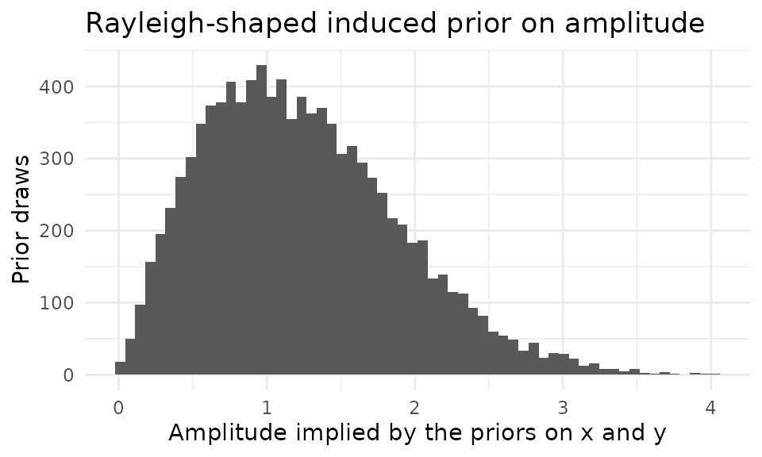

# Bayesian SSM Analysis

``` r

library(circumplex)
```

**Level:** Advanced. Read “Intermediate SSM Analysis” first.

**Not yet peer reviewed.** The Bayesian SSM recipe this page teaches is
the package’s own proposal. Its authors have not yet published it in a
peer-reviewed venue. Read it as a research tool, and state that status
when you report results from it.

## 1. Overview

This vignette estimates the SSM parameters with a Bayesian model and
summarizes its posterior draws. Section 2, “Why a Bayesian SSM?”,
motivates the approach. Section 3, “The cosine model as a linear
regression”, rewrites the cosine model so that a regression can fit it.
Section 4, “Fitting the model with brms”, fits it to the `jz2017` octant
scores. Section 5, “From posterior draws to SSM summaries”, turns the
draws into SSM summaries with
[`ssm_draws()`](http://circumplex.jmgirard.com/reference/ssm_draws.md).
Section 6, “The induced prior on amplitude”, shows what the priors on
$`x`$ and $`y`$ imply for the amplitude. The Wrap-up names related
functions and the next page to read.

## 2. Why a Bayesian SSM?

The Structural Summary Method (SSM) describes a circumplex profile with
an elevation $`e`$, an amplitude $`a`$, and a displacement $`d`$.
[`vignette("introduction-to-ssm-analysis")`](http://circumplex.jmgirard.com/articles/introduction-to-ssm-analysis.md)
defines these three parameters. The package’s
[`ssm_analyze()`](http://circumplex.jmgirard.com/reference/ssm_analyze.md)
estimates them with bootstrap or Monte Carlo confidence intervals.

A Bayesian alternative is attractive when you want prior information or
hierarchical structure. Prior information is what you know about the
parameters before you see the data. An example of hierarchical structure
is partial pooling across persons or groups, where each person’s or
group’s estimate is pulled toward the overall estimate. A Bayesian
alternative is also attractive when you want full posterior
distributions for derived quantities, such as amplitude and
displacement. A posterior distribution combines the prior and the data
into one distribution over the parameters.

The division of labor is deliberate. A general-purpose Bayesian package,
such as **brms**, fits the model. Then
[`ssm_draws()`](http://circumplex.jmgirard.com/reference/ssm_draws.md)
converts the resulting posterior draws into SSM parameter draws.
Posterior draws are samples from the posterior distribution.
[`ssm_draws()`](http://circumplex.jmgirard.com/reference/ssm_draws.md)
summarizes them with the same circular statistics (statistics for
angles) that the rest of the package uses. Displacement is an angle, so
its posterior needs circular treatment. In particular, an interval that
straddles the 0°/360° boundary must wrap across 0° rather than invert.
An inverted interval runs the long way around the circle.
[`ssm_draws()`](http://circumplex.jmgirard.com/reference/ssm_draws.md)
handles that by construction.

## 3. The cosine model as a linear regression

The SSM’s cosine model for a profile of scores $`S_j`$ observed at scale
angles $`\theta_j`$ is

``` math
S_j = e + a \cos(\theta_j - d).
```

Expanding the cosine of a difference gives

``` math
S_j = e + \underbrace{a \cos d}_{x} \cos \theta_j +
\underbrace{a \sin d}_{y} \sin \theta_j,
```

a linear regression of the scores on $`\cos \theta_j`$ and
$`\sin \theta_j`$. The intercept is the elevation $`e`$, the *cosine*
coefficient is $`x`$, and the *sine* coefficient is $`y`$. The amplitude
$`a`$ and displacement $`d`$ are recovered by

``` math
a = \sqrt{x^2 + y^2}, \qquad d = \operatorname{atan2}(y,\, x),
```

with the displacement wrapped into $`[0°, 360°)`$.

Note the argument order: `atan2(y, x)` takes the **sine coefficient
first**. Swapping the arguments is a classic silent error. It returns a
valid-looking angle that is wrong for almost every profile. The example
below pins the convention with a profile whose displacement is known to
be 90°. The swapped call would return 0° instead:

``` r

# Truth: e = 1, a = 2, d = 90 degrees
theta <- as.numeric(octants()) * pi / 180
scores <- 1 + 2 * cos(theta - pi / 2)
fit <- lm(scores ~ cos(theta) + sin(theta))
x_hat <- coef(fit)[["cos(theta)"]]
y_hat <- coef(fit)[["sin(theta)"]]
d_hat <- atan2(y_hat, x_hat) * 180 / pi
round(c(x = x_hat, y = y_hat, d = d_hat), 6)
#>  x  y  d 
#>  0  2 90
```

The printed `d` is 90. A hidden check stops the vignette build unless
`atan2(y_hat, x_hat)` gives 90° and the swapped `atan2(x_hat, y_hat)`
does not.

## 4. Fitting the model with brms

We model raw octant scores from the `jz2017` data. Octant scores are
scores on eight scales placed 45° apart around the circle. The data are
in long format, with one row per person-scale observation. A random
intercept per person gives each person their own baseline level. It is
included to absorb the dependence among a person’s eight scores. The
fixed effects are the coefficients shared by all persons (intercept,
cosine coefficient, sine coefficient). They are then the group-level
$`(e, x, y)`$. A random subsample of 200 persons, drawn with a fixed
seed, keeps the example light.

The long data frame is `dat`, with 1600 rows: one per person and octant
scale. Its columns are the person `id`, `cos_theta` and `sin_theta` (the
cosine and sine of the scale’s angle from
[`octants()`](http://circumplex.jmgirard.com/reference/octants.md)), and
the `score`. (The code that draws the subsample and builds `dat` is
omitted. It builds the same data as the seeded script named below.) Its
first rows are:

``` r

head(dat)
#>   id    cos_theta sin_theta score
#> 1  1 6.123234e-17         1  1.00
#> 2  2 6.123234e-17         1  0.25
#> 3  3 6.123234e-17         1  0.50
#> 4  4 6.123234e-17         1  0.75
#> 5  5 6.123234e-17         1  0.00
#> 6  6 6.123234e-17         1  0.50
```

**brms** fits its models with Stan, and Bayesian sampling with Stan
requires a working Stan toolchain. So the model below is not re-fitted
when this vignette is rebuilt. Its posterior draws were generated once
by the seeded script `data-raw/bayesian_ssm_draws.R`, and they ship with
the package. The `normal(0, 1)` prior on the regression coefficients is
a deliberate modeling choice. Section 6 examines its consequences for
the amplitude.

``` r

library(brms)
bfit <- brm(
  score ~ cos_theta + sin_theta + (1 | id),
  data = dat,
  prior = set_prior("normal(0, 1)", class = "b"),
  chains = 4, iter = 2000, cores = 4, seed = 12345
)
draws <- as.matrix(bfit,
                   variable = c("b_Intercept", "b_cos_theta", "b_sin_theta"))
```

## 5. From posterior draws to SSM summaries

The draws form a matrix with one row per posterior draw and three
columns interpreted **in column order** as $`(e, x, y)`$. The vignette
reads the shipped draws into the matrix `draws`. (The code that reads
the file is omitted.)

``` r

dim(draws)
#> [1] 4000    3
head(round(draws, 3))
#>     variable
#> draw b_Intercept b_cos_theta b_sin_theta
#>    1       0.990       0.315      -0.294
#>    2       0.938       0.382      -0.353
#>    3       0.931       0.356      -0.331
#>    4       0.921       0.339      -0.277
#>    5       0.946       0.382      -0.295
#>    6       0.913       0.355      -0.313
```

[`ssm_draws()`](http://circumplex.jmgirard.com/reference/ssm_draws.md)
accepts two draw shapes. The first is three-column *parameter* draws
like these. The second is *profile* draws: posterior draws of a whole
profile of scale scores, with one column per scale and `angles`
supplied. A three-column matrix without angles is ambiguous, because it
could also be profile draws from a three-scale instrument. So the shape
must be stated explicitly with `type = "parameters"`:

``` r

res <- ssm_draws(draws, type = "parameters")
summary(res)
#> 
#> Statistical Basis:   Posterior Draws 
#> Posterior Draws:  4000 
#> Credible Level:       0.95 
#> Draw Shape:       Parameters 
#> 
#> # Posterior Summary:
#> 
#>                Estimate   Lower CrI   Upper CrI
#> Elevation         0.933       0.868       0.998
#> X-Value           0.352       0.303       0.401
#> Y-Value          -0.319      -0.365      -0.273
#> Amplitude         0.476       0.427       0.522
#> Displacement    317.790     312.274     323.286
#> Model Fit
```

Each posterior draw of $`(x, y)`$ was converted to a draw of $`(a, d)`$.
Because $`d`$ is an angle, the displacement’s credible interval comes
from circular quantiles. A credible interval is the Bayesian counterpart
of a confidence interval. The circular mean is the direction of the
average of the angles taken as unit vectors. The draws are centered on
their circular mean and unwrapped (laid on a line with no jump near the
mean). Then the quantiles are taken, and the bounds are re-wrapped. The
interval never comes from naive linear quantiles that would misbehave
near 0°/360°.

Point estimates are posterior medians for the linear parameters:
elevation, $`x`$, $`y`$, amplitude, and fit where it is available. The
amplitude posterior is right-skewed, so a mean would overstate it. For
displacement, the point estimate is the circular mean.

One caveat to keep in mind: these marginal summaries are not jointly
coherent. A marginal summary describes one parameter’s draws on its own,
so the summaries need not agree with each other. The reported amplitude
is the median of the amplitude draws. It is not $`\sqrt{x^2 + y^2}`$
evaluated at the reported $`x`$ and $`y`$. Likewise, the reported
displacement is not the direction of the reported $`(x, y)`$. Each is
the honest marginal summary of its own posterior.

Model fit ($`R^2`$) is not reported here, because parameter draws carry
no profile to measure fit against. Profile draws (the second shape) do
yield fit draws from
[`ssm_draws()`](http://circumplex.jmgirard.com/reference/ssm_draws.md).

## 6. The induced prior on amplitude

Independent priors on $`x`$ and $`y`$ do not induce a flat prior on the
structural parameters. The induced prior is the prior on $`a`$ and $`d`$
that the priors on $`x`$ and $`y`$ imply. With
$`x, y \sim \mathrm{Normal}(0, 1)`$, the implied prior on
$`a = \sqrt{x^2 + y^2}`$ is Rayleigh-shaped: zero density at $`a = 0`$,
then a single peak, with a right skew. Its mass is pushed *away* from
$`a = 0`$. But the implied prior on $`d`$ is uniform. A prior-predictive
simulation makes the amplitude prior visible. It draws 10000 values each
of $`x`$ and $`y`$ from $`\mathrm{Normal}(0, 1)`$ and computes
$`a = \sqrt{x^2 + y^2}`$ for each pair. The histogram shows those draws
of $`a`$. The two printed numbers are their median and the share of them
below 0.1. (The simulation and plotting code is omitted.)



    #>         prior_median prior_mass_below_0.1 
    #>                1.164                0.005

The Rayleigh shape is not a defect. It is a modeling choice to be aware
of: the prior mildly disfavors exactly-flat profiles ($`a = 0`$). If
your application needs prior mass concentrated near $`a = 0`$, place
priors on $`(a, d)`$ directly in a custom Stan model instead. Its
posterior draws can still be summarized here. Convert them to
$`(x, y) = (a \cos d, a \sin d)`$, or pass profile draws.

## Wrap-up

- Per-person descriptive SSM parameters (no pooling):
  [`ssm_parameters_id()`](http://circumplex.jmgirard.com/reference/ssm_parameters_id.md)
  and its [`summary()`](https://rdrr.io/r/base/summary.html) method.
- Hierarchical pooling across persons or groups is exactly what the
  brms/Stan route is for. Fit the model you need, and feed the posterior
  draws (parameter or profile shape) back through
  [`ssm_draws()`](http://circumplex.jmgirard.com/reference/ssm_draws.md).
- Frequentist inference on group profiles and contrasts:
  [`ssm_analyze()`](http://circumplex.jmgirard.com/reference/ssm_analyze.md).

The next page to read is “Growth Models on SSM Parameters”. It fits a
growth model to SSM parameters measured at several waves and turns its
fixed effects into amplitude and displacement curves with
[`ssm_draws()`](http://circumplex.jmgirard.com/reference/ssm_draws.md).
