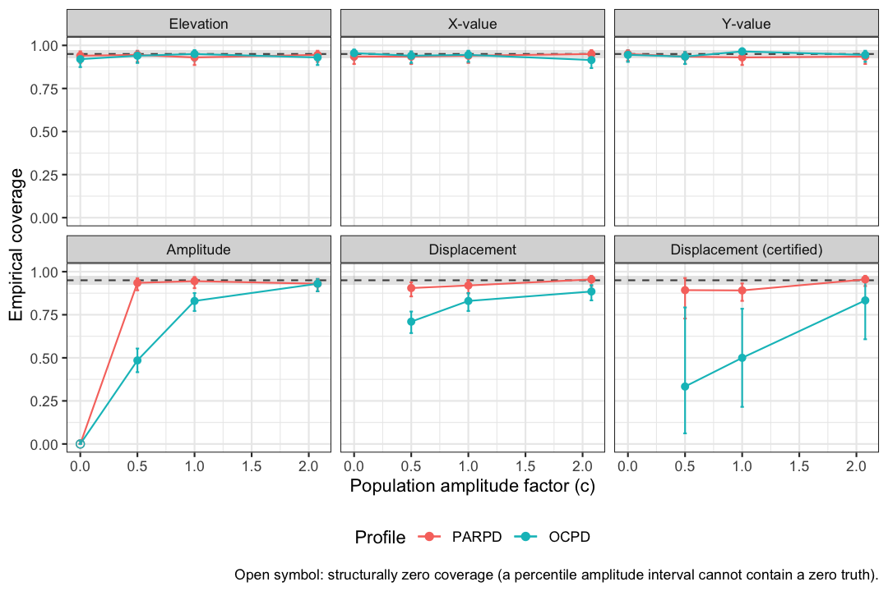

# Confidence Interval Accuracy

``` r

library(circumplex)
```

**Level:** Intermediate. Read “Evaluating Circumplex Structure” first.

## 1. Overview

This vignette asks whether the confidence intervals of an SSM analysis
can be trusted at your sample size and profile. Section 2, “What
Zimmermann & Wright (2017) found”, transcribes the published accuracy
thresholds. Section 3, “Simulating coverage for your own analysis”, runs
[`ssm_ci_accuracy()`](http://circumplex.jmgirard.com/reference/ssm_ci_accuracy.md)
at your configuration and reads its report. Section 4, “When to trust
SSM parameters”, puts the structure and accuracy checks into one
checklist. The examples use the `jz2017` dataset that “Evaluating
Circumplex Structure” describes. The Wrap-up lists what the page covered
and names the next page, and the References list the sources cited.

## 2. What Zimmermann & Wright (2017) found

Zimmermann and Wright’s simulation studies (their Studies 1–4) evaluated
the accuracy of 95% percentile bootstrap intervals for SSM parameters.
This is the same interval type that
[`ssm_analyze()`](http://circumplex.jmgirard.com/reference/ssm_analyze.md)
reports. They judged an interval accurate when its empirical coverage
stayed within Bradley’s (1978) liberal band of 92.5% to 97.5%. Their
headline results:

| Parameter | Point estimate | 95% bootstrap CI accurate when… |
|----|----|----|
| Elevation ($`e`$) | essentially unbiased | $`n \ge 50`$ |
| X value / affiliation | essentially unbiased | $`n \ge 50`$ |
| Y value / dominance | essentially unbiased | $`n \ge 50`$ |
| Amplitude ($`a`$) | **biased upward**, strongly so when population amplitude is small | $`n \ge 75`$ (general-factor instrument) or $`n \ge 150`$ (no general factor), *given* population amplitude $`\ge .10`$ |
| Displacement ($`\delta`$) | unbiased but imprecise at low amplitude | $`n \ge 100`$ (general factor) or $`n > 200`$ (no general factor), *given* population amplitude $`\ge .10`$ |
| Fit ($`R^2`$) | biased downward | population $`R^2 < .9`$ only (unsuited near 1) |

*(Transcribed from Zimmermann & Wright, 2017, Studies 1–2, pp. 6–11.)*

Three implications are worth internalizing:

- **Amplitude overestimates differentiation.** Across their conditions,
  the relative bias averaged 15.5% and reached 135.8%. With $`n = 50`$
  and no general factor, the *expected* sample amplitude was about .15
  when the population amplitude was exactly zero (their pp. 6–7). An
  amplitude of .15 is commonly read as “marked”. At small $`n`$, it can
  be pure sampling artifact.
- **Displacement is only as stable as amplitude is large.** The standard
  error of the displacement grows as amplitude shrinks. For example, it
  is roughly 50 degrees at $`n = 100`$ for a weakly differentiated
  profile (their p. 8). A displacement estimate from a flat profile has
  no meaningful direction.
- **The thresholds above are grid minima, not guarantees.** They come
  from specific instruments, specific sample sizes, and population
  amplitudes of .10 or larger. Their Study 3 quantified the frontier
  more finely. The minimum population affiliation/dominance component
  needed for accurate amplitude and displacement intervals is
  approximately $`2.95 \cdot f_a \cdot n^{-0.587}`$. Here $`f_a`$ is an
  instrument constant (their Eq. 3). $`f_a`$ is about .55 for the IIP-C,
  .63 for the IIP-SC and .85 for the IAS. At $`n = 100`$ with an
  IIP-C-like instrument, that is a population component of about .11.
  That is larger than many real construct profiles.

## 3. Simulating coverage for your own analysis

Published thresholds cover a coarse grid of conditions. Your analysis
(your instrument, your $`n`$, your group sizes, your profile, your
number of bootstrap resamples) usually falls between or outside the grid
points.
[`ssm_ci_accuracy()`](http://circumplex.jmgirard.com/reference/ssm_ci_accuracy.md)
answers the question directly at your configuration. It builds a
population whose structure matches your fitted estimates (through the
CPM by default). It simulates many datasets of your exact sample size
from that population, and it replays your own CI procedure on each. Then
it reports how often the intervals covered the known population values.

To see it catch a real problem, we analyze two PD scales at a modest
sample size. Paranoid PD has a well-differentiated interpersonal
profile. Obsessive–compulsive PD has a profile that Zimmermann and
Wright’s Table 4 showed to be nearly flat (amplitude .012 at full sample
size). We use the first 250 participants. Many construct-validation
studies would consider that sample size respectable.

``` r

set.seed(23456)
res <- ssm_analyze(
  jz2017[1:250, ],
  scales = PANO(),
  angles = octants(),
  measures = c("PARPD", "OCPD"),
  boots = 500 # reduced from the default 2000 to keep the vignette quick;
  # the diagnostic below replays whatever procedure this object used
)
summary(res)
#> 
#> Statistical Basis:    Correlation Scores 
#> Bootstrap Resamples:  500 
#> Confidence Level:     0.95 
#> Listwise Deletion:    TRUE 
#> Scale Displacements:  90 135 180 225 270 315 360 45 
#> 
#> 
#> # Profile [PARPD]:
#> 
#>                Estimate   Lower CI   Upper CI
#> Elevation         0.258      0.169      0.338
#> X-Value          -0.095     -0.160     -0.028
#> Y-Value           0.055     -0.017      0.122
#> Amplitude         0.110      0.054      0.185
#> Displacement    149.667    111.480    190.360
#> Model Fit         0.725                      
#> 
#> 
#> # Profile [OCPD]:
#> 
#>                Estimate   Lower CI   Upper CI
#> Elevation         0.218      0.123      0.302
#> X-Value          -0.021     -0.084      0.037
#> Y-Value          -0.003     -0.068      0.063
#> Amplitude         0.021      0.009      0.096
#> Displacement    188.695     29.052    335.755
#> Model Fit         0.150                      
#>   Note: model fit is inadequate (R² < .70); interpret only the elevation
#>   parameter.
#>   Note: the amplitude CI lower bound is under 0.35 CI-widths above zero; the
#>   displacement is not interpretable.
```

Note the guardrail in the printed output. When a profile’s amplitude CI
lower bound sits less than 0.35 CI-widths above zero,
[`ssm_analyze()`](http://circumplex.jmgirard.com/reference/ssm_analyze.md)
marks the displacement as uninterpretable, rather than certifying its
direction. That rule is scale-free. It compares the lower bound to the
interval’s own width, so it means the same thing on any score metric. It
also does not depend on the display precision. The diagnostic below
measures, among other things, how well that certification rule performs
at your configuration.

We again use reduced settings to keep the vignette fast: `reps = 200`, a
short amplitude ladder, and the smaller `boots` above. The ladder is a
set of scaling factors applied to the estimated amplitude (1 = as
estimated), explained below. The defaults are `reps = 1000` and four
ladder rungs, on an object built with the default `boots = 2000`. They
give a Monte Carlo standard error under one percentage point for
coverage near the nominal level, and they are recommended in practice.
The `parallel`/`ncpus` arguments speed up real runs without changing
results for a given seed. The CPM fit inside the diagnostic prints the
same ill-conditioned Hessian warning that “CPM Fits at a Boundary”
explains.

[`print()`](https://rdrr.io/r/base/print.html) shows the short report:
one block of verdicts per profile.

``` r

set.seed(34567)
acc <- ssm_ci_accuracy(res, reps = 200, amplitude_factors = c(1, 0.5, 0))
#> Warning: CPM Hessian is ill-conditioned (condition number 9.24e+16): angles
#> may be clustered or parameters weakly determined.
print(acc)
#> 
#> SSM CI accuracy, simulated at your n and settings (200 replications per
#> condition; bootstrap intervals with 500 replicates at level 0.95)
#> 
#>   # Profile [PARPD] (n = 250; 95% bootstrap CIs, 500 replicates):
#>     Elevation      coverage 93.0%: borderline
#>     Amplitude      coverage 94.5%: borderline
#>     Displacement   coverage 89.1% when certified: borderline
#>     Guardrail      under a truly zero amplitude, displacement would be
#>                    certified 1.0% of the time (user-expectation benchmark
#>                    2.5%)
#>   Verdict: BORDERLINE. Elevation, amplitude, and certified displacement
#>   coverage rates are borderline at this number of replications; a larger
#>   `reps` would sharpen the verdict.
#> 
#>   # Profile [OCPD] (n = 250; 95% bootstrap CIs, 500 replicates):
#>     Elevation      coverage 95.0%: borderline
#>     Amplitude      coverage 83.0%: INADEQUATE (under-coverage; misses are
#>                    almost all below the interval: the amplitude CI tends to
#>                    sit above the truth)
#>     Displacement   coverage 50.0% when certified: INADEQUATE (under-coverage)
#>     Guardrail      under a truly zero amplitude, displacement would be
#>                    certified 1.0% of the time (user-expectation benchmark
#>                    2.5%)
#>   Verdict: CAUTION. Amplitude CIs are less reliable than nominal at this
#>   sample size and displacement CIs mis-cover even when certified. Elevation
#>   coverage is borderline at this number of replications; a larger `reps`
#>   would sharpen the verdict. Consider a larger sample or treat near-zero
#>   amplitudes as inconclusive rather than absent.
```

How to read this output. Each profile’s lines classify its coverage at
the amplitude it was estimated to have. Coverage is how often your CI
procedure covered the truth in the simulated replications. The
diagnostic compares it with the nominal level, using the Wilson interval
(an interval around the estimated coverage) and the Bradley band.

- **Elevation, Amplitude and Displacement** give the coverage of each
  parameter and its class. Displacement coverage counts only the
  replications in which the profile was *certified*. A certified profile
  has its amplitude CI lower bound at least 0.35 CI-widths above zero.
- **Guardrail** gives the rate at which a profile whose true amplitude
  is zero would still be certified. Any such certification is a false
  certification. The line prints a caution when that rate is materially
  above the rate that a user would expect from the interval level. This
  is a measured property of the shipped display rule, not a hypothesis
  test.
- **Verdict** states the overall conclusion for the profile.

The two profiles tell usefully different stories. Paranoid PD is
certified. Its amplitude CI lower bound clears the 0.35-CI-width margin,
so the printed output adds no displacement note. None of its coverage
rates clearly leaves the Bradley band at the as-estimated amplitude.
Obsessive–compulsive PD is *not* certified. Its amplitude (about .02
here) is far too close to zero relative to its CI width. So the printed
output still shows its displacement and interval, but with a note that
the displacement is not interpretable. The
[`ssm_analyze()`](http://circumplex.jmgirard.com/reference/ssm_analyze.md)
result flags this on its own, before any coverage question is asked. On
top of that, the diagnostic shows that its amplitude and displacement
CIs under-cover badly at this sample size. Almost all amplitude misses
fall below the interval, so the amplitude CI tends to sit above the
truth. So its verdict is a caution for a genuine reason. The intervals
themselves are unreliable, not merely the point on the circle.

The guardrail line confirms that the rule is doing its job. At this
configuration ($`n = 250`$, eight octant correlations), take a profile
whose true amplitude is exactly zero. Its estimated certification rate
does not clearly exceed the benchmark rate. That rate is roughly the
one-sided error that a user reading the guardrail would expect. So no
caution fires from the guardrail itself. This is the payoff of the
scale-free rule. Unlike a fixed amplitude-unit cutoff, it keeps
false-certification from clearly exceeding the benchmark, even in the
near-zero regime that Zimmermann and Wright flagged. In that regime, a
sample amplitude large enough to look non-zero is otherwise the
*expected* outcome from a flat population.

One reading note: at reduced `reps`, classes tend to print as
`borderline`. This is because the Wilson interval around the estimated
coverage is too wide to place it clearly inside or outside the Bradley
band. That is the diagnostic being honest about its own Monte Carlo
error. The default `reps = 1000` sharpens such classifications into
`adequate` or `INADEQUATE`.

### The full report

[`summary()`](https://rdrr.io/r/base/summary.html) adds the settings, a
note on the simulated population, and a table of coverage at every rung
of the amplitude ladder:

``` r

summary(acc)
#> 
#> Correlation scores; bootstrap, 500 replicates, level 0.95; 200 reps per
#> condition.
#> Population: Browne circular model (CPM); groups All = 250; elapsed 11.7s.
#> Ladder c = 1, 0.5, 0, 2.077; certified if a_lci / (a_uci - a_lci) >= 0.35.
#> 
#> Structure note: population simulated from a Browne circular model fit (m = 3,
#> RMSEA = 0.064, SRMR = 0.038).
#>   The structure fits adequately (RMSEA <= 0.08, Browne & Cudeck, 1993; SRMR
#>   <= 0.08, Hu & Bentler, 1999), so the simulated population is a reasonable
#>   stand-in for yours.
#>   Boundary markers: Heywood communality; small correlation-function weight;
#>   ill-conditioned Hessian.
#> Near-zero regime: the amplitude estimate of profile [OCPD] is below half its
#> own CI width, so your analysis already sits in the amplitude-near-zero
#> regime; an absolute rung at the certification margin (c = 2.08, population
#> amplitude = the observed CI half-width) was added to the ladder.
#> 
#> Verdicts (c = 1, as estimated), Bradley (1978) liberal band, 95% Wilson CIs:
#> 
#>   # Profile [PARPD] (n = 250; 95% bootstrap CIs, 500 replicates):
#>     Elevation      coverage 93.0%: borderline
#>     Amplitude      coverage 94.5%: borderline
#>     Displacement   coverage 89.1% when certified: borderline
#>     Guardrail      under a truly zero amplitude, displacement would be
#>                    certified 1.0% of the time (user-expectation benchmark
#>                    2.5%)
#>   Verdict: BORDERLINE. Elevation, amplitude, and certified displacement
#>   coverage rates are borderline at this number of replications; a larger
#>   `reps` would sharpen the verdict.
#> 
#>   # Profile [OCPD] (n = 250; 95% bootstrap CIs, 500 replicates):
#>     Elevation      coverage 95.0%: borderline
#>     Amplitude      coverage 83.0%: INADEQUATE (under-coverage; misses are
#>                    almost all below the interval: the amplitude CI tends to
#>                    sit above the truth)
#>     Displacement   coverage 50.0% when certified: INADEQUATE (under-coverage)
#>     Guardrail      under a truly zero amplitude, displacement would be
#>                    certified 1.0% of the time (user-expectation benchmark
#>                    2.5%)
#>   Verdict: CAUTION. Amplitude CIs are less reliable than nominal at this
#>   sample size and displacement CIs mis-cover even when certified. Elevation
#>   coverage is borderline at this number of replications; a larger `reps`
#>   would sharpen the verdict. Consider a larger sample or treat near-zero
#>   amplitudes as inconclusive rather than absent.
#> 
#> Coverage by condition (d_cert: d when certified; cert: certification rate):
#>  Profile Condition     e     x     y     a     d d_cert  cert Structural
#>    PARPD     1.000 0.930 0.940 0.930 0.945 0.920  0.891 0.735      FALSE
#>    PARPD     0.500 0.945 0.935 0.935 0.935 0.905  0.893 0.140      FALSE
#>    PARPD     0.000 0.940 0.935 0.950 0.000    NA     NA 0.010       TRUE
#>    PARPD     2.077 0.945 0.950 0.935 0.930 0.955  0.955 1.000      FALSE
#>     OCPD     1.000 0.950 0.945 0.965 0.830 0.830  0.500 0.040      FALSE
#>     OCPD     0.500 0.940 0.940 0.935 0.485 0.710  0.333 0.015      FALSE
#>     OCPD     0.000 0.920 0.955 0.945 0.000    NA     NA 0.010       TRUE
#>     OCPD     2.077 0.930 0.915 0.945 0.930 0.885  0.833 0.090      FALSE
#>   Note: amplitude coverage on rows flagged Structural is structurally 0 (a
#>   percentile interval of strictly positive amplitude replicates cannot
#>   contain a zero truth). This is a theorem, not a measurement; the
#>   informative near-zero rungs are the small c > 0 ones.
```

How to read the additions:

- **The structure note** describes the population the replications were
  drawn from, with its fit indices and any boundary markers from the CPM
  fit.
- **The coverage table** reports coverage for each parameter at each
  rung of the ladder (`Condition = 1` is the amplitude as estimated).
  The `d_cert` column is displacement coverage when certified.
- **The amplitude ladder** (`Condition` column) matters because your
  estimated amplitude is biased upward. The population that generated
  your data plausibly has *less* differentiation than your estimate. The
  rungs below 1 show what happens to coverage in that direction. For
  paranoid PD, no coverage rate clearly leaves the Bradley band with the
  population amplitude halved either. The 0 rung shows the degenerate
  flat-profile case. There, displacement has no true value at all, and
  the amplitude interval cannot cover the boundary truth. (Its printed
  zero coverage is structural, and the table flags it.) When a profile’s
  estimated amplitude is smaller than half its own CI width, the
  diagnostic adds one more rung at a scaling factor above 1. This is the
  case for obsessive–compulsive PD here. That rung is the amplitude at
  which the population would sit exactly at the observed CI half-width.
- **The `cert` column** reports how often profiles were certified at
  each rung. The `Guardrail` line of the short report is this rate at
  the 0 rung.
- **The lines under `Verdicts (c = 1, as estimated)`** are the verdict
  blocks that [`print()`](https://rdrr.io/r/base/print.html) shows.

For a visual summary across the ladder:

``` r

plot(acc)
```



Two settings are worth knowing. First, `structure = "observed"` rebuilds
the population from the pooled observed correlations instead of the CPM.
If the two structures yield different verdicts, that disagreement is
itself informative: structure uncertainty is material for your data.
Second, the embedded CPM fit is returned as `acc$cpm`, for inspection
with the tools from “Evaluating Circumplex Structure”.

The diagnostic itself was validated against Zimmermann and Wright’s
published results. Configured to their transcribed simulation
conditions, it reproduces their accuracy classifications. It gives
coverage inside the Bradley band at conditions they found accurate. It
gives the same one-sided under-coverage at conditions they found
inaccurate.

## 4. When to trust SSM parameters

Putting “Evaluating Circumplex Structure” and this page together into a
checklist:

1.  **Structure first.** Fit
    [`cpm_fit()`](http://circumplex.jmgirard.com/reference/cpm_fit.md)
    to your instrument in your sample. If the octant ordering fails or
    communalities are very low, stop, because SSM positions mean little.
2.  **Elevation is the robust parameter.** It is essentially unbiased,
    and its intervals were accurate from $`n \ge 50`$ in every published
    and package-run condition. (On the correlation path, elevation is
    also the parameter that ipsatizing destroys. See “Structure Tests
    and Ipsatization”.)
3.  **Treat amplitude as optimistic.** It cannot go below zero, so it
    overshoots when true differentiation is weak. Before interpreting a
    “marked” amplitude at modest $`n`$, run
    [`ssm_ci_accuracy()`](http://circumplex.jmgirard.com/reference/ssm_ci_accuracy.md)
    and look at the sub-1 ladder rungs in its
    [`summary()`](https://rdrr.io/r/base/summary.html) or
    [`plot()`](https://rdrr.io/r/graphics/plot.default.html).
4.  **Only interpret displacement when amplitude is credible.** When the
    amplitude CI lower bound sits less than 0.35 CI-widths above zero,
    the printed output notes that the displacement is not interpretable.
    The diagnostic tells you how reliable that certification is at your
    configuration.
5.  **Do not build claims on the fit parameter’s interval.** Zimmermann
    and Wright found bootstrap $`R^2`$ intervals accurate only when
    population fit was mediocre. Near-perfect prototypicality cannot be
    bracketed from below. Report $`R^2`$ descriptively.
6.  **Remember what the diagnostic conditions on.** It asks “would my CI
    procedure work in a population *like my estimates*”, under
    multivariate normality, with complete data. It is a strong check,
    not a certificate.

## Wrap-up

Interval accuracy depends on the sample size, the instrument and how
differentiated the profile really is, and
[`ssm_ci_accuracy()`](http://circumplex.jmgirard.com/reference/ssm_ci_accuracy.md)
measures it at your own configuration. The next page is “Structure Tests
and Ipsatization”. It asks the exploratory version of the structure
question and shows what ipsatizing removes from a profile.

## References

- Bradley, J. V. (1978). Robustness? *British Journal of Mathematical
  and Statistical Psychology, 31*(2), 144–152.

- Zimmermann, J., & Wright, A. G. C. (2017). Beyond description in
  interpersonal construct validation: Methodological advances in the
  circumplex Structural Summary Approach. *Assessment, 24*(1), 3–23.
