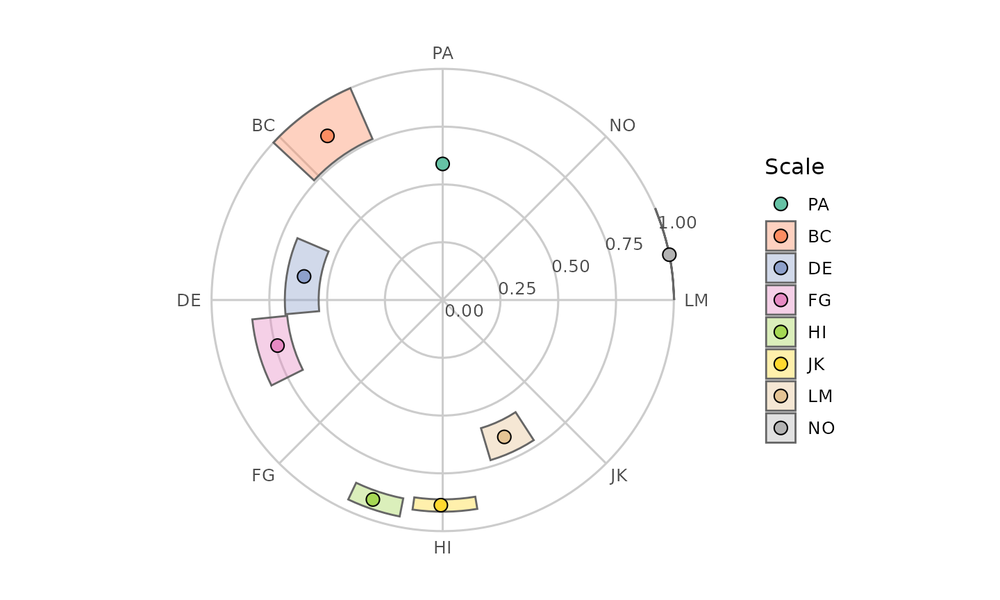
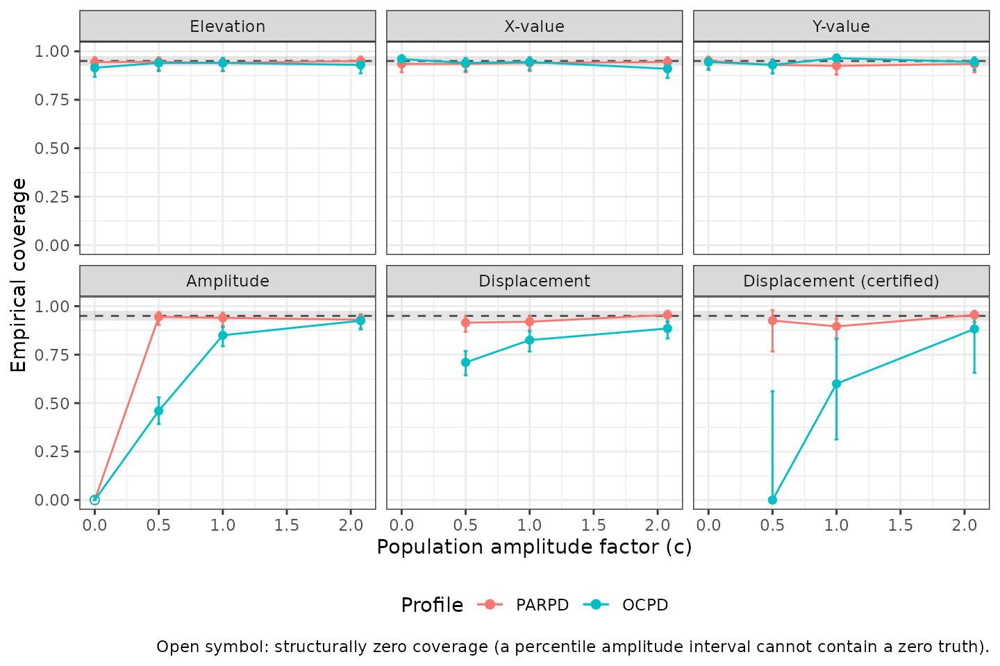
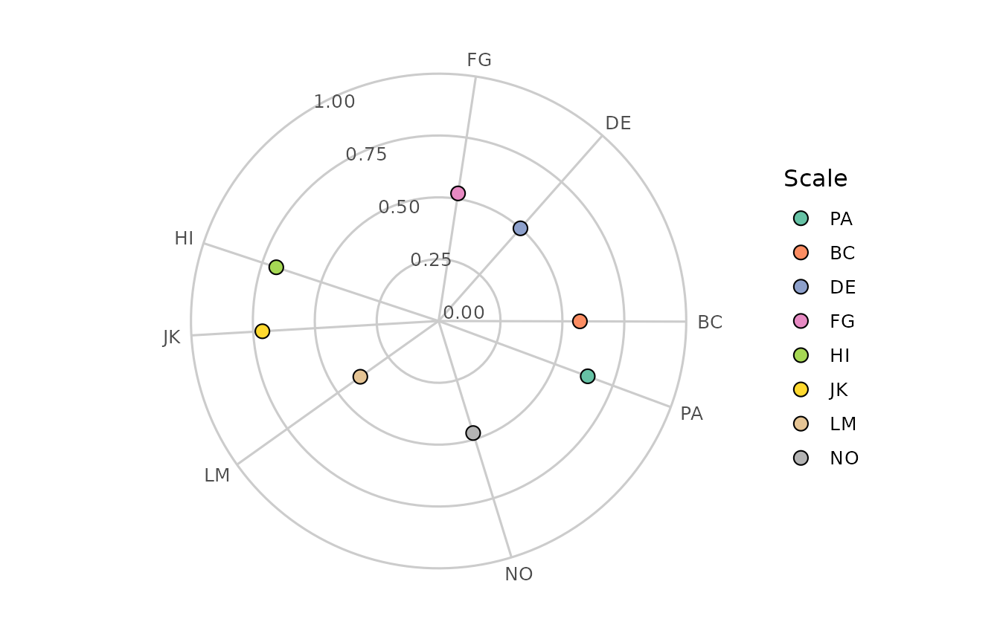

# Evaluating Circumplex Structure

``` r

library(circumplex)
```

## 1. Two questions to ask before interpreting an SSM analysis

The Structural Summary Method (SSM) condenses a circumplex profile into
a few interpretable parameters: elevation, amplitude, displacement, and
fit. That condensation rests on two assumptions that are testable but
often left untested:

1.  **Does the instrument actually have circumplex structure?** The SSM
    locates a profile on a circle whose positions are given by the
    scales’ theoretical angles. If the scales do not really form a
    circumplex — or sit at very different angles than the theory says —
    the summary is distorted before any profile is computed.

2.  **Are the confidence intervals trustworthy at your sample size and
    profile?** Zimmermann and Wright (2017) showed that the accuracy of
    bootstrap SSM intervals depends on the sample size, the instrument’s
    correlation structure, and — for amplitude and displacement — on how
    differentiated the profile really is in the population. Intervals
    that are accurate for one construct in your table can be inaccurate
    for the construct printed directly below it.

This vignette shows how to answer both questions with
[`cpm_fit()`](http://circumplex.jmgirard.com/reference/cpm_fit.md) and
[`fit_structure()`](http://circumplex.jmgirard.com/reference/fit_structure.md)
(question 1) and
[`ssm_ci_accuracy()`](http://circumplex.jmgirard.com/reference/ssm_ci_accuracy.md)
(question 2), using the `jz2017` dataset — the same sample of 1,166
undergraduates analyzed in Zimmermann and Wright (2017, Study 5), with
octant scores on the IIP-SC and personality disorder (PD) scales from
the PDQ-4+.

## 2. Does the instrument fit a circumplex?

### Fitting the circular process model

[`cpm_fit()`](http://circumplex.jmgirard.com/reference/cpm_fit.md)
estimates Browne’s (1992) circular process model (CPM), the confirmatory
model behind the CIRCUM and CircE programs. Each scale gets an estimated
angle on the circle and a *communality index* $`\zeta`$ (the correlation
between the scale and the common circumplex “factor”; its square,
$`\zeta^2`$, is the scale’s *communality* — the share of its variance
the circumplex explains). The model also yields the usual
covariance-structure fit indices.

On the raw-data path the default confidence intervals are bootstrapped.
We lower `boots` from its default of 2000 to keep this vignette quick to
build; in practice, use the default.

``` r

data("jz2017")
set.seed(12345)
cpm <- cpm_fit(jz2017, scales = PANO(), angles = octants(), boots = 500)
#> Warning: CPM Hessian is ill-conditioned (condition number 1.83e+14): angles may
#> be clustered or parameters weakly determined.
#> Warning: 11 of 500 bootstrap resamples were excluded (0 with a degenerate or
#> non-positive-definite correlation matrix, 11 failing the convergence acceptance
#> criterion); the confidence intervals are based on the remaining 489 replicates
#> and are conditional on estimability.
summary(cpm)
#> 
#> Circular Process Model (Browne, 1992) 
#> Model:             quasi-circumplex 
#> Harmonics (m):     3 
#> Sample size (N):   1166 
#> Reference scale:   PA 
#> CI method:         bootstrap 
#> Confidence level:  0.95 
#> 
#> # Estimated angles and communality indices
#> 
#>  Scale Angle_theory   Angle Angle_lci Angle_uci  Zeta Zeta_lci Zeta_uci
#>     PA           90  90.000    90.000    90.000 0.767    0.684    0.860
#>     BC          135 125.074   113.548   137.069 0.931    0.872    1.000
#>     DE          180 170.353   156.943   185.174 0.780    0.733    0.826
#>     FG          225 195.425   185.811   206.523 0.861    0.822    0.910
#>     HI          270 250.721   244.660   258.758 0.956    0.935    0.977
#>     JK          315 269.491   261.813   279.412 0.942    0.929    0.957
#>     LM          360 294.230   286.626   303.019 0.806    0.761    0.850
#>     NO           45  11.305     2.426    20.913 1.000    1.000    1.000
#>  Communality
#>        0.589
#>        0.868
#>        0.608
#>        0.741
#>        0.914
#>        0.888
#>        0.650
#>        1.000
#> 
#> # Correlation-function weights
#> 
#>  k  Beta Beta_lci Beta_uci
#>  0 0.450    0.418    0.481
#>  1 0.440    0.411    0.466
#>  2 0.074    0.065    0.087
#>  3 0.036    0.015    0.057
#> 
#> # Fit indices
#> 
#>   χ²(10) = 81.169, p = <1e-04
#>   RMSEA = 0.078 [0.063, 0.094] (90% CI)
#>   SRMR  = 0.042
#>   CFI   = 0.984    TLI = 0.956
#>   AIC   = 117.169    BIC = 208.273
#> 
#> # Residuals
#> 
#>   Largest absolute residual: 0.134 (PA – HI)
#> 
#> # Diagnostics
#> 
#>   Note: a communality index reached its upper boundary (ζ > 0.995, a Heywood-type solution).
#>   Note: 11 of 500 bootstrap resamples were excluded (0 degenerate, 11 non-convergent); the intervals are based on 489 replicates and are conditional on estimability.
#> 
#>   Note: boundary/weak-identification markers fired: Heywood communality;
#>   small correlation-function weight; ill-conditioned Hessian.
#>   What has been measured about these markers covers analytic intervals
#>   only, and not every marker was measured; they are not validated as
#>   predictors of the bootstrap intervals shown here (see the vignette
#>   section 'When a fit sits at a boundary').
```

Two parts of this output matter most for evaluating structure:

- **The estimated angles.** Compare them with the theoretical angles,
  but read the comparison carefully: one scale is held fixed to identify
  the configuration (PA here, at 90°), so every other scale’s departure
  is measured from that anchor and a different anchor would redistribute
  them. Two things are worth separating. The *ordering* around the
  circle is preserved — the estimated angles run through the octants in
  the same cyclic order the instrument assigns them. The *spacing* is
  not: the gaps between circularly adjacent estimates run from under 20°
  to nearly 80° against a theoretical 45°, and the largest departure
  from a theoretical position is about 66°. Departures from perfect
  structure are common in well-validated circumplex instruments (Gurtman
  & Pincus, 2000), and the model comparison below quantifies what this
  pattern costs: it is why forcing equal spacing fits these data poorly.
- **The communality indices.** Scales with low $`\zeta`$ are poorly
  described by the circle; a profile peak at such a scale’s angle means
  less than the same peak at a well-explained scale’s angle.

The estimated configuration is easiest to read on the circle itself:
each scale is drawn at its estimated angle, at a radius equal to its
communality ($`\zeta^2`$), with a joint confidence region where one is
estimable.

``` r

plot(cpm)
```



### Reading the fit indices

The [`summary()`](https://rdrr.io/r/base/summary.html) output reports
the standard indices, and the standard benchmarks apply: RMSEA at or
below about .08 suggests adequate approximate fit and above about .10
poor fit (Browne & Cudeck, 1993); SRMR at or below about .08 suggests
acceptable average residuals (Hu & Bentler, 1999); CFI and TLI near .95
or above suggest good comparative fit (Hu & Bentler, 1999). Treat these
as conventions from the broader covariance-structure literature, not
circumplex-specific laws.

Two caveats come from the benchmark sources themselves. Browne and
Cudeck call their own RMSEA thresholds “based on subjective judgment,”
cautioning that such a figure “cannot be regarded as infallible or
correct” (Browne & Cudeck, 1993) — read the cutoffs as conventions, not
decision rules. And these benchmarks are least dependable at small
samples: Hu and Bentler (1999) found that the ML-based TLI and RMSEA
tend to *overreject* true-population models when the sample is small
(CFI is not among the indices they flag), and circumplex analyses are
often run at modest sample sizes — the SSM accuracy thresholds in
Section 3 span roughly $`n = 50`$ to $`200`$. At small $`n`$, then, a
TLI or RMSEA that falls short of its benchmark can reflect the index’s
small-sample behavior as much as the model’s fit.

Two further cautions are circumplex-specific, both from this package’s
own validation simulations:

- **Boundary solutions are common at realistic sample sizes**, including
  in the fit above. What that means and what to do about it is the
  subject of the next subsection, *When a fit sits at a boundary*.
- **Do not lean hard on the chi-square p value.** In simulations at
  field-typical sample sizes with octant-like population structures, the
  test statistic did not follow its nominal chi-square reference
  distribution, even for correctly specified models. Read the chi-square
  descriptively (bigger is worse), and prefer RMSEA/SRMR/CFI for judging
  approximate fit.

For the same reasons, when the intervals are analytic (Wald) — the only
option on the correlation-matrix input path —
[`summary()`](https://rdrr.io/r/base/summary.html) prints a caution
below $`N = 2000`$, and up to very large $`N`$ when a boundary marker is
present: in validation, analytic intervals mis-covered in exactly those
regimes. Prefer the bootstrap (the raw-data default) when you have raw
data.

### When a fit sits at a boundary

The fit above is one of these fits, and it says so. Its `# Diagnostics`
block prints a note that a communality index reached its upper boundary,
and the results table shows which one: the NO scale’s communality index
is 1.000, with a confidence interval of \[1.000, 1.000\]. A zero-width
interval is not a precise estimate — it is an absent one. Both endpoints
equal the estimate, which is to say that at least the middle 95% of the
retained bootstrap resamples also sat on the boundary, leaving the
percentile interval no width to report. The same chunk also emits a
warning that the fit’s Hessian is ill-conditioned, a second signal from
the same regime. When octant scales share a strong general factor, as
interpersonal problem scales do, fitted solutions frequently sit at or
near a parameter boundary; this is the estimator meeting real data at
finite $`n`$, not a data-entry error.

[`cpm_fit()`](http://circumplex.jmgirard.com/reference/cpm_fit.md)
records five such markers, and
[`summary()`](https://rdrr.io/r/base/summary.html) names the ones that
fired:

- **Heywood communality** — a communality index estimated at its upper
  boundary ($`\hat\zeta > 0.995`$): the circle accounts for that scale
  essentially completely.
- **boundary harmonic removed** — a correlation-function weight sat at
  zero and was dropped from the model, with the degrees of freedom
  adjusted.
- **small correlation-function weight** — the smallest weight is below
  0.10, near enough to zero to matter for inference.
- **ill-conditioned Hessian** — the curvature matrix the analytic
  standard errors are computed from is close to singular; angles may be
  clustered or parameters weakly determined.
- **competing near-tied optima** — the search found more than one
  solution of nearly equal fit, so the reported one may not be uniquely
  determined.

[`summary()`](https://rdrr.io/r/base/summary.html) prints that list when
markers fire, though on the analytic path only within a sample-size
window. On the bootstrap path — as in the fit displayed above — it
prints as a descriptive note at every sample size, alongside a statement
that what has been measured about the markers covers analytic intervals
only (and not every marker was measured — *What a fired marker does and
does not tell you*, below, has the particulars), so they are not
validated as predictors of the bootstrap intervals they accompany. When
the intervals are analytic the list instead arrives inside a coverage
caution printed when $`N`$ falls between 2000 and 50000; below 2000 an
unconditional caution prints without the list, and above 50000 neither
prints. To see that caution-embedded form, we simulate a larger sample
from the structure just estimated with
[`cpm_simulate()`](http://circumplex.jmgirard.com/reference/cpm_simulate.md),
then refit it on the correlation-matrix path, where the intervals are
analytic.

``` r

set.seed(2026)
sim <- cpm_simulate(cpm, n = 2500) # draws from the structure estimated above
demo <- cpm_fit(
  cormat = cor(sim), scales = colnames(sim), angles = octants(), n = 2500
)
summary(demo)
#> 
#> Circular Process Model (Browne, 1992) 
#> Model:             quasi-circumplex 
#> Harmonics (m):     3 
#> Sample size (N):   2500 
#> Reference scale:   PA 
#> CI method:         analytic 
#> Confidence level:  0.95 
#> 
#> # Estimated angles and communality indices
#> 
#>  Scale Angle_theory   Angle Angle_lci Angle_uci  Zeta Zeta_lci Zeta_uci
#>     PA           90  90.000    90.000    90.000 0.785    0.748    0.823
#>     BC          135 125.057   120.571   129.542 0.881    0.852    0.911
#>     DE          180 167.802   161.988   173.616 0.799    0.777    0.820
#>     FG          225 193.344   187.711   198.976 0.878    0.854    0.901
#>     HI          270 250.958   245.112   256.805 0.958    0.944    0.971
#>     JK          315 269.528   263.351   275.706 0.948    0.938    0.958
#>     LM          360 293.619   286.622   300.617 0.803    0.778    0.829
#>     NO           45  12.673     7.017    18.329 0.929    0.836    1.023
#>  Communality
#>        0.617
#>        0.777
#>        0.638
#>        0.770
#>        0.917
#>        0.899
#>        0.645
#>        0.863
#> 
#> # Correlation-function weights
#> 
#>  k  Beta Beta_lci Beta_uci
#>  0 0.442    0.422    0.462
#>  1 0.453    0.436    0.470
#>  2 0.068    0.058    0.078
#>  3 0.037    0.030    0.044
#> 
#> # Fit indices
#> 
#>   χ²(10) = 2.229, p = 0.994
#>   RMSEA = 0 [0, 0] (90% CI)
#>   SRMR  = 0.005
#>   CFI   = 1    TLI = 1.002
#>   AIC   = 38.229    BIC = 143.062
#> 
#> # Residuals
#> 
#>   Largest absolute residual: 0.012 (FG – NO)
#> 
#>   Note: this solution is near a parameter boundary or weakly identified
#>   (small correlation-function weight);
#>   analytic (Wald) confidence intervals mis-covered for such fits in validation
#>   even at N in the tens of thousands. Interpret them with caution and prefer
#>   the bootstrap on the raw-data path when available.
```

One marker fires here — a **small correlation-function weight** — and
[`summary()`](https://rdrr.io/r/base/summary.html) names it. Notice what
did *not* happen: the population this sample was drawn from carries NO’s
communality at the boundary, yet this draw produced no Heywood case. A
boundary in the population does not guarantee a boundary in every sample
from it, any more than a quiet fit guarantees there is no boundary
behind the data.

**What a fired marker does and does not tell you.** The package’s
validation simulations measured what these markers predict, and the
measurement is narrower than the markers are. It covered *analytic*
(Wald) intervals fitted from a correlation matrix, and it measured
interval **coverage** — how often an interval contained the truth — not
bias in the point estimates.

- *Communality indices* take the worst of it **when an ill-conditioning,
  a Heywood, or a near-tied-optima marker fires** — all three covered
  $`\zeta`$ well below nominal, ill-conditioning worst of them. Two
  failure modes show up in the output rather than hiding in it: the
  analytic standard errors can come back missing, which happens for the
  angles and the weights at the same time because one singular curvature
  matrix takes all three families down together, or an interval can
  collapse to zero width because a negative asymptotic variance was
  clamped at zero. NO’s zero-width interval above arrives by a third
  route — it is a percentile interval whose resamples sat on the
  boundary — but it reaches the reader the same way, as an interval with
  no usable width.
- *Angles.* Taking all marker-firing fits together, angle intervals
  actually degraded somewhat *more* than communality intervals did, so
  the ranking above belongs to those markers rather than to the
  parameter families in general. The strongest single angle signal was
  the ill-conditioning marker, with the small-weight marker next and the
  Heywood marker weakest of the three.
- *Correlation-function weights* moved least: marker-firing fits covered
  $`\beta`$ only slightly less often than quiet ones, so a fired marker
  tells you least here. The real $`\beta`$ problem is a different one
  and does not depend on any marker — in the package’s bootstrap
  validation, percentile intervals for a weight whose *population* value
  sits near zero under-covered at every sample size studied, and the
  shortfall did not shrink as $`n`$ grew. That is a property of
  percentile intervals at a boundary, not a small-sample artifact, and
  it is about where the truth sits, not about what the fit flagged.

Four things the record does *not* support, and which no reading of these
markers should assume. Nothing was measured about bias in the point
estimates. The marker study fitted analytic intervals only, so the
markers are not validated as predictors on the bootstrap path this
vignette uses by default. The **boundary harmonic removed** marker
showed no evidence of predicting mis-coverage at all — fits carrying it
covered as well as fits without it; it is kept because it names a real
feature of the solution, not because it forecasts trouble. And the
numbers behind **Heywood communality**, **ill-conditioned Hessian** and
**competing near-tied optima** come almost entirely from one
deliberately provoking configuration, where those markers fire often
enough to measure, and near-tied optima fired only rarely even there.
Read them as what happens where those markers fire, not as how often
they fire.

**What to do when one fires.**

1.  *Locate it.* Read the results table beside the note and find the
    scale or weight sitting at the boundary, as NO is above. A marker
    with no identified owner is not yet a diagnosis.
2.  *Re-fit to find out what the boundary is about.* The default
    `"quasi-circumplex"` model is the least constrained of the variants
    in the next subsection, so a boundary that appears only under a
    constrained variant was put there by the constraint, while one
    already present in the default fit belongs to the data and the model
    family rather than to an assumption you added. If you fitted from a
    correlation matrix, refitting from raw data also buys you bootstrap
    intervals in place of analytic ones.
3.  *Report it.* Quote the marker alongside the estimate it belongs to:
    which scales sat at the boundary, and that their intervals are
    degenerate or missing. An angle or communality reported without its
    diagnostic note is a number stripped of its own caveat.
4.  *Keep using what still holds.* These remain usable: the point
    estimates, as the solution the model actually fitted (their bias in
    this regime is unmeasured, so read them as estimates, not to the
    digit); the fit indices and the residual summary, which a boundary
    changes the behaviour of the *intervals* around, not the computation
    of — read them with the caution given earlier in this section, which
    is about field sample sizes rather than about markers; and parameter
    intervals that came back with ordinary width, read knowing that
    marked fits covered less well than unmarked ones across all three
    families. This does not: a parameter interval that is missing or
    zero-width. (The demonstration fit above prints `RMSEA = 0 [0, 0]`,
    which is not that failure — it is a fit statistic at its own floor,
    because the refit recovers almost exactly the structure it was
    simulated from.)

### Comparing model variants

Constrained variants make the structural question sharp: is the
instrument consistent with *equally spaced* scales? With *equal*
communalities? The correlation-matrix path is convenient for this
comparison (point estimates and fit indices are deterministic, so no
bootstrap is needed):

``` r

R <- cpm$matrices$R # the sample correlation matrix stored by cpm_fit()
fits <- lapply(
  c("quasi-circumplex", "equal-communality", "circulant"),
  function(mod) {
    cpm_fit(
      cormat = R, scales = PANO(), angles = octants(),
      n = nrow(jz2017), model = mod
    )
  }
)
#> Warning: CPM Hessian is ill-conditioned (condition number 1.83e+14): angles may
#> be clustered or parameters weakly determined.
data.frame(
  model = vapply(fits, function(f) f$details$model, character(1)),
  df = vapply(fits, function(f) f$fit$df, numeric(1)),
  rmsea = round(vapply(fits, function(f) f$fit$rmsea, numeric(1)), 3),
  srmr = round(vapply(fits, function(f) f$fit$srmr, numeric(1)), 3),
  cfi = round(vapply(fits, function(f) f$fit$cfi, numeric(1)), 3),
  tli = round(vapply(fits, function(f) f$fit$tli, numeric(1)), 3)
)
#>               model df rmsea  srmr   cfi   tli
#> 1  quasi-circumplex 10 0.078 0.042 0.984 0.956
#> 2 equal-communality 17 0.100 0.063 0.956 0.928
#> 3         circulant 24 0.185 0.130 0.790 0.755
```

The pattern reproduces what Zimmermann and Wright (2017, p. 14) reported
for these data with CircE: the fully constrained model (equal spacing
*and* equal communality — the `"circulant"` variant) fits poorly, while
relaxing the equal-spacing constraint improves fit to the edge of the
conventional benchmarks (marginal by RMSEA, acceptable by SRMR and CFI);
they reported CFI = .824, TLI = .795, RMSEA = .169 for the former and
CFI = .958, TLI = .931, RMSEA = .098 for the latter. Do not expect the
default fit’s indices to match theirs to the digit: CIRCUM/CircE fit a
covariance version of the model with free scaling constants, whereas
[`cpm_fit()`](http://circumplex.jmgirard.com/reference/cpm_fit.md) by
default fits the correlation structure directly, and the two differ
slightly at finite sample sizes; pass `scaling = "free"` to fit their
covariance parameterization and reproduce published CIRCUM/CircE output
exactly. For the model test the choice does not matter here: with
correlation input the two families’ test statistics are
calibration-indistinguishable (differing by well under 1% of the model
degrees of freedom in paired simulation at sample sizes 250–50,000; the
free statistic never exceeds the default’s on the same input beyond
numerical tolerance, since the free family nests the default and is
additionally started from its solution), and the default is recommended
for routine inference because free scaling adds parameters whose
analytic standard errors are often undefined at small-to-moderate
samples. The *conclusion* — ordered octants with unequal spacing,
adequate approximate fit once equal spacing is not forced — is the same.

A poor CPM fit does not make SSM output uncomputable; it makes the
summary less meaningful, because the profile is being referred to scale
positions the data contradict. If the ordering itself fails (scales out
of sequence around the circle), SSM parameters should not be
interpreted.

## 3. Can you trust your confidence intervals?

### What Zimmermann & Wright (2017) found

Zimmermann and Wright’s simulation studies (their Studies 1–4) evaluated
the accuracy of 95% percentile bootstrap intervals for SSM parameters —
the same interval type
[`ssm_analyze()`](http://circumplex.jmgirard.com/reference/ssm_analyze.md)
reports — judging an interval accurate when its empirical coverage
stayed within Bradley’s (1978) liberal band of 92.5% to 97.5%. Their
headline results:

| Parameter | Point estimate | 95% bootstrap CI accurate when… |
|----|----|----|
| Elevation ($`e`$) | essentially unbiased | $`n \ge 50`$ |
| X value / affiliation | essentially unbiased | $`n \ge 50`$ |
| Y value / dominance | essentially unbiased | $`n \ge 50`$ |
| Amplitude ($`a`$) | **biased upward**, strongly so when population amplitude is small | $`n \ge 75`$ (general-factor instrument) or $`n \ge 150`$ (no general factor), *given* population amplitude $`\ge .10`$ |
| Displacement ($`\delta`$) | unbiased but imprecise at low amplitude | $`n \ge 100`$ (general factor) or $`n > 200`$ (no general factor), *given* population amplitude $`\ge .10`$ |
| Fit ($`R^2`$) | biased downward | population $`R^2 < .9`$ only; unsuited near 1 |

*(Transcribed from Zimmermann & Wright, 2017, Studies 1–2, pp. 6–11.)*

Three implications are worth internalizing:

- **Amplitude overestimates differentiation.** Across their conditions
  the relative bias averaged 15.5% and reached 135.8%; with $`n = 50`$
  and no general factor, the *expected* sample amplitude was about .15
  when the population amplitude was exactly zero (their pp. 6–7). An
  amplitude of .15 is commonly read as “marked”; at small $`n`$ it can
  be pure sampling artifact.
- **Displacement is only as stable as amplitude is large.** The standard
  error of the displacement grows as amplitude shrinks (e.g., roughly 50
  degrees at $`n = 100`$ for a weakly differentiated profile; their
  p. 8). A displacement estimate from a flat profile has no meaningful
  direction.
- **The thresholds above are grid minima, not guarantees.** They come
  from specific instruments, specific sample sizes, and population
  amplitudes of .10 or larger. Their Study 3 quantified the frontier
  more finely: the minimum population affiliation/dominance component
  needed for accurate amplitude and displacement intervals is
  approximately $`2.95 \cdot f_a \cdot n^{-0.587}`$, where $`f_a`$ is an
  instrument constant (their Eq. 3; ≈ .55 for the IIP-C, .63 for the
  IIP-SC, .85 for the IAS). At $`n = 100`$ with an IIP-C-like instrument
  that is a population component of about .11 — larger than many real
  construct profiles.

### Simulating coverage for your own analysis

Published thresholds cover a coarse grid of conditions, and your
analysis — your instrument, your $`n`$, your group sizes, your profile,
your number of bootstrap resamples — usually falls between or outside
the grid points.
[`ssm_ci_accuracy()`](http://circumplex.jmgirard.com/reference/ssm_ci_accuracy.md)
answers the question directly at your configuration: it builds a
population whose structure matches your fitted estimates (through the
CPM by default), simulates many datasets of your exact sample size from
it, replays your own CI procedure on each, and reports how often the
intervals covered the known population values.

To see it catch a real problem, we analyze two PD scales at a modest
sample size: paranoid PD (a well-differentiated interpersonal profile)
and obsessive–compulsive PD, whose profile Zimmermann and Wright’s Table
4 showed to be nearly flat (amplitude .012 at full sample size). We use
the first 250 participants — a sample size many construct-validation
studies would consider respectable.

``` r

set.seed(23456)
res <- ssm_analyze(
  jz2017[1:250, ],
  scales = PANO(),
  angles = octants(),
  measures = c("PARPD", "OCPD"),
  boots = 500 # reduced from the default 2000 to keep the vignette quick;
  # the diagnostic below replays whatever procedure this object used
)
summary(res)
#> 
#> Statistical Basis:    Correlation Scores 
#> Bootstrap Resamples:  500 
#> Confidence Level:     0.95 
#> Listwise Deletion:    TRUE 
#> Scale Displacements:  90 135 180 225 270 315 360 45 
#> 
#> 
#> # Profile [PARPD]:
#> 
#>                Estimate   Lower CI   Upper CI
#> Elevation         0.258      0.169      0.338
#> X-Value          -0.095     -0.160     -0.028
#> Y-Value           0.055     -0.017      0.122
#> Amplitude         0.110      0.054      0.185
#> Displacement    149.667    111.480    190.360
#> Model Fit         0.725                      
#> 
#> 
#> # Profile [OCPD]:
#> 
#>                Estimate   Lower CI   Upper CI
#> Elevation         0.218      0.123      0.302
#> X-Value          -0.021     -0.084      0.037
#> Y-Value          -0.003     -0.068      0.063
#> Amplitude         0.021      0.009      0.096
#> Displacement    188.695     29.052    335.755
#> Model Fit         0.150                      
#>   Note: model fit is inadequate (R² < .70); interpret only the elevation parameter.
#>   Note: the amplitude CI lower bound is under 0.35 CI-widths above zero; the displacement is not interpretable.
```

Note the guardrail in the printed output: when a profile’s amplitude CI
lower bound sits less than 0.35 CI-widths above zero,
[`ssm_analyze()`](http://circumplex.jmgirard.com/reference/ssm_analyze.md)
marks the displacement as uninterpretable rather than certifying its
direction. That rule is scale-free (it compares the lower bound to the
interval’s own width, so it means the same thing on any score metric)
and does not depend on the display precision. The diagnostic below
measures, among other things, how well that certification rule performs
at your configuration.

We again use reduced settings (`reps = 200`, a short amplitude ladder,
and the smaller `boots` above) to keep the vignette fast; the defaults
(`reps = 1000`, four ladder rungs, on an object built with the default
`boots = 2000`) give a Monte Carlo standard error under one percentage
point for coverage near the nominal level and are recommended in
practice. The `parallel`/`ncpus` arguments speed up real runs without
changing results for a given seed.

``` r

set.seed(34567)
acc <- ssm_ci_accuracy(res, reps = 200, amplitude_factors = c(1, 0.5, 0))
#> Warning: CPM Hessian is ill-conditioned (condition number 9.17e+16): angles may
#> be clustered or parameters weakly determined.
summary(acc)
#> 
#> Statistical Basis:    Correlation Scores 
#> Assessed Engine:  bootstrap with 500 replicates 
#> Confidence Level:     0.95 
#> Simulation Reps:  200 per condition 
#> Amplitude Ladder:     1 0.5 0 2.077 
#> Population Structure:     Browne circular model (CPM) 
#> Group Sizes:      All = 250 
#> Certification Rule:   a_lci / (a_uci - a_lci) >= 0.35 (scale-free, print-independent) 
#> Elapsed:      13.9 s
#> 
#> Structure note: population simulated from a Browne circular model fit (m = 3,
#> RMSEA = 0.064, SRMR = 0.038).
#>   The structure fits adequately (RMSEA <= 0.08, Browne & Cudeck, 1993; SRMR
#>   <= 0.08, Hu & Bentler, 1999), so the simulated population is a reasonable
#>   stand-in for yours.
#>   Boundary markers: Heywood communality; small correlation-function weight;
#>   ill-conditioned Hessian.
#> Near-zero regime: the amplitude estimate of profile [OCPD] is below half its
#> own CI width, so your analysis already sits in the amplitude-near-zero
#> regime; an absolute rung at the certification margin (c = 2.08, population
#> amplitude = the observed CI half-width) was added to the ladder.
#> 
#> CI trustworthiness at the as-estimated condition (c = 1), classified
#> against Bradley's (1978) liberal band via 95% Wilson intervals:
#> 
#>   # Profile [PARPD] (n = 250; 95% bootstrap CIs, 500 replicates):
#>     Elevation      coverage 94.0% -- borderline
#>     Amplitude      coverage 94.0% -- borderline
#>     Displacement   coverage 89.6% when certified -- borderline
#>     Guardrail      under a truly zero amplitude, displacement would be
#>                    certified 1.0% of the time (user-expectation benchmark
#>                    2.5%)
#>   Verdict: BORDERLINE -- elevation, amplitude, and certified displacement
#>   coverage rates are borderline at this number of replications; a larger
#>   `reps` would sharpen the verdict.
#> 
#>   # Profile [OCPD] (n = 250; 95% bootstrap CIs, 500 replicates):
#>     Elevation      coverage 94.0% -- borderline
#>     Amplitude      coverage 85.0% -- INADEQUATE (under-coverage; misses are
#>                    almost all below the interval: the amplitude CI tends to
#>                    sit above the truth)
#>     Displacement   coverage 60.0% when certified -- INADEQUATE
#>                    (under-coverage)
#>     Guardrail      under a truly zero amplitude, displacement would be
#>                    certified 1.0% of the time (user-expectation benchmark
#>                    2.5%)
#>   Verdict: CAUTION -- amplitude CIs are less reliable than nominal at this
#>   sample size and displacement CIs mis-cover even when certified. Elevation
#>   coverage is borderline at this number of replications; a larger `reps`
#>   would sharpen the verdict. Consider a larger sample or treat near-zero
#>   amplitudes as inconclusive rather than absent.
#> 
#> Coverage by profile, parameter, and amplitude condition:
#>  Profile Parameter Condition Coverage MC_se Left_miss Right_miss Median_width
#>    PARPD         e     1.000    0.940 0.017     0.030      0.030        0.152
#>    PARPD         x     1.000    0.940 0.017     0.030      0.030        0.122
#>    PARPD         y     1.000    0.925 0.019     0.020      0.055        0.131
#>    PARPD         a     1.000    0.940 0.017     0.045      0.015        0.125
#>    PARPD         d     1.000    0.920 0.019     0.035      0.045       63.384
#>     OCPD         e     1.000    0.940 0.017     0.025      0.035        0.156
#>     OCPD         x     1.000    0.945 0.016     0.025      0.030        0.126
#>     OCPD         y     1.000    0.965 0.013     0.030      0.005        0.131
#>     OCPD         a     1.000    0.850 0.025     0.150      0.000        0.103
#>     OCPD         d     1.000    0.825 0.027     0.075      0.100      221.255
#>    PARPD         e     0.500    0.945 0.016     0.025      0.030        0.152
#>    PARPD         x     0.500    0.935 0.017     0.025      0.040        0.124
#>    PARPD         y     0.500    0.930 0.018     0.020      0.050        0.128
#>    PARPD         a     0.500    0.945 0.016     0.055      0.000        0.112
#>    PARPD         d     0.500    0.915 0.020     0.045      0.040      157.065
#>     OCPD         e     0.500    0.940 0.017     0.030      0.030        0.158
#>     OCPD         x     0.500    0.940 0.017     0.030      0.030        0.128
#>     OCPD         y     0.500    0.930 0.018     0.025      0.045        0.131
#>     OCPD         a     0.500    0.460 0.035     0.540      0.000        0.102
#>     OCPD         d     0.500    0.710 0.032     0.160      0.130      256.904
#>    PARPD         e     0.000    0.945 0.016     0.020      0.035        0.153
#>    PARPD         x     0.000    0.935 0.017     0.030      0.035        0.123
#>    PARPD         y     0.000    0.950 0.015     0.040      0.010        0.131
#>    PARPD         a     0.000    0.000 0.000     1.000      0.000        0.099
#>    PARPD         d     0.000       NA    NA        NA         NA           NA
#>     OCPD         e     0.000    0.915 0.020     0.040      0.045        0.157
#>     OCPD         x     0.000    0.960 0.014     0.030      0.010        0.125
#>     OCPD         y     0.000    0.945 0.016     0.020      0.035        0.132
#>     OCPD         a     0.000    0.000 0.000     1.000      0.000        0.101
#>     OCPD         d     0.000       NA    NA        NA         NA           NA
#>    PARPD         e     2.077    0.950 0.015     0.025      0.025        0.151
#>    PARPD         x     2.077    0.945 0.016     0.030      0.025        0.118
#>    PARPD         y     2.077    0.935 0.017     0.035      0.030        0.128
#>    PARPD         a     2.077    0.930 0.018     0.035      0.035        0.124
#>    PARPD         d     2.077    0.955 0.015     0.015      0.030       31.199
#>     OCPD         e     2.077    0.930 0.018     0.040      0.030        0.157
#>     OCPD         x     2.077    0.910 0.020     0.060      0.030        0.126
#>     OCPD         y     2.077    0.945 0.016     0.030      0.025        0.131
#>     OCPD         a     2.077    0.925 0.019     0.075      0.000        0.109
#>     OCPD         d     2.077    0.885 0.023     0.050      0.065      158.585
#>  Coverage_conditional N_conditional Structural N_reps
#>                    NA            NA      FALSE    200
#>                    NA            NA      FALSE    200
#>                    NA            NA      FALSE    200
#>                    NA            NA      FALSE    200
#>                 0.896           144      FALSE    200
#>                    NA            NA      FALSE    200
#>                    NA            NA      FALSE    200
#>                    NA            NA      FALSE    200
#>                    NA            NA      FALSE    200
#>                 0.600            10      FALSE    200
#>                    NA            NA      FALSE    200
#>                    NA            NA      FALSE    200
#>                    NA            NA      FALSE    200
#>                    NA            NA      FALSE    200
#>                 0.926            27      FALSE    200
#>                    NA            NA      FALSE    200
#>                    NA            NA      FALSE    200
#>                    NA            NA      FALSE    200
#>                    NA            NA      FALSE    200
#>                 0.000             3      FALSE    200
#>                    NA            NA      FALSE    200
#>                    NA            NA      FALSE    200
#>                    NA            NA      FALSE    200
#>                    NA            NA       TRUE    200
#>                    NA             0      FALSE      0
#>                    NA            NA      FALSE    200
#>                    NA            NA      FALSE    200
#>                    NA            NA      FALSE    200
#>                    NA            NA       TRUE    200
#>                    NA             0      FALSE      0
#>                    NA            NA      FALSE    200
#>                    NA            NA      FALSE    200
#>                    NA            NA      FALSE    200
#>                    NA            NA      FALSE    200
#>                 0.955           200      FALSE    200
#>                    NA            NA      FALSE    200
#>                    NA            NA      FALSE    200
#>                    NA            NA      FALSE    200
#>                    NA            NA      FALSE    200
#>                 0.882            17      FALSE    200
#>   Note: amplitude coverage on rows flagged Structural is structurally 0 (a
#>   percentile interval of strictly positive amplitude replicates cannot
#>   contain a zero truth) -- a theorem, not a measurement; the informative
#>   near-zero rungs are the small c > 0 ones.
#> 
#> Guardrail operating characteristics:
#>  Profile Condition Cert_rate Cert_lci Cert_uci Benchmark Caution Fit_pass_rate
#>    PARPD     1.000     0.720    0.654    0.778     0.025      NA         0.555
#>     OCPD     1.000     0.050    0.027    0.090     0.025      NA         0.075
#>    PARPD     0.500     0.135    0.094    0.189     0.025      NA         0.115
#>     OCPD     0.500     0.015    0.005    0.043     0.025      NA         0.045
#>    PARPD     0.000     0.010    0.003    0.036     0.025   FALSE         0.020
#>     OCPD     0.000     0.010    0.003    0.036     0.025   FALSE         0.070
#>    PARPD     2.077     1.000    0.981    1.000     0.025      NA         0.985
#>     OCPD     2.077     0.085    0.054    0.132     0.025      NA         0.115
#>  Branch_pathology_rate N_reps
#>                      0    200
#>                      0    200
#>                      0    200
#>                      0    200
#>                      0    200
#>                      0    200
#>                      0    200
#>                      0    200
```

How to read this output:

- **The coverage table** reports, for each parameter, how often your CI
  procedure covered the truth in the simulated replications, at the
  amplitude the profile was estimated to have (`Condition = 1`) and at
  fractions of it. Compare coverage against the nominal level using the
  Wilson interval and the Bradley band, which is what the verdict does
  for you.
- **The amplitude ladder** (`Condition` column) matters because your
  estimated amplitude is biased upward — the population that generated
  your data plausibly has *less* differentiation than your estimate. The
  rungs below 1 show what happens to coverage in that direction; the 0
  rung shows the degenerate flat-profile case, where displacement has no
  true value at all and the amplitude interval cannot cover the boundary
  truth (its printed zero coverage is structural, flagged in the table).
  When a profile’s estimated amplitude is smaller than half its own CI
  width — as for obsessive–compulsive PD here — the diagnostic adds one
  more rung at a scaling factor above 1, the amplitude at which the
  population would sit exactly at the observed CI half-width.
- **The guardrail table** reports how often profiles were *certified*
  (amplitude CI lower bound at least 0.35 CI-widths above zero) at each
  rung. At the 0 rung, any certification is a false certification: the
  summary prints a caution when the false-certification rate is
  materially above the rate a user would expect from the interval level.
  This is a measured property of the shipped display rule, not a
  hypothesis test.
- **The verdict** classifies elevation, amplitude, and
  certification-conditional displacement coverage at your as-estimated
  amplitude, and the plain-language paragraph states the overall
  conclusion per profile.

For a visual summary across the ladder:

``` r

plot(acc)
```



The two profiles tell usefully different stories. Paranoid PD is
certified: its amplitude CI lower bound clears the 0.35-CI-width margin,
so
[`ssm_analyze()`](http://circumplex.jmgirard.com/reference/ssm_analyze.md)
reports its displacement, and nothing in its coverage table clearly
leaves the Bradley band at the as-estimated amplitude or with the
population amplitude halved. Obsessive–compulsive PD is *not* certified
— its amplitude (about .02 here) is far too close to zero relative to
its CI width — so the printed output already withholds its displacement
as uninterpretable, before any coverage question is asked. On top of
that, the diagnostic shows its amplitude and displacement CIs
under-cover badly at this sample size (missing below the truth), so its
verdict is a caution for a genuine reason: the intervals themselves are
unreliable, not merely the point on the circle.

The guardrail line confirms the rule is doing its job. At this
configuration ($`n = 250`$, eight octant correlations), a profile whose
true amplitude is exactly zero would be certified only about the
benchmark rate — roughly the one-sided error a user reading the
guardrail would expect — so no caution fires from the guardrail itself.
This is the scale-free rule’s payoff: unlike a fixed amplitude-unit
cutoff, it holds false-certification near its intended rate even in the
near-zero regime Zimmermann and Wright flagged, where a sample amplitude
large enough to look non-zero is otherwise the *expected* outcome from a
flat population.

One reading note: at reduced `reps`, classes tend to print as
`borderline` — the Wilson interval around the estimated coverage is too
wide to place it clearly inside or outside the Bradley band. That is the
diagnostic being honest about its own Monte Carlo error; the default
`reps = 1000` sharpens such classifications into `adequate` or
`inadequate`.

Two settings worth knowing: `structure = "observed"` rebuilds the
population from the pooled observed correlations instead of the CPM — if
the two structures yield different verdicts, that disagreement is itself
informative (structure uncertainty is material for your data); and the
embedded CPM fit is returned as `acc$cpm` for inspection with the tools
from Section 2.

The diagnostic itself was validated against Zimmermann and Wright’s
published results: configured to their transcribed simulation
conditions, it reproduces their accuracy classifications — coverage
inside the Bradley band at conditions they found accurate, and the same
one-sided under-coverage at conditions they found inaccurate.

### When to trust SSM parameters

Putting Sections 2 and 3 together into a checklist:

1.  **Structure first.** Fit
    [`cpm_fit()`](http://circumplex.jmgirard.com/reference/cpm_fit.md)
    to your instrument in your sample. If the octant ordering fails or
    communalities are very low, stop; SSM positions mean little.
2.  **Elevation is the robust parameter.** Essentially unbiased, and its
    intervals were accurate from $`n \ge 50`$ in every published and
    package-run condition. (On the correlation path, elevation is also
    the parameter ipsatizing destroys — see Section 4.)
3.  **Treat amplitude as optimistic.** It cannot go below zero, so it
    overshoots when true differentiation is weak. Before interpreting a
    “marked” amplitude at modest $`n`$, run
    [`ssm_ci_accuracy()`](http://circumplex.jmgirard.com/reference/ssm_ci_accuracy.md)
    and look at the sub-1 ladder rungs.
4.  **Only interpret displacement when amplitude is credible.** The
    package already withholds the displacement interval when the
    amplitude CI lower bound sits less than 0.35 CI-widths above zero;
    the diagnostic tells you how reliable that certification is at your
    configuration.
5.  **Do not build claims on the fit parameter’s interval.** Zimmermann
    and Wright found bootstrap $`R^2`$ intervals accurate only when
    population fit was mediocre — near-perfect prototypicality cannot be
    bracketed from below. Report $`R^2`$ descriptively.
6.  **Remember what the diagnostic conditions on.** It asks “would my CI
    procedure work in a population *like my estimates*”, under
    multivariate normality, with complete data. It is a strong check,
    not a certificate.

## 4. Does the instrument have circumplex structure at all?

Section 2’s confirmatory model
([`cpm_fit()`](http://circumplex.jmgirard.com/reference/cpm_fit.md))
fits one theory-driven circular model and asks how well it fits. A
complementary, more exploratory question is whether the scales’
correlations show circumplex structure *at all*, without committing to
the theoretical angles: are the scales spread evenly around a circle,
with comparable communalities, rather than clustering into a small
number of independent clusters (simple structure)? Acton and Revelle
(2004) evaluated ten such criteria by simulation;
[`fit_structure()`](http://circumplex.jmgirard.com/reference/fit_structure.md)
implements four of them — Fisher, Gap, VT2, and Rotation — leaving out a
variance-test variant A&R found ineffective (VT1) and a criterion so
highly correlated with Rotation as to be redundant (MT, r = .99 with RT
in their Table 1). A fifth test, RANDALL, is not one of A&R’s ten at
all: it is an independent order-correspondence test (Hubert & Arabie,
1987; Tracey, 1997) that A&R excluded from their own simulation because,
unlike their criteria, its null distribution is known analytically
rather than needing simulated cutoffs (their footnote 3).

### The five tests

[`fit_structure()`](http://circumplex.jmgirard.com/reference/fit_structure.md)
extracts the first two unrotated principal-axis factors of the scales’
correlation matrix (Acton & Revelle, 2004, p. 13) and computes four
criteria from that two-factor solution, plus a fifth test that works
directly on the correlations:

- **Fisher Test** (equal axes). Are the scales’ communalities on the
  two-factor solution comparable, rather than one axis dominating? The
  statistic is the coefficient of variation of the scales’ vector
  lengths $`\sqrt{h^2}`$.
- **Gap Test** (equal spacing). Are the scales evenly distributed in
  angle around the circle, rather than bunched together? The statistic
  is the variance of the angular gaps between angularly adjacent scales,
  including the gap that wraps from the last scale back around to the
  first.
- **Variance Test (VT2)** and **Rotation Test** (interstitiality). Both
  ask whether the scales sit *between* a small number of dominant axes
  rather than on them — the signature of a genuine circumplex, as
  opposed to simple structure. Each takes a criterion computed at many
  rotations of the two-factor solution and summarizes it as a
  coefficient of variation across rotations; a true circumplex is
  indifferent to rotation, so both criteria stay low.
- **RANDALL** (Hubert & Arabie, 1987; Tracey, 1997). Does the
  *hypothesized circular order* you supplied (the order of `scales`)
  match the observed correlations, in the sense that closer-together
  scales correlate more strongly? Unlike the other four, this is a
  genuine randomization test: its null distribution (scales randomly
  relabeled onto the hypothesized positions) is enumerated exactly for
  up to nine scales, or estimated by Monte Carlo relabeling for more, so
  it returns an exact or Monte Carlo p value rather than a simulated
  cutoff.

The four factor-analytic criteria (Fisher, Gap, VT2, Rotation) have the
most power to detect simple structure when there is no large general
factor across the scales. *Deviation scoring* — centering each
respondent on their own mean across the selected scales, exactly what
[`ipsatize()`](http://circumplex.jmgirard.com/reference/ipsatize.md)
does — approximates removing that general factor (Acton & Revelle, 2004,
p. 9), so it is
[`fit_structure()`](http://circumplex.jmgirard.com/reference/fit_structure.md)’s
default; pass `scoring = "raw"` to analyze the scores as given. Each of
the two scorings carries its own set of cutoffs (next section), matched
automatically.

``` r

res <- fit_structure(jz2017, scales = PANO())
res
#> 
#> Circumplex Structure Tests (Acton & Revelle, 2004)
#> Scales (nv):  8
#> Scoring:      deviation (row-mean centered)
#> 
#> # Exploratory criteria
#> 
#>  Test     Statistic Interpretation                                           
#>  Fisher   0.102     equal axes: at least 3x as likely as the alternative     
#>  Gap      0.152     equal spacing: at least 3x as likely as the alternative  
#>  Variance 0.180     interstitiality: almost certain                          
#>  Rotation 0.325     interstitiality: at least 3x as likely as the alternative
#> 
#> # Order hypothesis (RANDALL)
#> 
#>   Correspondence index = 0.868, p = 0.000397 (exact, 5040 relabelings)
#> 
#>   Interpretations are heuristic likelihood classifications from simulation, not
#>   significance tests (Acton & Revelle, 2004). RANDALL's p-value is exact.
```

``` r

summary(res)
#> 
#> Circumplex Structure Tests (Acton & Revelle, 2004)
#> Scales (nv):  8
#> Scoring:      deviation (row-mean centered)
#> Ridge:        0
#> 
#> # Exploratory criteria
#> 
#>  Test     Statistic Almost Thrice Twice Verdict       
#>  Fisher   0.102     0.07   0.12   0.15  3x+ likely    
#>  Gap      0.152     0.15   0.40   0.46  3x+ likely    
#>  Variance 0.180     0.19   0.59   0.64  almost certain
#>  Rotation 0.325     0.32   0.64   0.67  3x+ likely    
#> 
#> # Estimated scale geometry
#> 
#>  Scale Angle   Communality
#>  PA    339.635 0.642      
#>  BC    359.858 0.571      
#>  DE     48.584 0.500      
#>  FG     81.337 0.522      
#>  HI    161.662 0.690      
#>  JK    183.339 0.713      
#>  LM    215.503 0.388      
#>  NO    287.119 0.474      
#> 
#> # Order hypothesis (RANDALL)
#> 
#>   Correspondence index = 0.868, p = 0.000397 (exact, 5040 relabelings)
#> 
#>   Interpretations are heuristic likelihood classifications from simulation, not
#>   significance tests (Acton & Revelle, 2004). RANDALL's p-value is exact.
```

[`summary()`](https://rdrr.io/r/base/summary.html) adds the numeric
cutoffs behind each classification and the estimated angle and
communality of every scale on the two-factor solution — the same
geometry the plot below draws. A clean circumplex shows scales at
roughly the theoretical octant spacing with broadly similar
communalities; `Fisher` measures departures in communality,
`Gap`/`VT2`/`Rotation` measure departures in even angular spread.

``` r

plot(res)
```



For the IIP-SC octants the picture agrees with Section 2’s CPM fit: the
scales keep their theoretical circular *ordering* with comparable
communalities and roughly even spacing, and the Fisher, Gap, and
interstitiality criteria all classify the configuration as consistent
with (or close to) a circumplex under deviation scoring. One caveat when
reading the angles: the two-factor solution is *unrotated*, so its
absolute orientation is arbitrary — it is the scales’ ordering and
relative spacing that agree with theory, not their absolute angles
(which is why [`summary()`](https://rdrr.io/r/base/summary.html) places
PA well away from its nominal 90°). RANDALL’s p value confirms the
hypothesized circular order directly, independent of the factor-analytic
criteria.

### Where the cutoffs come from

The four factor-analytic criteria are only as good as the thresholds
used to classify them, and this is where the published article cannot be
used as-is. Acton and Revelle calibrated their cutoffs by simulation at
64 and 128 variables and reported (their p. 18) that the Gap Test’s
cutoffs shift sharply with the number of scales — far too sharply to
reuse at the eight scales a typical circumplex instrument has. This
package’s development process re-derived every cutoff at $`n_v = 8`$
under Acton and Revelle’s own generating model (their Eqs. 11.1–11.3),
in a script committed at `data-raw/structure-test-cutoffs.R`: it first
reproduced their published 64/128-variable design as a sanity gate on
the simulation machinery, then reran the same design at $`n_v = 8`$ to
derive the constants
[`fit_structure()`](http://circumplex.jmgirard.com/reference/fit_structure.md)
actually uses. The nv effect the re-derivation found is large — the raw-
scored Gap Test’s “almost certain” cutoff moves from .01 at
$`n_v = 64/128`$ to .35 at $`n_v = 8`$ — which is exactly why
[`fit_structure()`](http://circumplex.jmgirard.com/reference/fit_structure.md)
refuses to interpret any scale count it has not calibrated: at any
$`n_v \ne 8`$ the statistics are still reported, but the classification
column prints a dash rather than guessing.

RANDALL needs no such calibration; its p value comes from enumerating
(or Monte Carlo sampling) the randomization null directly on your data,
so it is available at any scale count of four or more.

### Reading the classifications

The classification categories describe where a statistic falls among the
simulated distributions for competing structures (circumplex vs. simple
structure): “almost certain” (below the 1st percentile of the competing
distribution), “at least 3x/2x as likely as the alternative” (the
criterion’s structure is at least three/two times as likely as its
competitor at that statistic value), and “not clearly supported”. Those
ratios are *likelihood ratios*, not posterior probabilities or p values.
They are **heuristic classifications read off simulated distributions,
not significance tests**, and
[`fit_structure()`](http://circumplex.jmgirard.com/reference/fit_structure.md)’s
[`print()`](https://rdrr.io/r/base/print.html)/[`summary()`](https://rdrr.io/r/base/summary.html)
output repeats that caveat every time an interpretation is shown. Treat
a “weak” or unsupported classification as a caution to inspect the
loading configuration (the plot above) and Section 2’s CPM fit together,
not as a rejection of any specific hypothesis.

### How this complements the CPM fit

[`cpm_fit()`](http://circumplex.jmgirard.com/reference/cpm_fit.md)
(Section 2) and
[`fit_structure()`](http://circumplex.jmgirard.com/reference/fit_structure.md)
ask related but different questions.
[`cpm_fit()`](http://circumplex.jmgirard.com/reference/cpm_fit.md)
commits to the theoretical angles and communality model and tests
goodness of fit against that specific structure; a good overall
RMSEA/CFI can still hide unequal spacing or a dominant general factor,
both of which
[`fit_structure()`](http://circumplex.jmgirard.com/reference/fit_structure.md)
is built to detect. Conversely,
[`fit_structure()`](http://circumplex.jmgirard.com/reference/fit_structure.md)’s
exploratory criteria say nothing about how well the scales match *your*
theoretical angles — only RANDALL, via the order you supply, references
a hypothesis at all, and even that is an order hypothesis, not the
specific angles
[`cpm_fit()`](http://circumplex.jmgirard.com/reference/cpm_fit.md)
estimates. Running both is more informative than either alone: agreement
between a good CPM fit and circumplex-supporting
[`fit_structure()`](http://circumplex.jmgirard.com/reference/fit_structure.md)
classifications is stronger evidence than either result on its own, and
disagreement (for example, adequate CPM fit alongside a Fisher Test
flagging unequal axes) points to exactly which aspect of circumplex
structure to examine further.

## 5. Ipsatization and what it costs

Ipsatizing — subtracting each respondent’s own mean across the octant
scales from each of their scale scores
([`ipsatize()`](http://circumplex.jmgirard.com/reference/ipsatize.md)) —
is a common preprocessing step in circumplex work, used to remove
individual differences in overall endorsement before examining profile
shape.

For SSM analyses its main cost is simple to state: **ipsatizing discards
elevation.** After row-centering, every respondent’s octant scores sum
to zero, so a group’s mean profile has zero mean by construction, and
the covariances between the ipsatized scales and any external measure
sum to exactly zero — forcing the mean correlation toward zero
regardless of how strongly the construct relates to the instrument’s
general factor (Zimmermann & Wright, 2017, p. 4).

``` r

set.seed(45678)
res_raw <- ssm_analyze(
  jz2017,
  scales = PANO(),
  angles = octants(),
  measures = "PARPD",
  boots = 100
)
jz_ips <- ipsatize(jz2017, items = PANO())
set.seed(45678)
res_ips <- ssm_analyze(
  jz_ips,
  scales = paste0(PANO(), "_i"),
  angles = octants(),
  measures = "PARPD",
  boots = 100
)
comparison <- rbind(
  res_raw$results[, c("e_est", "a_est", "d_est")],
  res_ips$results[, c("e_est", "a_est", "d_est")]
)
rownames(comparison) <- c("raw", "ipsatized")
round(comparison, 3)
#>           e_est a_est   d_est
#> raw       0.250 0.150 128.945
#> ipsatized 0.007 0.113 132.949
```

The raw-score elevation — which matches the value Zimmermann and Wright
report for this scale in their Table 4 — collapses to near zero after
ipsatizing. The displacement stays close to its raw-score value, and the
amplitude stays broadly similar — though not identical, because
ipsatizing also changes the scales’ variances and intercorrelations, so
shape parameters shift somewhat too. Guidance:

- If elevation carries meaning in your application (for interpersonal
  problems it indexes association with generalized interpersonal
  distress), analyze raw scores and let the SSM separate elevation from
  shape — that separation is exactly what the model is for.
- If you receive data that were already ipsatized, do not interpret the
  elevation row, and say so in the write-up; amplitude and displacement
  remain interpretable.
- Do not describe an ipsatized profile’s near-zero elevation as evidence
  that a construct is “not generally interpersonal” — the preprocessing
  made that value uninformative.

## 6. Wrap-up

Evaluating circumplex structure has two layers: whether the instrument
behaves like a circumplex in your sample
([`cpm_fit()`](http://circumplex.jmgirard.com/reference/cpm_fit.md)),
and whether the inferential machinery of the SSM can be trusted at your
sample size and profile
([`ssm_ci_accuracy()`](http://circumplex.jmgirard.com/reference/ssm_ci_accuracy.md)).
Both are one function call, and both change what you should claim more
often than users expect — amplitude and displacement intervals, in
particular, earn their trust only when the profile is genuinely
differentiated relative to the precision your sample size affords.

## References

- Acton, G. S., & Revelle, W. (2004). Evaluation of ten psychometric
  criteria for circumplex structure. *Methods of Psychological Research
  Online, 9*(1), 1–27.

- Bradley, J. V. (1978). Robustness? *British Journal of Mathematical
  and Statistical Psychology, 31*(2), 144–152.

- Browne, M. W. (1992). Circumplex models for correlation matrices.
  *Psychometrika, 57*(4), 469–497.

- Browne, M. W., & Cudeck, R. (1993). Alternative ways of assessing
  model fit. In K. A. Bollen & J. S. Long (Eds.), *Testing structural
  equation models* (pp. 136–162). Newbury Park, CA: Sage.

- Grassi, M., Luccio, R., & Di Blas, L. (2010). CircE: An R
  implementation of Browne’s circular stochastic process model.
  *Behavior Research Methods, 42*(1), 55–73.

- Gurtman, M. B., & Pincus, A. L. (2000). Interpersonal Adjective
  Scales: Confirmation of circumplex structure from multiple
  perspectives. *Personality and Social Psychology Bulletin, 26*(3),
  374–384.

- Hu, L., & Bentler, P. M. (1999). Cutoff criteria for fit indexes in
  covariance structure analysis: Conventional criteria versus new
  alternatives. *Structural Equation Modeling, 6*(1), 1–55.

- Hubert, L., & Arabie, P. (1987). Evaluating order hypotheses within
  proximity matrices. *Psychological Bulletin, 102*(1), 172–178.

- Tracey, T. J. G. (1997). RANDALL: A Microsoft FORTRAN program for a
  randomization test of hypothesized order relations. *Educational and
  Psychological Measurement, 57*(1), 164–168.

- Zimmermann, J., & Wright, A. G. C. (2017). Beyond description in
  interpersonal construct validation: Methodological advances in the
  circumplex Structural Summary Approach. *Assessment, 24*(1), 3–23.
