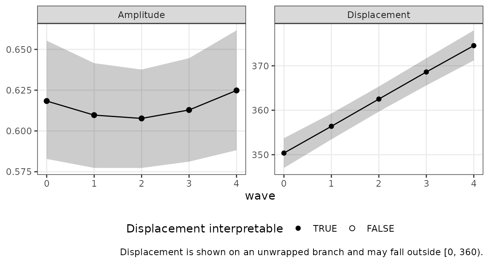
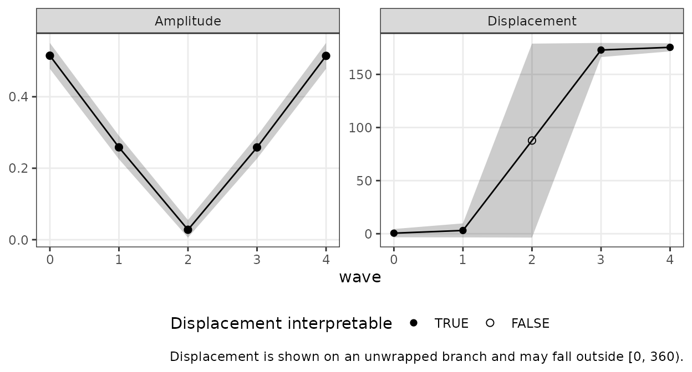

# Growth Models on SSM Parameters

``` r

library(circumplex)
```

## 1. The question growth modeling answers

A single Structural Summary Method (SSM) analysis describes one profile:
an elevation $`e`$, an amplitude $`a`$, and a displacement $`d`$. With
repeated measurements — the same persons assessed at several waves — a
new question opens up: *how does the profile change over time?* Does the
group’s interpersonal style drift toward warmth? Does its
distinctiveness (amplitude) grow or fade?

Displacement is an angle, and angles resist ordinary growth modeling: a
trajectory drifting from 350° to 10° has moved 20°, not −340°, and a
linear model fit directly to raw displacements will get this wrong
whenever a trajectory crosses the 0°/360° boundary. This vignette
presents the package’s recommended recipe, which avoids the boundary
entirely by modeling growth in the Cartesian coordinates $`(x, y)`$ —
the same coordinates the SSM estimator itself uses — and converting
fitted trajectories back to $`(a(t), d(t))`$ with circular-correct
summaries at the end.

The division of labor is deliberate and mirrors the package’s Bayesian
vignette: **circumplex does not fit mixed models**. It prepares the
coordinate data on the way in
([`ssm_parameters_id()`](http://circumplex.jmgirard.com/reference/ssm_parameters_id.md))
and converts fitted model draws on the way out
([`ssm_draws()`](http://circumplex.jmgirard.com/reference/ssm_draws.md));
the growth model itself belongs to a dedicated mixed-modeling package.
The reference recipe below uses **glmmTMB**; the same stacked-outcome
formulation can be fit with `nlme` (shipped with base R) using its
`varIdent`/`corSymm` machinery.

## 2. From repeated measures to a coordinate table

The input to the growth model is a person-by-wave table of SSM
coordinates.
[`ssm_parameters_id()`](http://circumplex.jmgirard.com/reference/ssm_parameters_id.md)
computes each person’s $`(e, x, y)`$ (and $`a`$, $`d`$, fit) from their
circumplex scale scores; applied per wave, it yields exactly the tidy
input a mixed model wants.

We simulate five waves of octant scores for 150 persons whose
group-level displacement drifts from 350° to 10° — deliberately crossing
the 0°/360° boundary — with amplitude near 0.6 throughout.

``` r

n <- 150
waves <- 0:4
theta <- as.numeric(octants()) * pi / 180

# Group trajectory: (x, y) linear between 0.6*(cos, sin)(350 deg) and
# 0.6*(cos, sin)(10 deg); elevation constant at 0.5
xy_start <- 0.6 * c(cos(350 * pi / 180), sin(350 * pi / 180))
xy_end <- 0.6 * c(cos(10 * pi / 180), sin(10 * pi / 180))
x_t <- seq(xy_start[1], xy_end[1], length.out = length(waves))
y_t <- seq(xy_start[2], xy_end[2], length.out = length(waves))

# Person effects: elevation shifts and profile tilts, stable across waves
u_e <- rnorm(n, 0, 0.30)
v_x <- rnorm(n, 0, 0.15)
v_y <- rnorm(n, 0, 0.15)

coord <- do.call(rbind, lapply(seq_along(waves), function(k) {
  mu <- 0.5 + (x_t[k] + v_x) %o% cos(theta) + (y_t[k] + v_y) %o% sin(theta)
  scores <- mu + u_e + matrix(rnorm(n * length(theta), 0, 0.40), n)
  colnames(scores) <- PANO()
  pp <- ssm_parameters_id(as.data.frame(scores), scales = PANO())
  data.frame(person = pp$id, wave = waves[k],
             e = pp$Elev, x = pp$Xval, y = pp$Yval)
}))
head(coord, 3)
#>   person wave         e         x          y
#> 1      1    0 0.4595363 0.5697631 -0.1920113
#> 2      2    0 0.8644617 0.9896316  0.2426116
#> 3      3    0 0.5354376 0.6640467 -0.2164674
```

## 3. One joint model, not three separate ones

The growth model treats the three coordinates as a *multivariate*
outcome: stack them into long format with an outcome indicator `dv`,
give each outcome its own intercept and slope, and let the person-level
random effects be **correlated across outcomes**.

``` r

long <- reshape(coord, direction = "long",
                varying = list(c("e", "x", "y")), v.names = "value",
                timevar = "dv", times = c("e", "x", "y"),
                idvar = c("person", "wave"))
long$dv <- factor(long$dv, levels = c("e", "x", "y"))
long$person <- factor(long$person)
```

``` r

fit <- glmmTMB::glmmTMB(
  value ~ 0 + dv + dv:wave + us(0 + dv | person),
  dispformula = ~ 0 + dv,
  data = long,
  REML = TRUE
)
glmmTMB::fixef(fit)$cond
#>           dve           dvx           dvy      dve:wave      dvx:wave 
#>  0.5249198595  0.6085429795 -0.1036244260 -0.0007414075 -0.0010567782 
#>      dvy:wave 
#>  0.0649480442
```

Why joint? The displacement $`d(t)`$ is derived from $`\hat{x}(t)`$ and
$`\hat{y}(t)`$*together*, so its uncertainty depends on their **joint**
sampling distribution — including the covariance
$`\mathrm{Cov}(\hat{x}(t), \hat{y}(t))`$. Fitting two (or three)
univariate mixed models instead is a tempting shortcut that produces
valid-looking output and **wrong $`d(t)`$ intervals**: separate fits
have independent covariance matrices, which silently sets
$`\mathrm{Cov}(\hat{x}(t), \hat{y}(t)) = 0`$. In our validation
simulations, a design with strongly correlated $`x`$–$`y`$ person
effects (a realistic situation — profile tilts are rarely axis-aligned)
drops the shortcut’s pointwise $`d(t)`$ coverage from the nominal 95% to
roughly 86%, while the joint recipe stays at nominal. Do not fit the
coordinates separately.

## 4. From fixed effects to $`(a(t), d(t))`$ with intervals

The fixed effects define the mean trajectory
$`(\hat{e}(t), \hat{x}(t), \hat{y}(t))`$. To carry uncertainty through
the nonlinear map to $`(a(t), d(t))`$, draw coefficient vectors from the
multivariate normal implied by the fixed-effect covariance matrix — the
same asymptotic move the package’s Monte Carlo engine makes — evaluate
each draw at each wave, and hand the per-wave draws to
[`ssm_draws()`](http://circumplex.jmgirard.com/reference/ssm_draws.md),
which applies the package’s circular-statistics machinery (medians and
circular means, equal-tailed intervals with correct wrapping at the
boundary).

``` r

fe <- glmmTMB::fixef(fit)$cond
V <- as.matrix(vcov(fit)$cond)

# MVN draws of the coefficient vector (eigen root, robust to tiny
# negative eigenvalues from floating point)
mvn_draw <- function(n_draws, mu, sigma) {
  eig <- eigen(sigma, symmetric = TRUE)
  root <- eig$vectors %*% (sqrt(pmax(eig$values, 0)) * t(eig$vectors))
  sweep(matrix(rnorm(n_draws * length(mu)), nrow = n_draws) %*% root,
        2, mu, "+")
}
B <- mvn_draw(4000, fe, V)
colnames(B) <- names(fe)

per_wave <- lapply(waves, function(t) {
  draws_t <- cbind(
    e = B[, "dve"] + t * B[, "dve:wave"],
    x = B[, "dvx"] + t * B[, "dvx:wave"],
    y = B[, "dvy"] + t * B[, "dvy:wave"]
  )
  ssm_draws(draws_t, type = "parameters")
})

trajectory <- data.frame(
  wave = waves,
  a_est = sapply(per_wave, function(s) s$results$a_est),
  a_lci = sapply(per_wave, function(s) s$results$a_lci),
  a_uci = sapply(per_wave, function(s) s$results$a_uci),
  d_est = sapply(per_wave, function(s) as.numeric(s$results$d_est)),
  d_lci = sapply(per_wave, function(s) as.numeric(s$results$d_lci)),
  d_uci = sapply(per_wave, function(s) as.numeric(s$results$d_uci)),
  certified = sapply(per_wave, function(s) s$details$certified)
)
round_df <- trajectory
round_df[-1] <- lapply(round_df[-1], function(v) {
  if (is.numeric(v)) round(v, 2) else v
})
round_df
#>   wave a_est a_lci a_uci  d_est  d_lci  d_uci certified
#> 1    0  0.62  0.58  0.66 350.37 347.01 353.71      TRUE
#> 2    1  0.61  0.58  0.64 356.39 353.44 359.27      TRUE
#> 3    2  0.61  0.58  0.64   2.51 359.69   5.34      TRUE
#> 4    3  0.61  0.58  0.64   8.61   5.58  11.69      TRUE
#> 5    4  0.62  0.59  0.66  14.53  11.21  17.97      TRUE
```

The displacement estimates hug the 0°/360° boundary by design — values
near 350° at early waves and near 10° at late waves — and the intervals
wrap correctly rather than spanning “the long way around.” A table in
this shape — one row per time point, with `a_est`/`a_lci`/`a_uci`,
`d_est`/`d_lci`/`d_uci`, and optionally `certified` — is what
[`ssm_plot_trajectory()`](http://circumplex.jmgirard.com/reference/ssm_plot_trajectory.md)
plots directly:

``` r

ssm_plot_trajectory(trajectory, time = "wave")
```



The displacement panel is drawn on an *unwrapped* branch, so the
trajectory crosses the boundary as one continuous path instead of
jumping a full turn, and values there may legitimately fall outside
$`[0°, 360°)`$. Each interval is placed on its estimate’s branch and
keeps the width it was reported with — including an interval that
straddles the seam, which is stored with `d_lci > d_uci`. Doing this by
hand is easy to get subtly wrong: the natural “shift each bound by its
signed distance from the estimate” recipe silently cannot represent an
interval wider than a half-turn, which is exactly the near-origin case
Section 5 is about. The function handles both.

## 5. Certification: when $`d(t)`$ intervals are not interpretable

A direction is only meaningful when the trajectory is far enough from
the origin. As $`a(t) \to 0`$ the draws of $`d(t)`$ become diffuse or
bimodal, and a quantile interval of them is not a trustworthy statement
about direction. At each wave,
[`ssm_draws()`](http://circumplex.jmgirard.com/reference/ssm_draws.md)
applies the package’s scale-free certification rule to the amplitude
interval (lower bound at least 0.35 interval-widths above zero) and
records the verdict in `$details$certified` — the `certified` column
above. **At any uncertified wave, the $`d(t)`$ interval is not
interpretable** and should be reported as such, not narrated as a
direction.

Every wave in our worked example is certified. Here is a trajectory
where that fails: the group crosses near the origin mid-study (its $`x`$
coordinate changes sign while $`y`$ stays near zero).

``` r

x_t2 <- seq(0.5, -0.5, length.out = length(waves))
coord2 <- do.call(rbind, lapply(seq_along(waves), function(k) {
  mu <- 0.5 + (x_t2[k] + v_x) %o% cos(theta) + (0.02 + v_y) %o% sin(theta)
  scores <- mu + u_e + matrix(rnorm(n * length(theta), 0, 0.40), n)
  colnames(scores) <- PANO()
  pp <- ssm_parameters_id(as.data.frame(scores), scales = PANO())
  data.frame(person = pp$id, wave = waves[k],
             e = pp$Elev, x = pp$Xval, y = pp$Yval)
}))
long2 <- reshape(coord2, direction = "long",
                 varying = list(c("e", "x", "y")), v.names = "value",
                 timevar = "dv", times = c("e", "x", "y"),
                 idvar = c("person", "wave"))
long2$dv <- factor(long2$dv, levels = c("e", "x", "y"))
long2$person <- factor(long2$person)
fit2 <- glmmTMB::glmmTMB(
  value ~ 0 + dv + dv:wave + us(0 + dv | person),
  dispformula = ~ 0 + dv, data = long2, REML = TRUE
)
fe2 <- glmmTMB::fixef(fit2)$cond
B2 <- mvn_draw(4000, fe2, as.matrix(vcov(fit2)$cond))
colnames(B2) <- names(fe2)
mid <- ssm_draws(cbind(
  e = B2[, "dve"] + 2 * B2[, "dve:wave"],
  x = B2[, "dvx"] + 2 * B2[, "dvx:wave"],
  y = B2[, "dvy"] + 2 * B2[, "dvy:wave"]
), type = "parameters")
mid
#> 
#> # Posterior Summary:
#> 
#>                Estimate   Lower CrI   Upper CrI
#> Elevation         0.516       0.468       0.565
#> X-Value           0.001      -0.030       0.031
#> Y-Value           0.023      -0.005       0.051
#> Amplitude         0.028       0.006       0.055
#> Displacement     87.741     356.372     178.957
#> Model Fit                                      
#>   Note: the amplitude CrI lower bound is under 0.35 CrI-widths above zero; the displacement is not interpretable.
```

The printed note is the certification rule firing: at this wave the
amplitude interval sits too close to zero, and the displacement interval
— here spanning more than half the circle — is not a statement about
direction. In our validation simulations of this regime, the caution
fires at the degraded wave in essentially every replicate while the
origin-distal waves remain certified and nominally covered.

Assembling this fit’s full trajectory the same way, and carrying the
`certified` verdict into the table, lets the plot mark the verdict
itself:

``` r

per_wave2 <- lapply(waves, function(t) {
  ssm_draws(cbind(
    e = B2[, "dve"] + t * B2[, "dve:wave"],
    x = B2[, "dvx"] + t * B2[, "dvx:wave"],
    y = B2[, "dvy"] + t * B2[, "dvy:wave"]
  ), type = "parameters")
})
trajectory2 <- data.frame(
  wave = waves,
  a_est = sapply(per_wave2, function(s) s$results$a_est),
  a_lci = sapply(per_wave2, function(s) s$results$a_lci),
  a_uci = sapply(per_wave2, function(s) s$results$a_uci),
  d_est = sapply(per_wave2, function(s) as.numeric(s$results$d_est)),
  d_lci = sapply(per_wave2, function(s) as.numeric(s$results$d_lci)),
  d_uci = sapply(per_wave2, function(s) as.numeric(s$results$d_uci)),
  certified = sapply(per_wave2, function(s) s$details$certified)
)
ssm_plot_trajectory(trajectory2, time = "wave")
```



Uncertified waves are drawn as **hollow** points on the displacement
panel. Read them as gaps in the argument, not as estimates with wide
intervals: the amplitude panel shows why, with the interval collapsing
toward zero as the group passes the origin. The displacement interval at
such a wave can cover most of the circle, and the panel draws it at that
full width rather than flattening it into something that looks precise.

The `certified` column is optional. A table without it plots the same
way, minus the hollow marking and its legend — the figure then makes no
claim about interpretability either way, which is the honest default
when the verdict was never computed.

## 6. A caution about REML intervals at small samples

The fixed-effect covariance matrix used for the draws conditions on the
estimated variance components: it ignores their uncertainty. At small
sample sizes this makes the resulting intervals anticonservative (too
narrow). This is a property of the mixed-model machinery, not of the SSM
transform, and the remedy is user-side: with modest N, prefer
degrees-of-freedom-adjusted inference — the Kenward–Roger adjustment for
`lme4` fits via **pbkrtest**, the approximate denominator degrees of
freedom `nlme` supplies, or $`t`$-quantile-based intervals — or a
parametric bootstrap of the fixed effects, over raw normal-approximation
draws.

## 7. The unwrap alternative: `angle_unwrap()`

There is a second documented recipe: compute each person’s displacement
at each wave, **unwrap** each person’s sequence onto a continuous
branch, and fit an ordinary univariate growth model to the unwrapped
angles.

``` r

# One person's displacement over five waves, drifting across the boundary
d_person <- c(350, 355, 2, 8, 12)
angle_unwrap(d_person)
#> [1] 350 355 362 368 372
```

[`angle_unwrap()`](http://circumplex.jmgirard.com/reference/angle_unwrap.md)
wraps its input into \[0°, 360°), then accumulates the shortest signed
rotation between successive waves (an exact 180° step ascends, by the
package’s half-turn convention; an `NA` makes every later wave
branch-ambiguous, so `NA` propagates onward). The unwrapped values live
on an ordinary line, so any univariate mixed model applies — this
framing models the *mean of the person-level directions*, which is a
legitimate (and different) estimand from the direction of the mean
trajectory in Section 4.

Its failure modes are sharp, though, and they are the reason the
$`(x, y)`$ recipe is the reference:

- **Fast movement between waves.** Unwrapping assumes successive waves
  move less than a half-turn. A trajectory sampled too sparsely (or a
  person who genuinely swings more than 180° between waves) is unwrapped
  onto the wrong branch with no warning — near-180° jumps are resolved
  by convention, not by information the data contain.
- **No common branch across persons.** When persons occupy genuinely
  heterogeneous locations around the circle (e.g., half the sample near
  90°, half near 270°), their unwrapped branches are not comparable, and
  the fixed-effect “mean trajectory” averages numbers that do not share
  a scale. The $`(x, y)`$ framing has no such requirement.
- **Low amplitude.** A person’s observed displacement at a wave where
  their amplitude is near zero is mostly noise, and one noisy wave can
  throw the rest of that person’s sequence onto a wrong branch (the same
  reason the Section 5 certification exists).

In the concentrated, common-branch regime — everyone well away from the
origin, trajectories moving slowly, directions clustered — the two
recipes agree closely (our validation simulations find mean trajectory
differences well under a degree), so the choice matters exactly when the
unwrap recipe’s assumptions are in doubt.

## 8. Caveats and upgrades

Two statistical facts about the $`(x, y)`$ recipe deserve explicit
statement:

- **The derived $`d(t)`$ is the direction of the mean trajectory, not
  the mean of the person-level directions.** These differ whenever
  persons disperse directionally; neither is wrong, but they answer
  different questions, and Section 7’s unwrap recipe targets the latter.
- **The derived $`a(t)`$ shrinks toward zero under directional
  dispersion.** The amplitude of an average profile is smaller than the
  average of individual amplitudes whenever persons point in different
  directions — the standard SSM aggregation fact, inherited intact by
  the growth setting.

Finally, the MVN-draw propagation used here is a large-sample
approximation that is defensible in the concentrated regime and guarded
by the Section 5 certification elsewhere. The fully model-based upgrade
is **projected-normal regression** — e.g., the **bpnreg** package —
which models circular outcomes directly with person-level structure and
gives exact posterior inference for $`d(t)`$; circumplex does not wrap
it, but
[`ssm_draws()`](http://circumplex.jmgirard.com/reference/ssm_draws.md)
will happily summarize posterior draws produced by any such model.

## References

- Girard, J. M., Zimmermann, J., & Wright, A. G. C. (2018). New tools
  for circumplex data analysis and visualization in R. *Assessment,
  25*(1), 3–20.
- Zimmermann, J., & Wright, A. G. C. (2017). Beyond description in
  interpersonal construct validation: Methodological advances in the
  circumplex Structural Summary Approach. *Assessment, 24*(1), 3–23.
- Cremers, J., & Klugkist, I. (2018). One direction? A tutorial for
  circular data analysis using R with examples in cognitive psychology.
  *Frontiers in Psychology, 9*, 2040.
