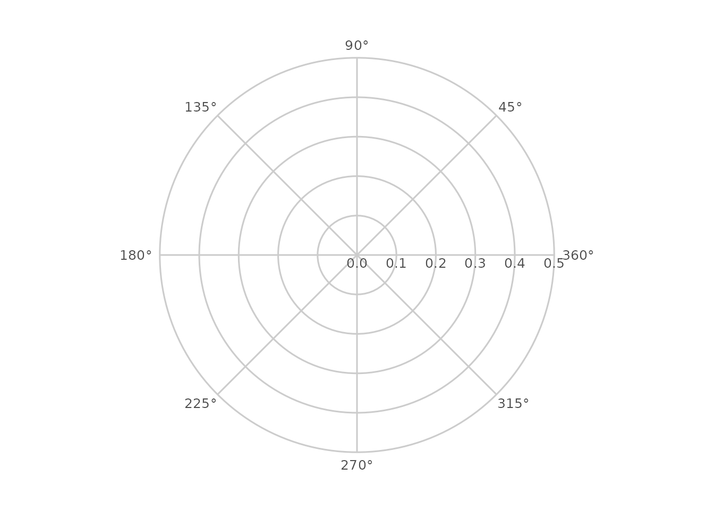
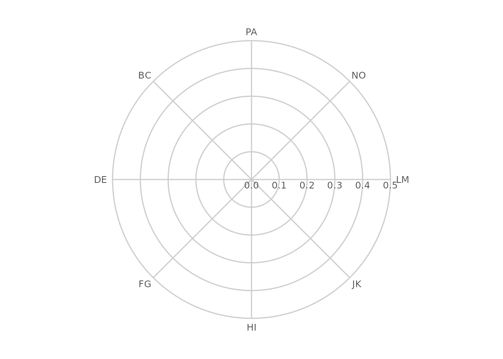
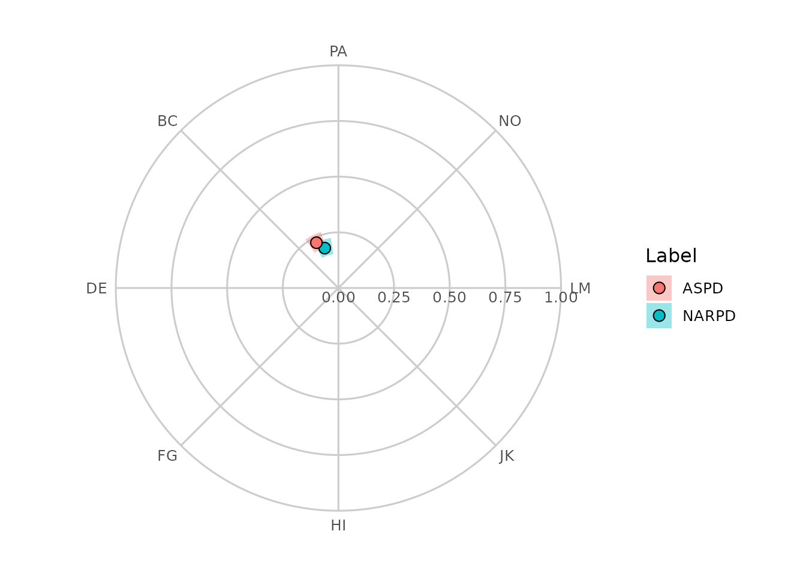
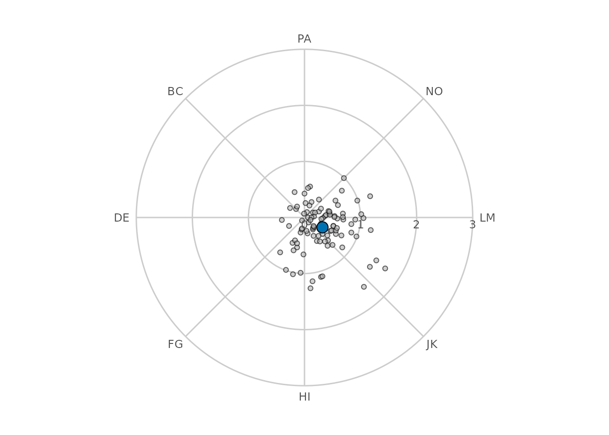
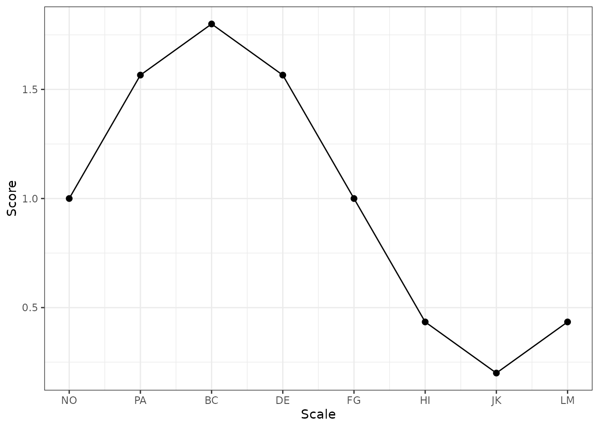

# Advanced Circumplex Visualization

``` r

library(circumplex)
```

## Beyond the built-in plots

The
[`ssm_plot_circle()`](http://circumplex.jmgirard.com/dev/reference/ssm_plot_circle.md),
[`ssm_plot_curve()`](http://circumplex.jmgirard.com/dev/reference/ssm_plot_curve.md),
and
[`ssm_plot_contrast()`](http://circumplex.jmgirard.com/dev/reference/ssm_plot_contrast.md)
functions cover the most common circumplex figures, but they each
produce a finished plot with a fixed set of layers. Sometimes you want
more control: to overlay individual respondents on a group profile, to
annotate a specific region of the circle, to restyle the points, or to
place several circumplex panels side by side.

To make that possible, `circumplex` exposes the building blocks that the
built-in plots are themselves made of. These are ordinary
[`ggplot2`](https://ggplot2.tidyverse.org/) components, so you compose
them with `+` and combine them freely with any other `ggplot2` layers,
scales, and themes:

- [`ggcircumplex()`](http://circumplex.jmgirard.com/dev/reference/ggcircumplex.md)
  draws the empty circular **canvas** (amplitude rings, displacement
  spokes, and scale labels).
- [`geom_ssm_point()`](http://circumplex.jmgirard.com/dev/reference/geom_ssm_point.md)
  and
  [`geom_ssm_arc()`](http://circumplex.jmgirard.com/dev/reference/geom_ssm_arc.md)
  are polar-native **layers** that place profile points and their
  confidence regions in the circle, taking amplitude and displacement
  directly as aesthetics.
- [`scale_x_circumplex()`](http://circumplex.jmgirard.com/dev/reference/scale_x_circumplex.md)
  is a **scale** for the angle axis of linear circumplex plots (such as
  the score-by-angle curve).

This vignette works through each of these and then combines them.

## The circular canvas

[`ggcircumplex()`](http://circumplex.jmgirard.com/dev/reference/ggcircumplex.md)
returns a `ggplot2` object containing just the circular backdrop, with
no data drawn on it yet. By default it uses octant scales labeled by
their angular position in degrees:

``` r

ggcircumplex()
```



You can label the scales however you like. Passing a character vector
labels the spokes in the order of the angles:

``` r

ggcircumplex(octants(), labels = PANO())
```



If you are working with one of the instruments bundled with the package,
you can pass it directly and the scale angles and abbreviations are
taken from the instrument:

``` r

ggcircumplex(instrument = csip)
```


The `amax` argument sets the amplitude represented by the outer ring; it
also determines the amplitude gridline labels. It matters because it is
the shared reference that the data layers below must agree with, as we
will see next.

## Placing SSM results in the circle

Let’s estimate a Structural Summary Method (SSM) profile for two
measures and draw it on the canvas ourselves, rather than calling
[`ssm_plot_circle()`](http://circumplex.jmgirard.com/dev/reference/ssm_plot_circle.md).

``` r

results <- ssm_analyze(
  jz2017,
  scales = PANO(),
  measures = c("NARPD", "ASPD")
)
results$results[, c("Label", "a_est", "d_est", "a_lci", "a_uci")]
#>   Label    a_est    d_est     a_lci     a_uci
#> 1 NARPD 0.189244 108.9667 0.1537900 0.2271848
#> 2  ASPD 0.226159 115.9267 0.1905403 0.2640428
```

[`geom_ssm_point()`](http://circumplex.jmgirard.com/dev/reference/geom_ssm_point.md)
places a point for each profile at its amplitude (`a_est`) and
displacement (`d_est`), and
[`geom_ssm_arc()`](http://circumplex.jmgirard.com/dev/reference/geom_ssm_arc.md)
draws the wedge spanning each profile’s amplitude confidence interval
radially and its displacement confidence interval angularly. Both take
the SSM parameters directly as aesthetics and handle the conversion into
circular coordinates internally, including wrap-around when a
displacement interval crosses the 0/360 degree boundary.

The one rule to remember is that **`amax` must be the same** for the
canvas and for every data layer, so that amplitudes map onto the same
radius. Here we set it once and reuse it:

``` r

amax <- 1

ggcircumplex(octants(), labels = PANO(), amax = amax) +
  geom_ssm_arc(
    data = results$results,
    mapping = aes(
      amplitude_min = a_lci, amplitude_max = a_uci,
      displacement_min = d_lci, displacement_max = d_uci,
      fill = Label
    ),
    amax = amax, alpha = 0.4, color = NA
  ) +
  geom_ssm_point(
    data = results$results,
    mapping = aes(amplitude = a_est, displacement = d_est, fill = Label),
    amax = amax
  )
#> ! The `amax` argument of `geom_ssm_arc()` is deprecated and ignored.
#> ℹ Amplitude scaling is now owned by `coord_circumplex()`; set `amax` there (or via `ggcircumplex(amax = )`).
#> ! The `amax` argument of `geom_ssm_point()` is deprecated and ignored.
#> ℹ Amplitude scaling is now owned by `coord_circumplex()`; set `amax` there (or via `ggcircumplex(amax = )`).
#> This message is displayed once per session.
```



Each arc displays two separate confidence intervals for one profile at
once: its radial extent is the amplitude interval and its angular extent
is the displacement interval. It is a convenient way to show both
intervals together, not a single joint confidence region with its own
coverage level, and not a hypothesis test. The angular extent in
particular is a range of plausible *directions*: because zero degrees is
an arbitrary reference direction rather than a null value, it should not
be read as a significance test the way a confidence interval for a
linear parameter (such as elevation) can be. Displacement is only worth
interpreting at all when the amplitude interval is clearly above zero
and the model fits reasonably well (see the “Introduction to SSM
Analysis” vignette and
[`?ssm_analyze`](http://circumplex.jmgirard.com/dev/reference/ssm_analyze.md)).

## Composing custom layers

Because the canvas and geoms are ordinary `ggplot2` objects, you can add
anything else to them. A common request is to show where individual
respondents fall relative to a summary. We can compute each person’s own
amplitude and displacement with
[`ssm_score()`](http://circumplex.jmgirard.com/dev/reference/ssm_score.md)
and draw them as a faint cloud behind a group-level point.

``` r

# Per-person SSM parameters for a subset of the sample. A respondent whose
# scores are flat has no displacement and is returned as NA (with a warning),
# so we keep only the well-defined profiles.
people <- ssm_score(
  jz2017[1:100, ],
  scales = PANO(),
  append = FALSE
)
people <- people[!is.na(people$Disp), ]

# Group-level profile for the same subset
group <- ssm_analyze(jz2017[1:100, ], scales = PANO())

amax <- 3

ggcircumplex(octants(), labels = PANO(), amax = amax) +
  geom_ssm_point(
    data = people,
    mapping = aes(amplitude = Ampl, displacement = Disp),
    amax = amax, fill = "grey70", size = 1.5, alpha = 0.6
  ) +
  geom_ssm_point(
    data = group$results,
    mapping = aes(amplitude = a_est, displacement = d_est),
    amax = amax, fill = "#0072B2", size = 4
  )
```



The individual points spread around the circle while the group summary
sits near their center of mass, a picture that none of the built-in
functions produce directly. Any other `ggplot2` layer — text
annotations, additional geoms, faceting — can be added the same way.

## The angle axis for linear plots

Not every circumplex figure is circular. The score-by-angle curve drawn
by
[`ssm_plot_curve()`](http://circumplex.jmgirard.com/dev/reference/ssm_plot_curve.md)
is a linear plot whose x-axis runs through the scale angles.
[`scale_x_circumplex()`](http://circumplex.jmgirard.com/dev/reference/scale_x_circumplex.md)
labels that axis consistently with the circular canvas: by default with
the angle in degrees, or with custom labels or an instrument’s
abbreviations.

``` r

angles <- octants()
curve <- data.frame(
  angle = angles,
  score = 1 + 0.8 * cos((angles - 135) * pi / 180)
)

ggplot(curve, aes(x = angle, y = score)) +
  geom_line() +
  geom_point(size = 2) +
  scale_x_circumplex(angles, labels = PANO()) +
  labs(x = "Scale", y = "Score") +
  theme_bw()
```



Passing the same `labels` (or the same `instrument`) to both
[`ggcircumplex()`](http://circumplex.jmgirard.com/dev/reference/ggcircumplex.md)
and
[`scale_x_circumplex()`](http://circumplex.jmgirard.com/dev/reference/scale_x_circumplex.md)
guarantees that a circular figure and a linear one label their scales
identically.

## Relationship to the built-in plots

The built-in plotting functions are implemented on exactly these
components:
[`ssm_plot_circle()`](http://circumplex.jmgirard.com/dev/reference/ssm_plot_circle.md)
is
[`ggcircumplex()`](http://circumplex.jmgirard.com/dev/reference/ggcircumplex.md)
plus
[`geom_ssm_arc()`](http://circumplex.jmgirard.com/dev/reference/geom_ssm_arc.md)
and
[`geom_ssm_point()`](http://circumplex.jmgirard.com/dev/reference/geom_ssm_point.md),
and
[`ssm_plot_curve()`](http://circumplex.jmgirard.com/dev/reference/ssm_plot_curve.md)
uses
[`scale_x_circumplex()`](http://circumplex.jmgirard.com/dev/reference/scale_x_circumplex.md)
for its angle axis. So you can always start from a built-in plot and add
to it, or rebuild it from the pieces when you need finer control.
Whichever route you take, the coordinates are computed the same way, so
the results line up.

## References

- Gurtman, M. B. (1992). Construct validity of interpersonal personality
  measures: The interpersonal circumplex as a nomological net. *Journal
  of Personality and Social Psychology, 63*(1), 105–118.

- Wright, A. G. C., Pincus, A. L., Conroy, D. E., & Hilsenroth, M. J.
  (2009). Integrating methods to optimize circumplex description and
  comparison of groups. *Journal of Personality Assessment, 91*(4),
  311–322.

- Zimmermann, J., & Wright, A. G. C. (2017). Beyond description in
  interpersonal construct validation: Methodological advances in the
  circumplex Structural Summary Approach. *Assessment, 24*(1), 3–23.
