# Intermediate SSM Analysis

``` r

library(circumplex)
```

## 1. Generalizing the basic analyses

### Generalizing to multiple means

We’ve already seen how adding the `measures` argument can change
[`ssm_analyze()`](http://circumplex.jmgirard.com/dev/reference/ssm_analyze.md)
from analyzing means to analyzing correlations. Similarly, we can change
it from analyzing all observations as a single group to analyzing
subgroups separately. This is done using the `grouping` argument. This
argument needs to contain a single variable (name or column number) that
specifies each observation’s group. For instance, the `Gender` variable
in the `jz2017` dataset is a factor with two levels: Female and Male. To
analyze each gender separately, we need to add the `grouping = "Gender"`
argument to the function call.

``` r

data("jz2017")
results <- ssm_analyze(
  data = jz2017, 
  scales = PANO(), 
  angles = octants(), 
  grouping = "Gender"
)
summary(results)
#> 
#> Statistical Basis:    Mean Scores 
#> Bootstrap Resamples:  2000 
#> Confidence Level:     0.95 
#> Listwise Deletion:    TRUE 
#> Scale Displacements:  90 135 180 225 270 315 360 45 
#> 
#> 
#> # Profile [Female]:
#> 
#>                Estimate   Lower CI   Upper CI
#> Elevation         0.946      0.907      0.984
#> X-Value           0.459      0.422      0.498
#> Y-Value          -0.310     -0.357     -0.266
#> Amplitude         0.554      0.511      0.600
#> Displacement    325.963    321.834    329.805
#> Model Fit         0.889                      
#> 
#> 
#> # Profile [Male]:
#> 
#>                Estimate   Lower CI   Upper CI
#> Elevation         0.884      0.839      0.928
#> X-Value           0.227      0.191      0.262
#> Y-Value          -0.186     -0.225     -0.147
#> Amplitude         0.294      0.256      0.330
#> Displacement    320.685    313.386    327.985
#> Model Fit         0.824
```

Note that the output of
[`summary()`](https://rdrr.io/r/base/summary.html) looks the same as
previous mean-based analyses except that there are now two Profile
blocks: one for Female and one for Male. A similar modification will
occur if we generate a table and figure.

``` r

ssm_table(results)
```

| Profile | Elevation | X.Value | Y.Value | Amplitude | Displacement | Fit |
|:---|:---|:---|:---|:---|:---|:---|
| Female | 0.95 (0.91, 0.98) | 0.46 (0.42, 0.50) | -0.31 (-0.36, -0.27) | 0.55 (0.51, 0.60) | 326.0 (321.8, 329.8) | 0.889 |
| Male | 0.88 (0.84, 0.93) | 0.23 (0.19, 0.26) | -0.19 (-0.23, -0.15) | 0.29 (0.26, 0.33) | 320.7 (313.4, 328.0) | 0.824 |

Mean-based Structural Summary Statistics with 95% CIs {.table .table
style="font-size: 12px; margin-left: auto; margin-right: auto;"}

``` r

ssm_plot_circle(results)
```

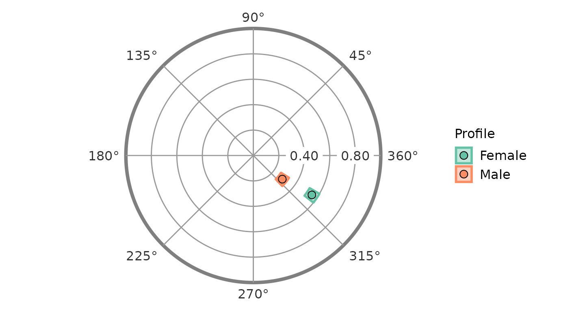

``` r

ssm_plot_curve(results)
```

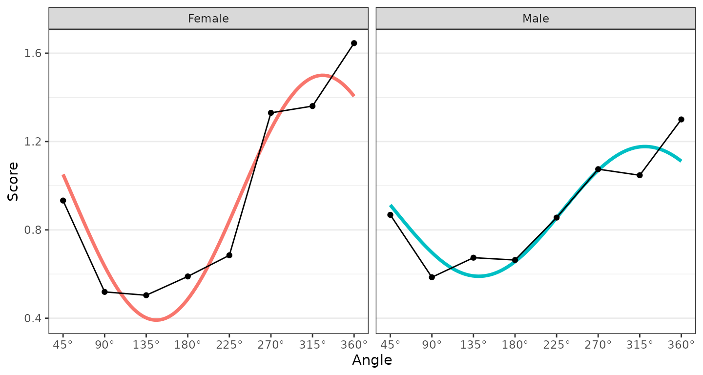

Any number of groups can be analyzed in this way, and the output will
contain additional profile blocks, the table will contain additional
rows, and the figures will contain additional points or curves. The
grouping variable just needs to contain more than one level (i.e.,
unique value).

### Generalizing to multiple measures

Similarly, we can analyze multiple external measures in a single
function call by providing a vector of variables to the `measures`
argument instead of a single variable. This can be done by wrapping the
variable names or column numbers with the
[`c()`](https://rdrr.io/r/base/c.html) or, if they are adjacent columns,
with the column numbers and the `:` shortcut. The package functions were
written to analyze all measures and groups within a single
bootstrapping, so adding additional measures and groups should still be
fast.

``` r

results2 <- ssm_analyze(
  data = jz2017, 
  scales = PANO(), 
  angles = octants(),
  measures = c("NARPD", "ASPD")
)
summary(results2)
#> 
#> Statistical Basis:    Correlation Scores 
#> Bootstrap Resamples:  2000 
#> Confidence Level:     0.95 
#> Listwise Deletion:    TRUE 
#> Scale Displacements:  90 135 180 225 270 315 360 45 
#> 
#> 
#> # Profile [NARPD]:
#> 
#>                Estimate   Lower CI   Upper CI
#> Elevation         0.202      0.168      0.236
#> X-Value          -0.062     -0.095     -0.026
#> Y-Value           0.179      0.145      0.214
#> Amplitude         0.189      0.155      0.225
#> Displacement    108.967     98.853    118.517
#> Model Fit         0.957                      
#> 
#> 
#> # Profile [ASPD]:
#> 
#>                Estimate   Lower CI   Upper CI
#> Elevation         0.124      0.090      0.157
#> X-Value          -0.099     -0.134     -0.063
#> Y-Value           0.203      0.168      0.240
#> Amplitude         0.226      0.188      0.265
#> Displacement    115.927    107.250    124.516
#> Model Fit         0.964
```

``` r

ssm_table(results2)
```

| Profile | Elevation | X.Value | Y.Value | Amplitude | Displacement | Fit |
|:---|:---|:---|:---|:---|:---|:---|
| NARPD | 0.20 (0.17, 0.24) | -0.06 (-0.09, -0.03) | 0.18 (0.14, 0.21) | 0.19 (0.15, 0.22) | 109.0 (98.9, 118.5) | 0.957 |
| ASPD | 0.12 (0.09, 0.16) | -0.10 (-0.13, -0.06) | 0.20 (0.17, 0.24) | 0.23 (0.19, 0.27) | 115.9 (107.2, 124.5) | 0.964 |

Correlation-based Structural Summary Statistics with 95% CIs {.table
.table style="font-size: 12px; margin-left: auto; margin-right: auto;"}

``` r

ssm_plot_circle(results2)
```

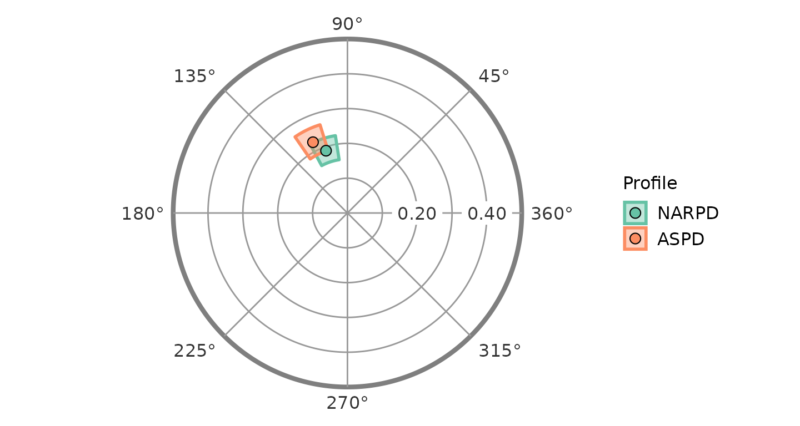

``` r

ssm_plot_curve(results2)
```

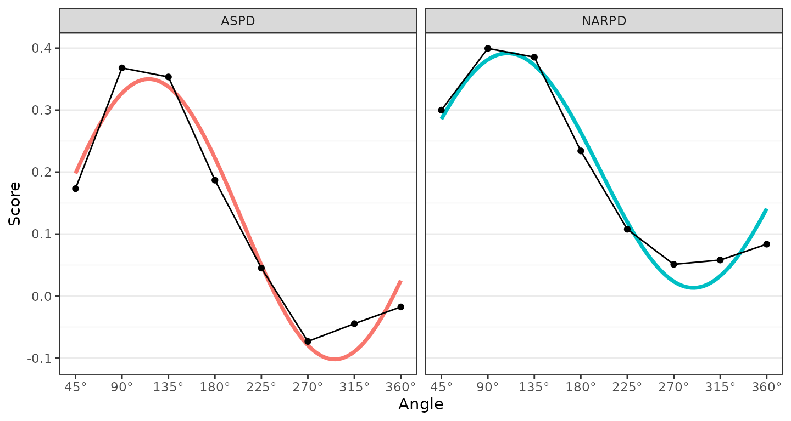

### Generalizing to multiple groups and multiple measures

Finally, it is possible to analyze multiple measures within multiple
groups. As you might expect, this requires providing both the `measures`
and `grouping` arguments to the same function call. Again, any number of
measures and groups is possible. The profiles in such an analysis will
be named “Measure: Group” as below.

``` r

results3 <- ssm_analyze(
  data = jz2017, 
  scales = PANO(), 
  angles = octants(), 
  grouping = "Gender", 
  measures = 10:12)
summary(results3)
#> 
#> Statistical Basis:    Correlation Scores 
#> Bootstrap Resamples:  2000 
#> Confidence Level:     0.95 
#> Listwise Deletion:    TRUE 
#> Scale Displacements:  90 135 180 225 270 315 360 45 
#> 
#> 
#> # Profile [PARPD: Female]:
#> 
#>                Estimate   Lower CI   Upper CI
#> Elevation         0.262      0.220      0.305
#> X-Value          -0.146     -0.192     -0.100
#> Y-Value           0.120      0.070      0.171
#> Amplitude         0.189      0.137      0.243
#> Displacement    140.524    126.580    155.129
#> Model Fit         0.870                      
#> 
#> 
#> # Profile [SCZPD: Female]:
#> 
#>                Estimate   Lower CI   Upper CI
#> Elevation         0.177      0.130      0.218
#> X-Value          -0.230     -0.285     -0.173
#> Y-Value          -0.047     -0.103      0.006
#> Amplitude         0.235      0.185      0.288
#> Displacement    191.613    178.684    208.113
#> Model Fit         0.845                      
#> 
#> 
#> # Profile [SZTPD: Female]:
#> 
#>                Estimate   Lower CI   Upper CI
#> Elevation         0.237      0.194      0.280
#> X-Value          -0.130     -0.175     -0.087
#> Y-Value           0.016     -0.037      0.069
#> Amplitude         0.131      0.090      0.180
#> Displacement    172.870    151.247    198.040
#> Model Fit         0.812                      
#> 
#> 
#> # Profile [PARPD: Male]:
#> 
#>                Estimate   Lower CI   Upper CI
#> Elevation         0.243      0.193      0.288
#> X-Value          -0.035     -0.080      0.015
#> Y-Value           0.114      0.066      0.165
#> Amplitude         0.120      0.075      0.171
#> Displacement    106.881     82.677    129.996
#> Model Fit         0.648                      
#>   Note: model fit is inadequate (R² < .70); interpret only the elevation parameter.
#> 
#> 
#> # Profile [SCZPD: Male]:
#> 
#>                Estimate   Lower CI   Upper CI
#> Elevation         0.204      0.145      0.260
#> X-Value          -0.178     -0.220     -0.136
#> Y-Value          -0.017     -0.071      0.039
#> Amplitude         0.179      0.139      0.222
#> Displacement    185.351    167.551    203.091
#> Model Fit         0.917                      
#> 
#> 
#> # Profile [SZTPD: Male]:
#> 
#>                Estimate   Lower CI   Upper CI
#> Elevation         0.240      0.186      0.293
#> X-Value          -0.037     -0.084      0.011
#> Y-Value           0.029     -0.018      0.079
#> Amplitude         0.047      0.013      0.101
#> Displacement    142.345     68.178    218.702
#> Model Fit         0.424                      
#>   Note: model fit is inadequate (R² < .70); interpret only the elevation parameter.
#>   Note: the amplitude CI lower bound is under 0.35 CI-widths above zero; the displacement is not interpretable.
```

``` r

ssm_table(results3)
```

| Profile | Elevation | X.Value | Y.Value | Amplitude | Displacement | Fit |
|:---|:---|:---|:---|:---|:---|:---|
| PARPD: Female | 0.26 (0.22, 0.30) | -0.15 (-0.19, -0.10) | 0.12 (0.07, 0.17) | 0.19 (0.14, 0.24) | 140.5 (126.6, 155.1) | 0.870 |
| SCZPD: Female | 0.18 (0.13, 0.22) | -0.23 (-0.29, -0.17) | -0.05 (-0.10, 0.01) | 0.23 (0.19, 0.29) | 191.6 (178.7, 208.1) | 0.845 |
| SZTPD: Female | 0.24 (0.19, 0.28) | -0.13 (-0.18, -0.09) | 0.02 (-0.04, 0.07) | 0.13 (0.09, 0.18) | 172.9 (151.2, 198.0) | 0.812 |
| PARPD: Male | 0.24 (0.19, 0.29) | -0.03 (-0.08, 0.01) | 0.11 (0.07, 0.17) | 0.12 (0.07, 0.17) | 106.9 (82.7, 130.0) | 0.648 |
| SCZPD: Male | 0.20 (0.15, 0.26) | -0.18 (-0.22, -0.14) | -0.02 (-0.07, 0.04) | 0.18 (0.14, 0.22) | 185.4 (167.6, 203.1) | 0.917 |
| SZTPD: Male | 0.24 (0.19, 0.29) | -0.04 (-0.08, 0.01) | 0.03 (-0.02, 0.08) | 0.05 (0.01, 0.10) | 142.3 (68.2, 218.7) | 0.424 |

Correlation-based Structural Summary Statistics with 95% CIs {.table
.table style="font-size: 12px; margin-left: auto; margin-right: auto;"}

``` r

ssm_plot_circle(results3)
```

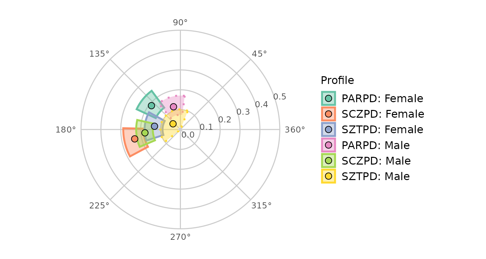

Note that the borders for the “PARPD: Male” and “SZTPD: Male” blocks are
dashed instead of solid. This indicates that these profiles have low fit
(i.e., $`R^2<.7`$). We could alternatively hide these such profiles by
adding `drop_lowfit = TRUE` as below (noting that the color guide may
change as profiles are dropped).

``` r

ssm_plot_circle(results3, drop_lowfit = TRUE)
```

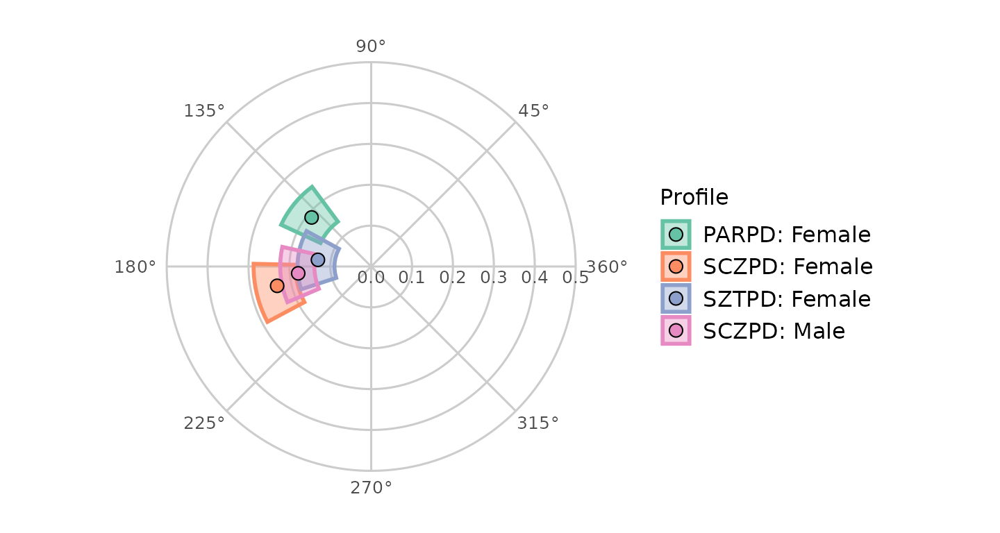

``` r

ssm_plot_curve(results3)
```

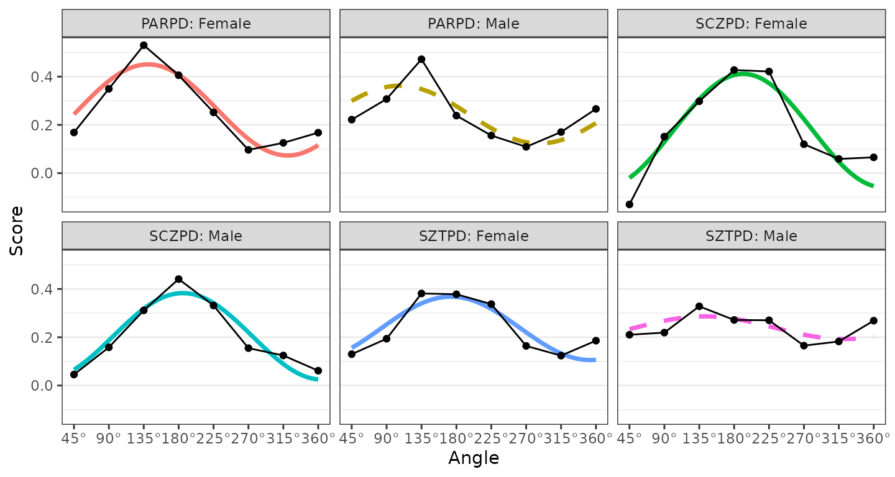

``` r

ssm_plot_curve(results3, drop_lowfit = TRUE)
```

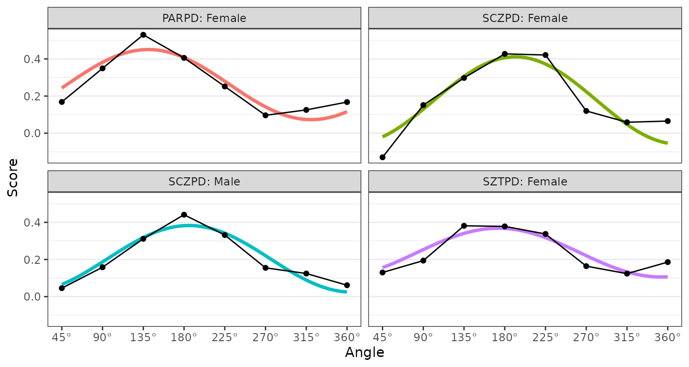

## 2. Contrast analyses

The final argument to master in this vignette is `contrast`, which
allows us to compare two groups or measures. Setting this argument to
TRUE will first generate scores for each group (or measure), then
estimate SSM parameters for these scores, and finally calculate the
difference between the parameters. To keep the code simpler and to
discourage “fishing expeditions,” only two groups or measures can be
compared at a time.

### Contrasts between groups’ means

To compare the mean profiles for females and males, we can start with
the same syntax we had before and then add a `contrast` argument.

``` r

results4 <- ssm_analyze(
  data = jz2017, 
  scales = PANO(), 
  angles = octants(), 
  grouping = "Gender", 
  contrast = TRUE
)
summary(results4)
#> 
#> Statistical Basis:    Mean Scores 
#> Bootstrap Resamples:  2000 
#> Confidence Level:     0.95 
#> Listwise Deletion:    TRUE 
#> Scale Displacements:  90 135 180 225 270 315 360 45 
#> 
#> 
#> # Profile [Female]:
#> 
#>                Estimate   Lower CI   Upper CI
#> Elevation         0.946      0.908      0.984
#> X-Value           0.459      0.419      0.498
#> Y-Value          -0.310     -0.353     -0.269
#> Amplitude         0.554      0.510      0.599
#> Displacement    325.963    322.251    329.698
#> Model Fit         0.889                      
#> 
#> 
#> # Profile [Male]:
#> 
#>                Estimate   Lower CI   Upper CI
#> Elevation         0.884      0.841      0.925
#> X-Value           0.227      0.191      0.261
#> Y-Value          -0.186     -0.225     -0.148
#> Amplitude         0.294      0.256      0.331
#> Displacement    320.685    313.293    327.938
#> Model Fit         0.824                      
#> 
#> 
#> # Contrast [Male - Female]:
#> 
#>                  Estimate   Lower CI   Upper CI
#> Δ Elevation        -0.062     -0.119     -0.004
#> Δ X-Value          -0.232     -0.285     -0.181
#> Δ Y-Value           0.124      0.066      0.183
#> Δ Amplitude        -0.261     -0.318     -0.203
#> Δ Displacement     -5.278    -13.627      2.178
#> Δ Model Fit        -0.066
```

Note that we have the profile blocks for each group as well as a
contrast block. The contrast is made by subtracting the first level of
the grouping variable from the second level (e.g., Male - Female). This
provides an indication of the direction of the contrast. We can again
generate a table and figure to display the results.

``` r

ssm_table(results4)
```

| Contrast | Elevation | X.Value | Y.Value | Amplitude | Displacement | Fit |
|:---|:---|:---|:---|:---|:---|:---|
| Female | 0.95 (0.91, 0.98) | 0.46 (0.42, 0.50) | -0.31 (-0.35, -0.27) | 0.55 (0.51, 0.60) | 326.0 (322.3, 329.7) | 0.889 |
| Male | 0.88 (0.84, 0.93) | 0.23 (0.19, 0.26) | -0.19 (-0.22, -0.15) | 0.29 (0.26, 0.33) | 320.7 (313.3, 327.9) | 0.824 |
| Male - Female | -0.06 (-0.12, -0.00) | -0.23 (-0.29, -0.18) | 0.12 (0.07, 0.18) | -0.26 (-0.32, -0.20) | -5.3 (-13.6, 2.2) | -0.066 |

Mean-based Structural Summary Statistic Contrasts with 95% CIs {.table
.table style="font-size: 12px; margin-left: auto; margin-right: auto;"}

``` r

ssm_plot_contrast(results4)
```

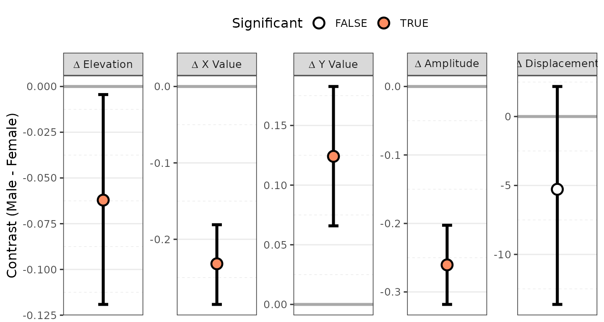

### Contrasts between measures in a group

Comparing measures in a group is very similar. Again, all we need to do
is add the `contrast` argument to the function call containing
`measures`. Here we will use a parameter contrast to see what they look
like.

``` r

results5 <- ssm_analyze(
  data = jz2017, 
  scales = PANO(), 
  angles = octants(), 
  measures = c("NARPD", "ASPD"),
  contrast = TRUE
)
summary(results5)
#> 
#> Statistical Basis:    Correlation Scores 
#> Bootstrap Resamples:  2000 
#> Confidence Level:     0.95 
#> Listwise Deletion:    TRUE 
#> Scale Displacements:  90 135 180 225 270 315 360 45 
#> 
#> 
#> # Profile [NARPD]:
#> 
#>                Estimate   Lower CI   Upper CI
#> Elevation         0.202      0.169      0.233
#> X-Value          -0.062     -0.097     -0.029
#> Y-Value           0.179      0.144      0.212
#> Amplitude         0.189      0.154      0.226
#> Displacement    108.967     99.122    118.902
#> Model Fit         0.957                      
#> 
#> 
#> # Profile [ASPD]:
#> 
#>                Estimate   Lower CI   Upper CI
#> Elevation         0.124      0.091      0.159
#> X-Value          -0.099     -0.135     -0.065
#> Y-Value           0.203      0.166      0.237
#> Amplitude         0.226      0.190      0.265
#> Displacement    115.927    107.571    124.311
#> Model Fit         0.964                      
#> 
#> 
#> # Contrast [ASPD - NARPD]:
#> 
#>                  Estimate   Lower CI   Upper CI
#> Δ Elevation        -0.079     -0.114     -0.043
#> Δ X-Value          -0.037     -0.074      0.002
#> Δ Y-Value           0.024     -0.014      0.061
#> Δ Amplitude         0.037     -0.002      0.075
#> Δ Displacement      6.960     -3.391     17.383
#> Δ Model Fit         0.007
```

``` r

ssm_table(results5)
```

| Contrast | Elevation | X.Value | Y.Value | Amplitude | Displacement | Fit |
|:---|:---|:---|:---|:---|:---|:---|
| NARPD | 0.20 (0.17, 0.23) | -0.06 (-0.10, -0.03) | 0.18 (0.14, 0.21) | 0.19 (0.15, 0.23) | 109.0 (99.1, 118.9) | 0.957 |
| ASPD | 0.12 (0.09, 0.16) | -0.10 (-0.13, -0.06) | 0.20 (0.17, 0.24) | 0.23 (0.19, 0.26) | 115.9 (107.6, 124.3) | 0.964 |
| ASPD - NARPD | -0.08 (-0.11, -0.04) | -0.04 (-0.07, 0.00) | 0.02 (-0.01, 0.06) | 0.04 (-0.00, 0.08) | 7.0 (-3.4, 17.4) | 0.007 |

Correlation-based Structural Summary Statistic Contrasts with 95% CIs
{.table .table
style="font-size: 12px; margin-left: auto; margin-right: auto;"}

``` r

ssm_plot_contrast(results5)
```

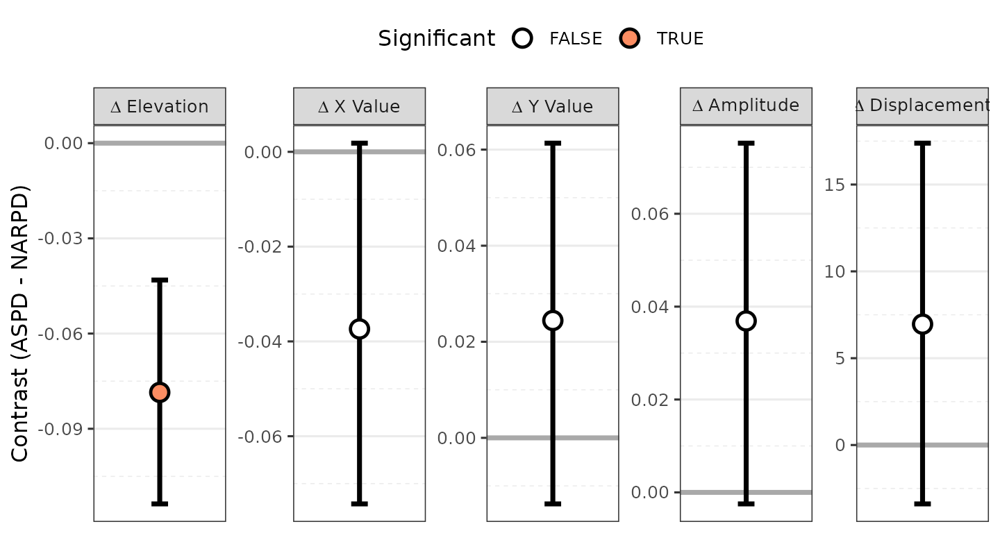

Here, instead of a circle plot, we see a contrast plot showing the
difference between the two measures’ SSM parameters and their 95%
confidence intervals. Because the confidence interval for the elevation
parameter does not include zero, this parameter is significantly
different between the measures.

### Contrasts between groups’ correlations

Finally, we might want to compare a single measure’s profiles in two
different groups. To do so, we need to specify the `measures`, the
`grouping` variable, and the type of `contrast`. In this case, we need
to ensure that we are providing only a single measure and a grouping
variable with just two levels (as again only two things can be
contrasted at a time). Note that the contrast name in this case will
take the form of “Measure: Group2 - Group1”.

``` r

results6 <- ssm_analyze(
  data = jz2017, 
  scales = PANO(), 
  angles = octants(), 
  measures = "BORPD", 
  grouping = "Gender", 
  contrast = TRUE
)
summary(results6)
#> 
#> Statistical Basis:    Correlation Scores 
#> Bootstrap Resamples:  2000 
#> Confidence Level:     0.95 
#> Listwise Deletion:    TRUE 
#> Scale Displacements:  90 135 180 225 270 315 360 45 
#> 
#> 
#> # Profile [BORPD: Female]:
#> 
#>                Estimate   Lower CI   Upper CI
#> Elevation         0.251      0.206      0.293
#> X-Value          -0.068     -0.114     -0.021
#> Y-Value           0.126      0.064      0.184
#> Amplitude         0.143      0.084      0.203
#> Displacement    118.247     99.973    138.946
#> Model Fit         0.947                      
#> 
#> 
#> # Profile [BORPD: Male]:
#> 
#>                Estimate   Lower CI   Upper CI
#> Elevation         0.320      0.267      0.370
#> X-Value           0.012     -0.034      0.058
#> Y-Value           0.054      0.004      0.106
#> Amplitude         0.055      0.016      0.109
#> Displacement     77.367     12.983    133.991
#> Model Fit         0.500                      
#>   Note: model fit is inadequate (R² < .70); interpret only the elevation parameter.
#>   Note: the amplitude CI lower bound is under 0.35 CI-widths above zero; the displacement is not interpretable.
#> 
#> 
#> # Contrast [BORPD: Male - Female]:
#> 
#>                  Estimate   Lower CI   Upper CI
#> Δ Elevation         0.069      0.000      0.136
#> Δ X-Value           0.080      0.017      0.146
#> Δ Y-Value          -0.072     -0.152      0.010
#> Δ Amplitude        -0.088     -0.160     -0.003
#> Δ Displacement    -40.880   -108.719     16.006
#> Δ Model Fit        -0.447
```

``` r

ssm_table(results6)
```

| Contrast | Elevation | X.Value | Y.Value | Amplitude | Displacement | Fit |
|:---|:---|:---|:---|:---|:---|:---|
| BORPD: Female | 0.25 (0.21, 0.29) | -0.07 (-0.11, -0.02) | 0.13 (0.06, 0.18) | 0.14 (0.08, 0.20) | 118.2 (100.0, 138.9) | 0.947 |
| BORPD: Male | 0.32 (0.27, 0.37) | 0.01 (-0.03, 0.06) | 0.05 (0.00, 0.11) | 0.06 (0.02, 0.11) | 77.4 (13.0, 134.0) | 0.500 |
| BORPD: Male - Female | 0.07 (0.00, 0.14) | 0.08 (0.02, 0.15) | -0.07 (-0.15, 0.01) | -0.09 (-0.16, -0.00) | -40.9 (-108.7, 16.0) | -0.447 |

Correlation-based Structural Summary Statistic Contrasts with 95% CIs
{.table .table
style="font-size: 12px; margin-left: auto; margin-right: auto;"}

``` r

ssm_plot_contrast(results6)
```

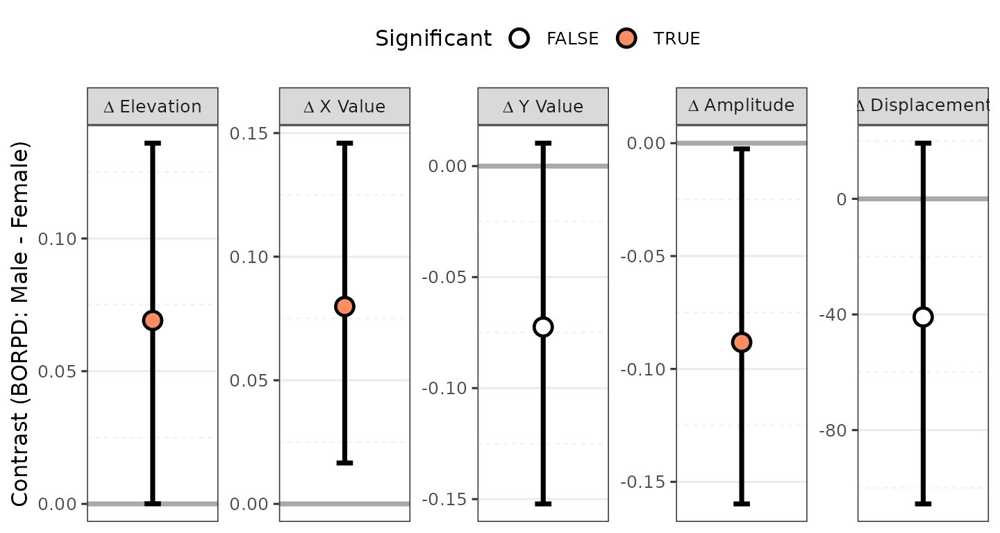

## 3. Taxonomy of analysis types

Although all SSM analyses are based on the idea of decomposing
circumplex scores into the parameters of a cosine curve, there are
actually many different ways to implement it. Each of these
implementations allows different questions to be explored. In the table
below, a list of the SSM analysis types that are currently implemented
in the `circumplex` package is provided. This table also provides the
specific combination of arguments needed to implement each analysis
using the
[`ssm_analyze()`](http://circumplex.jmgirard.com/dev/reference/ssm_analyze.md)
function. Specifying which analysis to run is simply a matter of
providing the correct arguments to the function; this allows a single
function to essentially do the work of seven and makes for a more
intuitive user experience.

[TABLE]

The three main questions to ask when conducting a new SSM analysis are:

1.  **Do we want to project non-circumplex measures into the circumplex
    space?** If yes, we must specify one or more `measures`, and the
    scores that get modeled using SSM will be the correlations between
    the circumplex scales and these measures. If no, we must omit the
    `measures` argument, and the scores that get modeled using SSM will
    be the mean scores on the circumplex scales.

2.  **Do we want to perform analyses separately for groups within the
    dataset?** If yes, we must specify a `grouping` variable, and the
    output will contain results for each group (i.e., unique value of
    this variable). If no, we must omit the `grouping` argument, and a
    single set of results for all data will be output.

3.  **Do we want to contrast/compare two sets of results?** If yes, we
    must specify `contrast` as TRUE and ensure that we are only
    requesting two sets of results (i.e., two groups or two measures).
    If no, we must omit the `contrast` argument or set it to FALSE, and
    the results themselves will be output, rather than their contrast.

## 4. Working with SSM tables

### Basic customizations of tables

Additional arguments to the
[`ssm_table()`](http://circumplex.jmgirard.com/dev/reference/ssm_table.md)
function can be explored using the
[`?ssm_table`](http://circumplex.jmgirard.com/dev/reference/ssm_table.md)
command. Two useful options are the `drop_xy` argument, which shows or
hides the x-value and y-value columns, and the `caption` argument which
allows a custom string to be printed above the table. Note as well that
the return object of this function is just a data frame, which can be
easily edited to add, change, or remove text. To change the formatting
of the table, see the `htmlTable` or `kableExtra` packages.

## 5. Working with SSM figures

### Exporting figures as files

All SSM plots are created using the `ggplot2` package, which is
incredibly flexible and powerful. It also offers the
[`ggsave()`](http://circumplex.jmgirard.com/dev/reference/ggsave.md)
function to export figures to external files of various types. See the
documentation for this function
([`?ggsave`](http://circumplex.jmgirard.com/dev/reference/ggsave.md)) to
learn more, but some useful arguments are `filename`, `plot`, `width`,
`height`, and `units`. We can save the figure as a raster image file
(e.g., “png”, “jpeg”, “tiff”), a vector image file (e.g., “svg”), or a
portable document (e.g., “pdf” or “tex”). We can also control the exact
width and height of the image in different units (i.e., “in”, “cm”, or
“mm”). Because the underlying graphics are vectorized in R, they can be
easily scaled to any size without loss of quality and used in
manuscripts, presentations, or posters.

``` r

ssm_plot_contrast(results6)
ggsave("bordpd_gender.png", width = 7.5, height = 4, units = "in")
```

## Wrap-up

In this vignette, we learned how to generalize the SSM analyses to
multiple groups and measures, how to conduct contrast analyses, how to
make basic customizations to tables and figures, and how to export
tables and figures to external files. In the next vignette, “Advanced
Circumplex Visualization,” we learn how to build circumplex figures from
scratch by composing the
[`ggcircumplex()`](http://circumplex.jmgirard.com/dev/reference/ggcircumplex.md)
canvas, the
[`geom_ssm_point()`](http://circumplex.jmgirard.com/dev/reference/geom_ssm_point.md)
and
[`geom_ssm_arc()`](http://circumplex.jmgirard.com/dev/reference/geom_ssm_arc.md)
layers, and the
[`scale_x_circumplex()`](http://circumplex.jmgirard.com/dev/reference/scale_x_circumplex.md)
axis scale with any other `ggplot2` components.

## References

- Gurtman, M. B. (1992). Construct validity of interpersonal personality
  measures: The interpersonal circumplex as a nomological net. *Journal
  of Personality and Social Psychology, 63*(1), 105–118.

- Gurtman, M. B., & Pincus, A. L. (2003). The circumplex model: Methods
  and research applications. In J. A. Schinka & W. F. Velicer (Eds.),
  *Handbook of psychology. Volume 2: Research methods in psychology*
  (pp. 407–428). Hoboken, NJ: John Wiley & Sons, Inc.

- Wright, A. G. C., Pincus, A. L., Conroy, D. E., & Hilsenroth, M. J.
  (2009). Integrating methods to optimize circumplex description and
  comparison of groups. *Journal of Personality Assessment, 91*(4),
  311–322.

- Zimmermann, J., & Wright, A. G. C. (2017). Beyond description in
  interpersonal construct validation: Methodological advances in the
  circumplex Structural Summary Approach. *Assessment, 24*(1), 3–23.
