# Introduction to SSM Analysis

``` r

library(circumplex)
```

## 1. Background and Motivation

### Circumplex models, scales, and data

Circumplex models are popular within many areas of psychology because
they offer a parsimonious account of complex psychological domains, such
as emotion and interpersonal functioning. This parsimony is achieved by
understanding phenomena in a domain as being a “blend” of two primary
dimensions. For instance, circumplex models of emotion typically
represent affective phenomena as a blend of *valence* (pleasantness
versus unpleasantness) and *arousal* (activity versus passivity),
whereas circumplex models of interpersonal functioning typically
represent interpersonal phenomena as a blend of *communion* (affiliation
versus separation) and *agency* (dominance versus submissiveness). These
models are often depicted as circles around the intersection of the two
dimensions (see figure). Any given phenomenon can be located within this
circular space through reference to the two underlying dimensions (e.g.,
anger is a blend of unpleasantness and activity).

Circumplex scales contain multiple subscales that attempt to measure
different blends of the two primary dimensions (i.e., different parts of
the circle). Although there have historically been circumplex scales
with as many as sixteen subscales, it has become most common to use
eight subscales: one for each “pole” of the two primary dimensions and
one for each “quadrant” that combines the two dimensions. In order for a
set of subscales to be considered circumplex, they must exhibit certain
properties. Circumplex fit analyses can be used to quantify these
properties.

Circumplex data is composed of scores on a set of circumplex scales for
one or more participants (e.g., persons or organizations). Such data is
usually collected via self-report, informant-report, or observational
ratings in order to locate psychological phenomena within the circular
space of the circumplex model. For example, a therapist might want to
understand the interpersonal problems encountered by an individual
patient, a social psychologist might want to understand the emotional
experiences of a group of participants during an experiment, and a
personality psychologist might want to understand what kind of
interpersonal behaviors are associated with a trait (e.g.,
extraversion).

    #> Warning: The `label.size` argument of `geom_label()` is deprecated as of ggplot2 3.5.0.
    #> ℹ Please use the `linewidth` argument instead.
    #> This warning is displayed once per session.
    #> Call `lifecycle::last_lifecycle_warnings()` to see where this warning was
    #> generated.

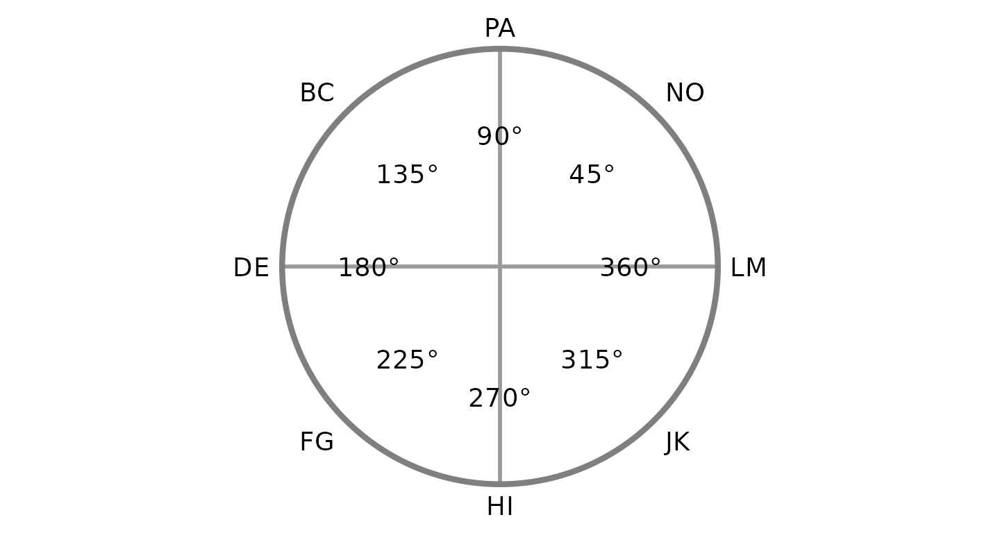

### The Structural Summary Method

The Structural Summary Method (SSM) is a technique for analyzing
circumplex data that offers practical and interpretive benefits over
alternative techniques. It consists of fitting a cosine curve to the
data, which captures the pattern of correlations among scores associated
with a circumplex scale (i.e., mean scores on circumplex scales or
correlations between circumplex scales and an external measure). By
plotting a set of example scores below, we can gain a visual intuition
that a cosine curve makes sense in this case. First, we can examine the
scores with a bar chart ignoring the circular relationship among them.

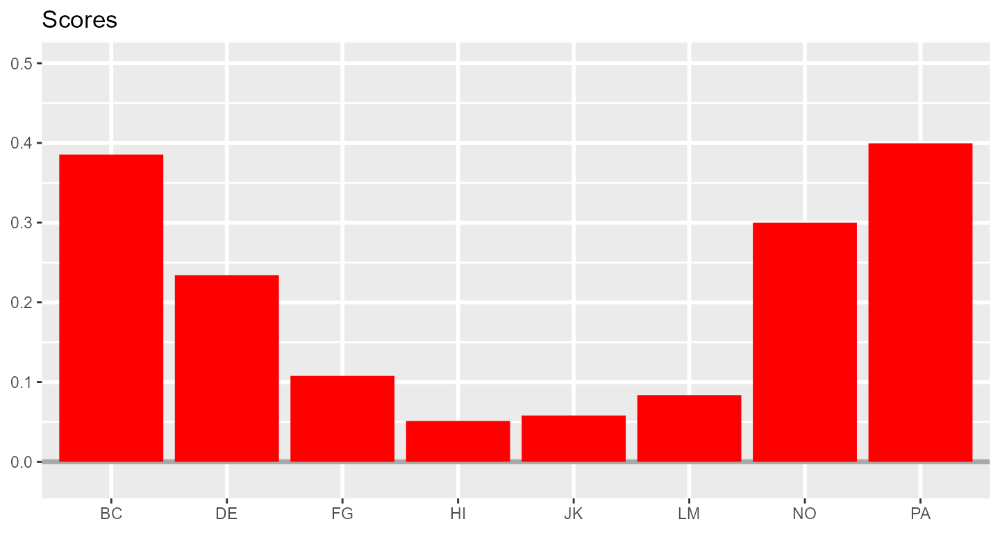

Next, we can leverage the fact that these subscales have specific
angular displacements in the circumplex model (and that 0 and 360
degrees are the same) to create a path diagram.

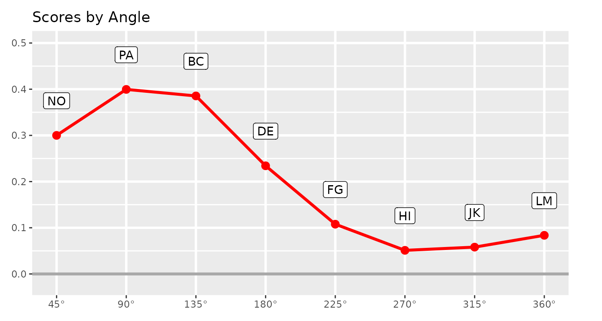

This already looks like a cosine curve, and we can finally use the SSM
to estimate the parameters of the curve that best fits the observed
data. By plotting it alongside the data, we can get a sense of how well
the model fits our example data.

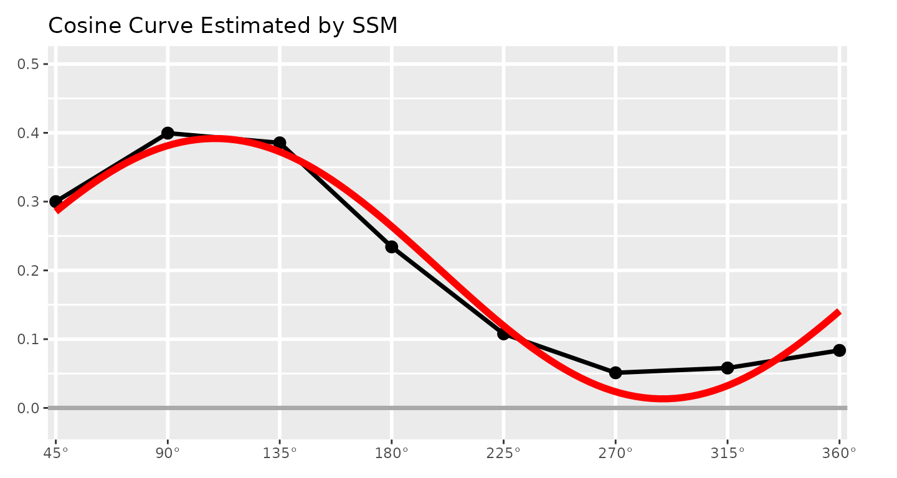

### Understanding the SSM parameters

The SSM estimates a cosine curve to the data using the following
equation:
``` math
S_i = e + a \times \cos(\theta_i - d)
```
where $`S_i`$ and $`\theta_i`$ are the score and angle on scale $`i`$,
respectively, and $`e`$, $`a`$, and $`d`$ are the elevation, amplitude,
and displacement parameters, respectively. Before we discuss these
parameters, however, we can also estimate the fit of the SSM model. This
is essentially how close the cosine curve is to the observed data
points. Deviations (in red, below) will lower model fit.

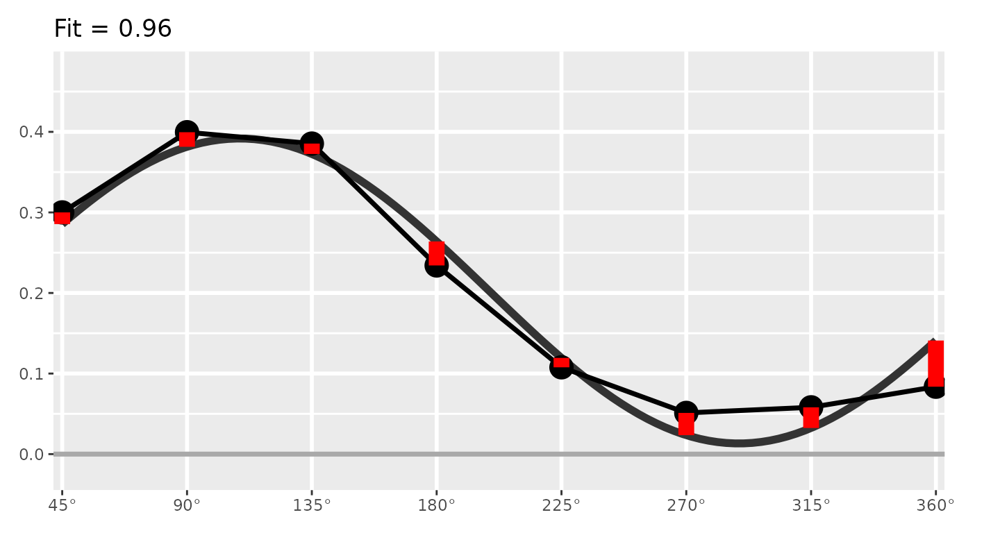

If fit is less than 0.70, it is considered “unacceptable” and only the
elevation parameter should be interpreted. If fit is between 0.70 and
0.80, it is considered “adequate,” and if it is greater than 0.80, it is
considered “good.” Sometimes SSM model fit is called prototypicality or
denoted using $`R^2`$.

The first SSM parameter is elevation or $`e`$, which is calculated as
the mean of all scores. It is the size of the general factor in the
circumplex model and its interpretation varies from scale to scale. For
measures of interpersonal problems, it is interpreted as generalized
interpersonal distress. When using correlation-based SSM, $`|e|\ge.15`$
is considered “marked” and $`|e|<.15`$ is considered “modest.”

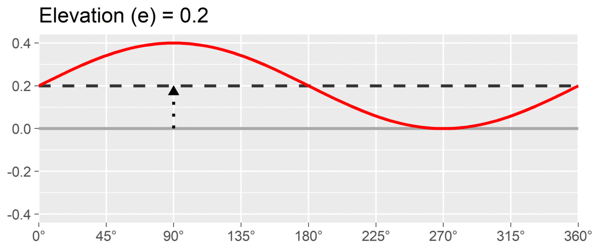

The second SSM parameter is amplitude or $`a`$, which is calculated as
the difference between the highest point of the curve and the curve’s
mean. It is interpreted as the distinctiveness or differentiation of a
profile: how much it is peaked versus flat. Similar to elevation, when
using correlation-based SSM, $`a\ge.15`$ is considered “marked” and
$`a<.15`$ is considered “modest.”

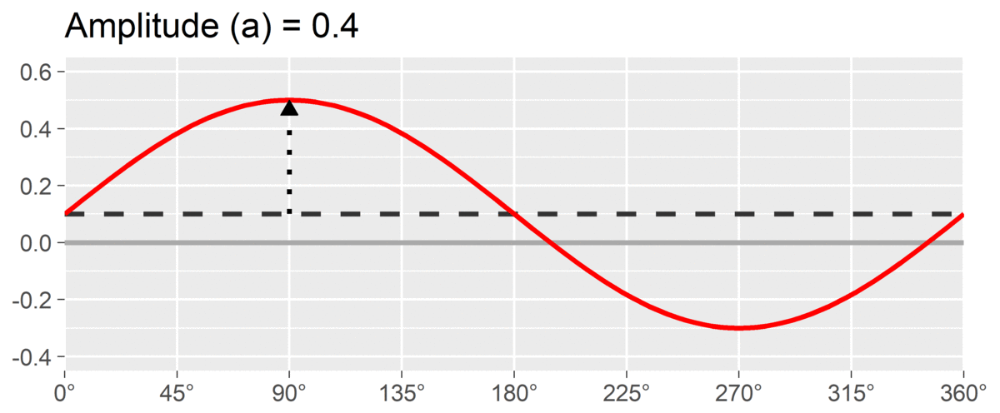

The final SSM parameter is displacement or $`d`$, which is calculated as
the angle at which the curve reaches its highest point. It is
interpreted as the style of the profile. For instance, if $`d=90^\circ`$
and we are using a circumplex scale that defines 90 degrees as
“domineering,” then the profile’s style is domineering. Displacement is
reported on the $`[0^\circ, 360^\circ)`$ circle; a profile that peaks
right at the $`0^\circ`$/$`360^\circ`$ boundary may be reported as
either value, since both point in the same direction.

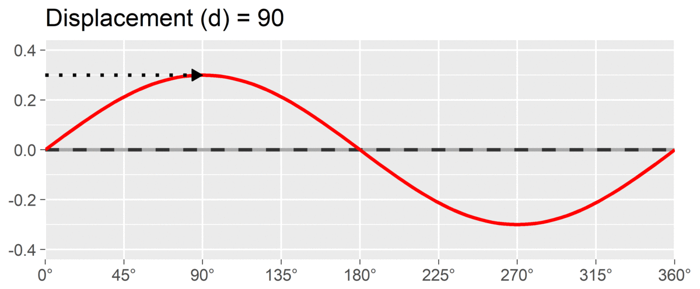

By interpreting these three parameters, we can understand a profile much
more parsimoniously than by trying to interpret all eight subscales
individually. This approach also leverages the circumplex relationship
(i.e., dependency) among subscales. It is also possible to transform the
amplitude and displacement parameters into estimates of distance from
the x-axis and y-axis, which will be shown in the output discussed
below.

## 2. Example data: jz2017

To illustrate the SSM functions, we will use the example dataset
`jz2017`, which was provided by Zimmermann & Wright (2017) and
reformatted for this package. This dataset includes self-report data
from 1166 undergraduate students. Students completed a circumplex
measure of interpersonal problems with eight subscales (PA, BC, DE, FG,
HI, JK, LM, and NO) and a measure of personality disorder symptoms with
ten subscales (PARPD, SCZPD, SZTPD, ASPD, BORPD, HISPD, NARPD, AVPD,
DPNPD, and OCPD). More information about these variables can be accessed
using the
[`?jz2017`](http://circumplex.jmgirard.com/dev/reference/jz2017.md)
command in R.

``` r

data("jz2017")
head(jz2017)
#>   Gender   PA   BC   DE   FG   HI   JK   LM   NO PARPD SCZPD SZTPD ASPD BORPD
#> 1 Female 1.50 1.50 1.25 1.00 2.00 2.50 2.25 2.50     4     3     7    7     8
#> 2 Female 0.00 0.25 0.00 0.25 1.25 1.75 2.25 2.25     1     0     2    0     1
#> 3 Female 0.00 0.00 0.00 0.00 0.00 0.00 0.00 0.00     0     1     0    4     1
#> 4   Male 2.00 1.75 1.75 2.50 2.00 1.75 2.00 2.50     1     0     0    0     1
#> 5 Female 0.25 0.50 0.25 0.00 0.00 0.00 0.00 0.00     0     0     0    0     1
#> 6   Male 1.50 1.75 2.25 1.75 2.00 1.25 2.25 2.50     5     5     7    5     4
#>   HISPD NARPD AVPD DPNPD OCPD
#> 1     4     6    3     4    6
#> 2     2     3    0     1    0
#> 3     5     4    0     0    1
#> 4     0     0    0     0    0
#> 5     0     0    1     0    0
#> 6     4     7    2     0    3
```

The circumplex scales in `jz2017` come from the Inventory of
Interpersonal Problems - Short Circumplex (IIP-SC). These scales can be
arranged into the following circular model, which is organized around
the two primary dimensions of agency (y-axis) and communion (x-axis).
Note that the two-letter scale abbreviations and angular values are
based in convention. A high score on PA indicates that one has
interpersonal problems related to being “domineering” or too high on
agency, whereas a high score on DE indicates problems related to being
“cold” or too low on communion. Scales that are not directly on the
y-axis or x-axis (i.e., BC, FG, JK, and NO) represent blends of agency
and communion.

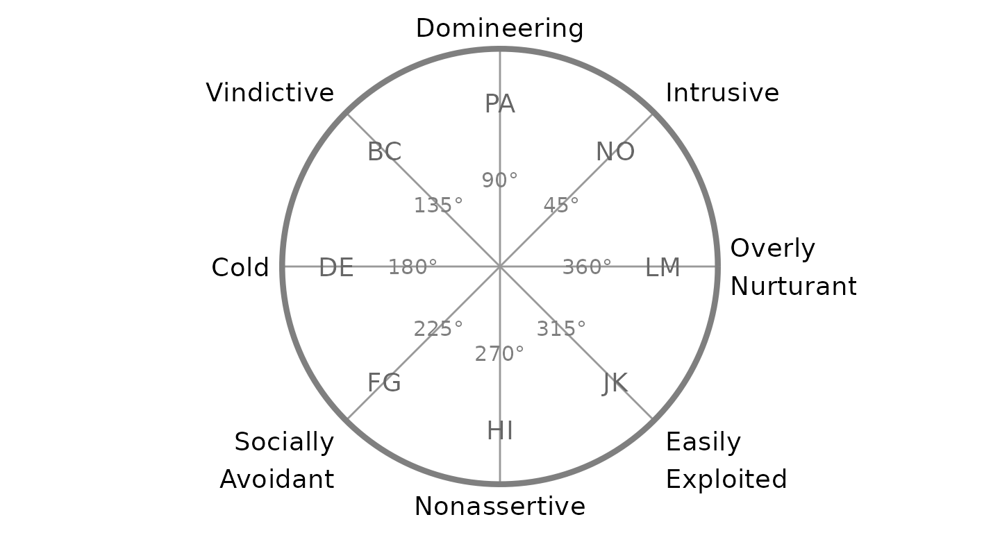

## 3. Mean-based SSM Analysis

### Conducting SSM for a group’s mean scores

To begin, let’s say that we want to use the SSM to describe the
interpersonal problems of the average individual in the entire dataset.
We will use the raw scores contained in `jz2017`, although note that the
results may be more interpretable if we standardized the scores first
(e.g., using the
[`norm_standardize()`](http://circumplex.jmgirard.com/dev/reference/norm_standardize.md)
function as described in the “Using Circumplex Instruments” vignette).

We can use the
[`ssm_analyze()`](http://circumplex.jmgirard.com/dev/reference/ssm_analyze.md)
function to perform the SSM analysis. The first three arguments to this
function are `data` (the data frame containing our scores), `scales` (a
vector of the names or numbers of columns containing the circumplex
scales), and `angles` (a vector of the circular angle of each scale, in
degrees). Below, I spell out the names of all the `scales` and the
numbers of all the `angles` for teaching purposes. Later on, we will
learn some shortcuts.

``` r

results <- ssm_analyze(
  data = jz2017,
  scales = c("PA", "BC", "DE", "FG", "HI", "JK", "LM", "NO"),
  angles = c(90, 135, 180, 225, 270, 315, 360, 45)
)
```

The output of the function has been saved in the `results` object, which
we can examine in detail using the
[`summary()`](https://rdrr.io/r/base/summary.html) function. This will
output the call we made to create the output, as well as some of the
default options that we didn’t bother changing (see
[`?ssm_analyze`](http://circumplex.jmgirard.com/dev/reference/ssm_analyze.md)
to learn how to change them) and, most importantly, the estimated SSM
parameter values with bootstrapped confidence intervals.

``` r

summary(results)
#> 
#> Statistical Basis:    Mean Scores 
#> Bootstrap Resamples:  2000 
#> Confidence Level:     0.95 
#> Listwise Deletion:    TRUE 
#> Scale Displacements:  90 135 180 225 270 315 360 45 
#> 
#> 
#> # Profile [All]:
#> 
#>                Estimate   Lower CI   Upper CI
#> Elevation         0.917      0.890      0.945
#> X-Value           0.351      0.324      0.377
#> Y-Value          -0.252     -0.280     -0.223
#> Amplitude         0.432      0.402      0.461
#> Displacement    324.292    320.827    327.766
#> Model Fit         0.878
```

That was pretty easy! We can now write up these results. However, the
`circumplex` package has some features that can make what we just did
even easier. First, because we organized the `jz2017` data frame to have
the circumplex scale variables adjacent and in order from PA to NO, we
can simplify their specification by using the
[`PANO()`](http://circumplex.jmgirard.com/dev/reference/PANO.md)
shortcut. Second, because the use of octant scales is so common, we can
use the
[`octants()`](http://circumplex.jmgirard.com/dev/reference/octants.md)
shortcut. Note that, even when using these shortcuts, the results are
the same except for minor stochastic differences in the confidence
intervals due to the randomness inherent to bootstrapping.

``` r

results2 <- ssm_analyze(data = jz2017, scales = PANO(), angles = octants())
summary(results2)
#> 
#> Statistical Basis:    Mean Scores 
#> Bootstrap Resamples:  2000 
#> Confidence Level:     0.95 
#> Listwise Deletion:    TRUE 
#> Scale Displacements:  90 135 180 225 270 315 360 45 
#> 
#> 
#> # Profile [All]:
#> 
#>                Estimate   Lower CI   Upper CI
#> Elevation         0.917      0.889      0.945
#> X-Value           0.351      0.326      0.380
#> Y-Value          -0.252     -0.281     -0.225
#> Amplitude         0.432      0.404      0.464
#> Displacement    324.292    320.913    327.623
#> Model Fit         0.878
```

### Visualizing the results with a table and figure

Next, we can produce a table to display our results. With only a single
set of parameters, this table is probably overkill, but in future
analyses we will see how this function saves a lot of time and effort.
To create the table, simply pass the `results` (or `results2`) object to
the
[`ssm_table()`](http://circumplex.jmgirard.com/dev/reference/ssm_table.md)
function.

``` r

ssm_table(results2)
```

| Profile | Elevation | X.Value | Y.Value | Amplitude | Displacement | Fit |
|:---|:---|:---|:---|:---|:---|:---|
| All | 0.92 (0.89, 0.94) | 0.35 (0.33, 0.38) | -0.25 (-0.28, -0.23) | 0.43 (0.40, 0.46) | 324.3 (320.9, 327.6) | 0.878 |

Mean-based Structural Summary Statistics with 95% CIs {.table .table
style="font-size: 14px; margin-left: auto; margin-right: auto;"}

Next, let’s leverage the fact that we are working within a circumplex
space by creating a nice-looking circular plot by mapping the amplitude
parameter to the points’ distance from the center of the circle and the
displacement parameter to the points’ rotation from due-east (as is
conventional). This, again, is as simple as passing the `results` object
to the
[`ssm_plot_circle()`](http://circumplex.jmgirard.com/dev/reference/ssm_plot_circle.md)
or
[`ssm_plot_curve()`](http://circumplex.jmgirard.com/dev/reference/ssm_plot_curve.md)
functions.

``` r

ssm_plot_circle(results2)
```

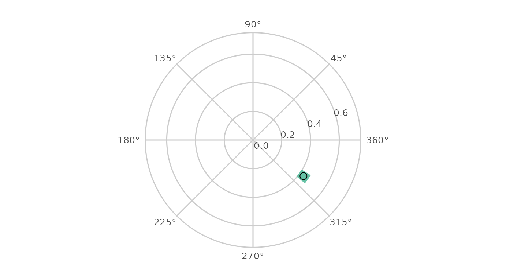

``` r

ssm_plot_curve(results2)
```

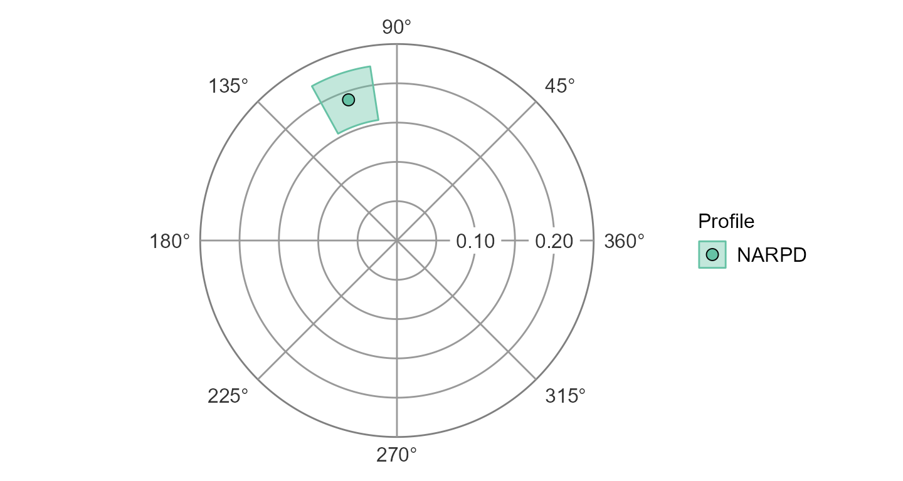

## 4. Correlation-based SSM Analysis

### Conducting SSM for a group’s correlations with an external measure

Next, let’s say that we are interested in analyzing not the mean scores
on the circumplex scales but rather their correlations with an external
measure. This is sometimes referred to as “projecting” that external
measure into the circumplex space. As an example, let’s project the
NARPD variable, which captures symptoms of narcissistic personality
disorder, into the circumplex space defined by the IIP-SC. Based on
theory and previous findings, we can expect this measure to be
associated with some general interpersonal distress and a style that is
generally high in agency.

To conduct this analysis, we can start with the syntax from the
mean-based analysis. All SSM analyses use the
[`ssm_analyze()`](http://circumplex.jmgirard.com/dev/reference/ssm_analyze.md)
function and the data, scales, and angles are the same as before.
However, we also need to let the function know that we want to analyze
correlations with NARPD as opposed to scale means. To do this, we add an
additional argument `measures`.

``` r

results3 <- ssm_analyze(
  data = jz2017, 
  scales = PANO(), 
  angles = octants(),
  measures = "NARPD"
)
summary(results3)
#> 
#> Statistical Basis:    Correlation Scores 
#> Bootstrap Resamples:  2000 
#> Confidence Level:     0.95 
#> Listwise Deletion:    TRUE 
#> Scale Displacements:  90 135 180 225 270 315 360 45 
#> 
#> 
#> # Profile [NARPD]:
#> 
#>                Estimate   Lower CI   Upper CI
#> Elevation         0.202      0.170      0.237
#> X-Value          -0.062     -0.096     -0.028
#> Y-Value           0.179      0.144      0.211
#> Amplitude         0.189      0.155      0.224
#> Displacement    108.967     98.720    118.827
#> Model Fit         0.957
```

Note that this output looks very similar to the mean-based output except
that the statistical basis is now correlation scores instead of mean
scores and instead of saying “Profile \[All\]” it now says “Profile
\[NARPD\]”.

### Visualizing the results with a table and figure

We can also create a similar table and figure using the exact same
syntax as before. The
[`ssm_table()`](http://circumplex.jmgirard.com/dev/reference/ssm_table.md),
[`ssm_plot_circle()`](http://circumplex.jmgirard.com/dev/reference/ssm_plot_circle.md),
and
[`ssm_plot_curve()`](http://circumplex.jmgirard.com/dev/reference/ssm_plot_curve.md)
functions are smart enough to know whether the results are mean-based or
correlation-based and will work in both cases.

``` r

ssm_table(results3)
```

| Profile | Elevation | X.Value | Y.Value | Amplitude | Displacement | Fit |
|:---|:---|:---|:---|:---|:---|:---|
| NARPD | 0.20 (0.17, 0.24) | -0.06 (-0.10, -0.03) | 0.18 (0.14, 0.21) | 0.19 (0.16, 0.22) | 109.0 (98.7, 118.8) | 0.957 |

Correlation-based Structural Summary Statistics with 95% CIs {.table
.table style="font-size: 14px; margin-left: auto; margin-right: auto;"}

From the table, we can see that the model fit is good (\>.80) and that
the elevation and amplitude parameters are significantly different from
zero, i.e., their confidence intervals do not include zero (a “different
from zero” test is not meaningful for the displacement parameter, since
it is an angle and 0 degrees is just an arbitrary reference direction
rather than a null value). Furthermore, the confidence intervals for the
elevation and amplitude parameters are greater than or equal to 0.15,
which can be interpreted as being “marked.” So, consistent with our
hypotheses, NARPD was associated with marked general interpersonal
distress (elevation) and was markedly distinctive in its profile
(amplitude). The displacement parameter was somewhere between 100 and
120 degrees; to interpret this we would need to either consult the
mapping between scales and angles or plot the results.

``` r

ssm_plot_circle(results3)
```

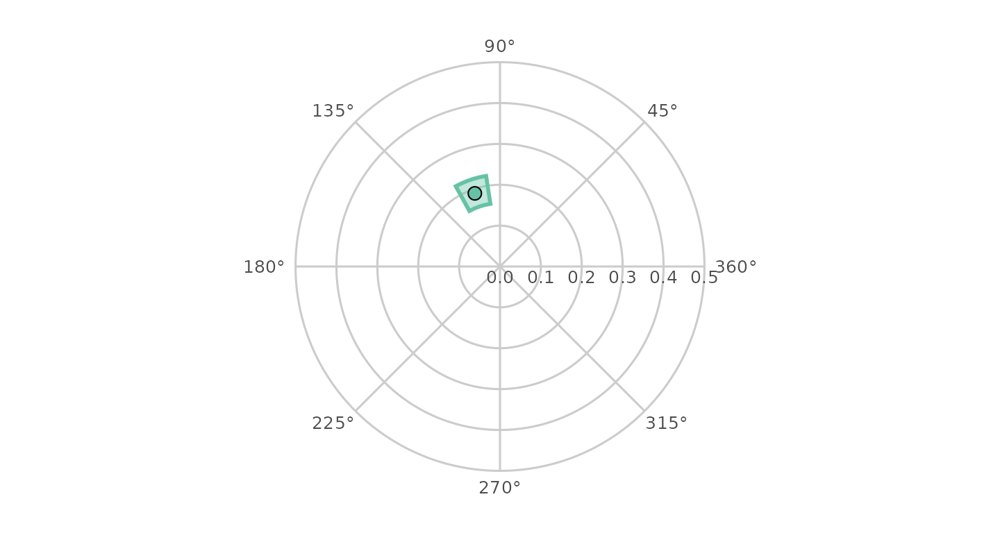

From this figure, it is very easy to see that, consistent with our
hypotheses, the displacement for NARPD was associated with high agency
and was somewhere between the “domineering” and “vindictive” octants.

``` r

ssm_plot_curve(results3)
```

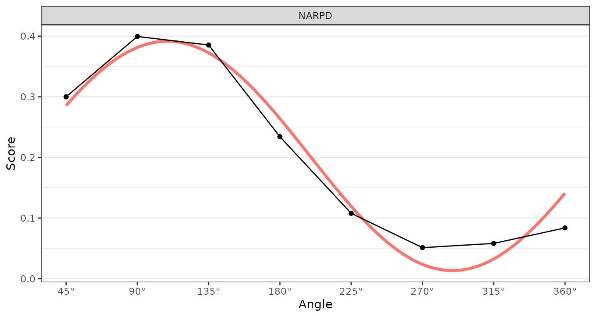

## 5. Wrap-up

In this vignette, we learned about circumplex models, scales, and data
as well as the Structural Summary Method (SSM) for analyzing such data.
We learned about the `circumplex` package and how to use the
[`ssm_analyze()`](http://circumplex.jmgirard.com/dev/reference/ssm_analyze.md)
function to generate SSM results for a single group’s mean scores and
for correlations with a single external measure. We learned several
shortcuts for making calls to this function easier and then explored the
basics of SSM visualization by creating simple tables and circular
plots. In the next vignette, “Intermediate SSM Analysis”, we will build
upon this knowledge to learn how to (1) generalize our analyses to
multiple groups and multiple measures, (2) perform contrast analyses to
compare groups or measures, and (3) export and make basic changes to
tables and figures.

## References

- Gurtman, M. B. (1992). Construct validity of interpersonal personality
  measures: The interpersonal circumplex as a nomological net. *Journal
  of Personality and Social Psychology, 63*(1), 105–118.

- Gurtman, M. B., & Pincus, A. L. (2003). The circumplex model: Methods
  and research applications. In J. A. Schinka & W. F. Velicer (Eds.),
  *Handbook of psychology. Volume 2: Research methods in psychology*
  (pp. 407–428). Hoboken, NJ: John Wiley & Sons, Inc.

- Wright, A. G. C., Pincus, A. L., Conroy, D. E., & Hilsenroth, M. J.
  (2009). Integrating methods to optimize circumplex description and
  comparison of groups. *Journal of Personality Assessment, 91*(4),
  311–322.

- Zimmermann, J., & Wright, A. G. C. (2017). Beyond description in
  interpersonal construct validation: Methodological advances in the
  circumplex Structural Summary Approach. *Assessment, 24*(1), 3–23.
