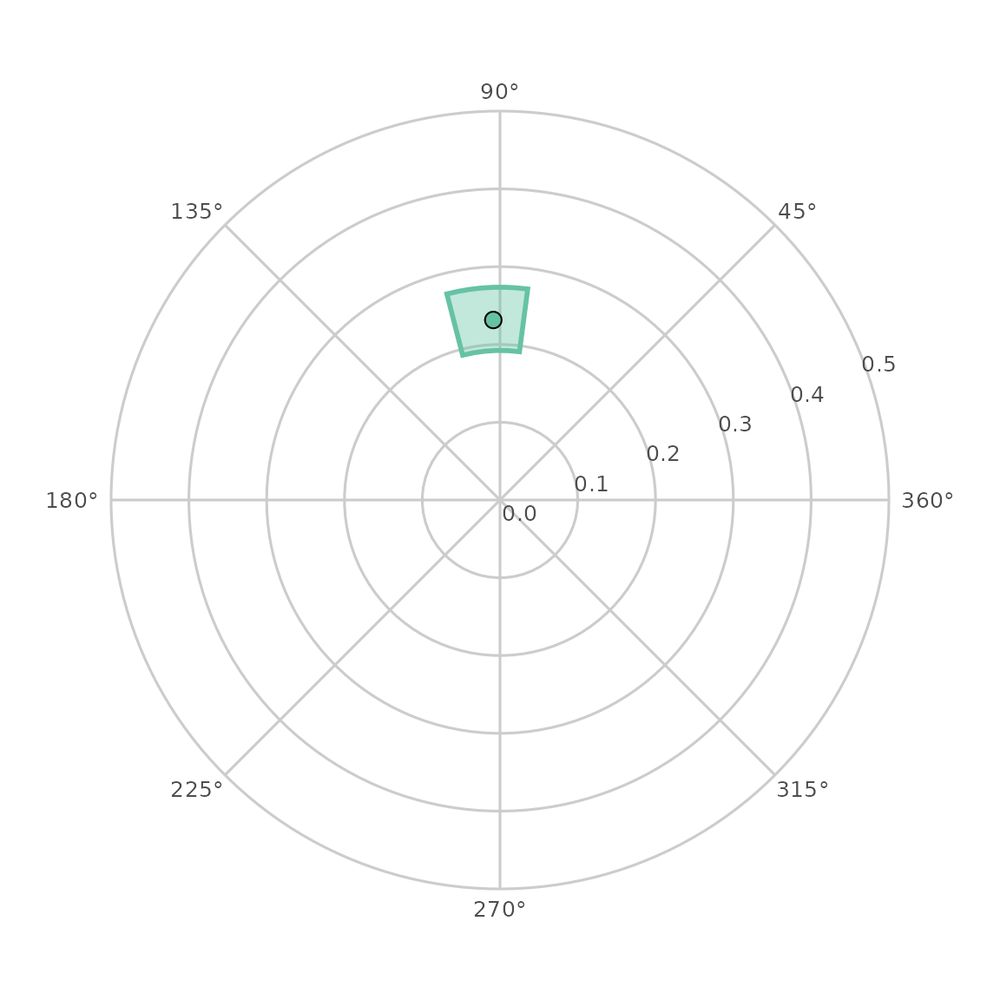
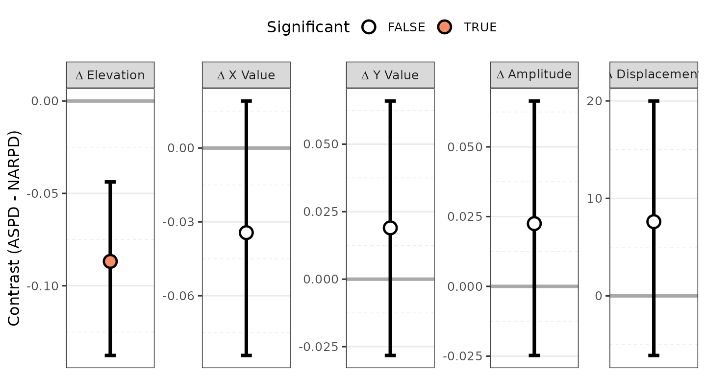

# SEM-Based SSM Analysis

``` r

library(circumplex)
```

The other vignettes model *observed* circumplex scores: the mean profile
of a group, or the profile of correlations between the circumplex scales
and an external measure. This vignette introduces a **latent**
counterpart, built on a structural equation model (SEM) of the
circumplex scales, and exposed through
[`ssm_sem()`](http://circumplex.jmgirard.com/dev/reference/ssm_sem.md)
and its helpers. It teaches two products — the latent profile of a
measure and the invariance-gated latent contrast between groups — how
their confidence intervals are constructed, and the assumptions that
make them interpretable.

The latent-level Structural Summary Method appears to be new: a search
of the SEM–circumplex literature (2019 onward) found related work on the
latent structure of circumplex *scales* (e.g., Wendt et al., 2019) and
on inference for disattenuated correlations (Moss, 2026), but no prior
work applying the SSM decomposition — elevation, amplitude,
displacement, and fit — to a measure’s *latent* profile with
circular-aware intervals. Treat this layer as a research tool whose
assumptions you should understand before relying on it.

## 1. Why a latent SSM?

An observed correlation profile is *attenuated* by measurement error:
because each circumplex scale is imperfectly reliable, the correlations
between the scales and an external measure are pulled toward zero, and —
because the scales are not equally reliable — pulled toward zero by
*different amounts*. The observed SSM parameters inherit both effects.
Amplitude is deflated by the average unreliability, and displacement is
rotated by the *heterogeneity* of reliability around the circle.

The latent SSM estimates the profile the measure would show against the
**latent circumplex content** of the scales — the disattenuated analog
of the observed correlation profile (Zimmermann & Wright, 2017, defined
the observed version; this is its latent counterpart). It fits a
measurement model in which each scale loads on latent factors placed at
that scale’s *fixed theoretical angle*, then reads the measure’s
correlations with the common circumplex content and summarizes them with
the usual SSM transform.

Two consequences are worth stating up front, because they shape
everything below:

- The latent profile is **model-conditional**. Every latent parameter is
  conditional on the fixed-angle measurement model being an adequate
  description of the data. A poorly fitting model does not make the
  latent parameters merely imprecise; it makes them uninterpretable.
  Global fit is therefore reported alongside every result.
- The angles are **theoretical claims, not estimates**.
  [`ssm_sem()`](http://circumplex.jmgirard.com/dev/reference/ssm_sem.md)
  never estimates an angle. If an instrument’s real geometry departs
  from theory, that departure is absorbed into misfit, not into the
  angles. To *examine* circumplex geometry — to let the angles be free —
  use
  [`cpm_fit()`](http://circumplex.jmgirard.com/dev/reference/cpm_fit.md),
  which fits Browne’s (1992) circumplex model; that is a different
  question and a different tool.

## 2. The measurement model

[`ssm_sem()`](http://circumplex.jmgirard.com/dev/reference/ssm_sem.md)
builds and fits a lavaan measurement model for you, but it is worth
seeing the model it generates.
[`ssm_sem_syntax()`](http://circumplex.jmgirard.com/dev/reference/ssm_sem_syntax.md)
returns that model as a string:

``` r

scales <- c("PA", "BC", "DE", "FG", "HI", "JK", "LM", "NO")
syntax <- ssm_sem_syntax(scales = scales, angles = octants(), measures = "NARPD")
cat(syntax)
#> # circumplex SSM measurement model (generated by ssm_sem_syntax())
#> # scales: PA, BC, DE, FG, HI, JK, LM, NO
#> # angles (degrees): 90, 135, 180, 225, 270, 315, 360, 45
#> # model tier: scaled
#> 
#> # general factor: free per-scale saturations
#> g =~ NA*PA + a1*PA + a2*BC + a3*DE + a4*FG + a5*HI + a6*JK + a7*LM + a8*NO
#> # circumplex plane: loadings free but with each scale's angle fixed
#> cx =~ NA*PA + lx1*PA + lx2*BC + lx3*DE + lx4*FG + lx5*HI + lx6*JK + lx7*LM + lx8*NO
#> cy =~ NA*PA + ly1*PA + ly2*BC + ly3*DE + ly4*FG + ly5*HI + ly6*JK + ly7*LM + ly8*NO
#> # fixed-angle direction constraints: sin(a)*lx - cos(a)*ly == 0
#> 0 == 1*lx1 - 0*ly1
#> 0 == 0.70710678118654757*lx2 - -0.70710678118654746*ly2
#> 0 == 0*lx3 - -1*ly3
#> 0 == -0.70710678118654746*lx4 - -0.70710678118654768*ly4
#> 0 == -1*lx5 - 0*ly5
#> 0 == -0.70710678118654768*lx6 - 0.70710678118654735*ly6
#> 0 == 0*lx7 - 1*ly7
#> 0 == 0.70710678118654746*lx8 - 0.70710678118654757*ly8
#> # isotropic orthonormal plane metric (plane scale absorbed by loadings)
#> g ~~ 1*g
#> cx ~~ 1*cx
#> cy ~~ 1*cy
#> cx ~~ 0*cy
#> # general-plane covariances fixed to zero: with free per-scale
#> # saturations, freeing these is locally unidentified exactly at
#> # phi_g = 0 (the trade a_i +/- d*c_i*cos/sin(angle_i) <-> phi_g is
#> # first-order flat there), so they cannot be estimated. To model a
#> # general factor leaning into the plane, use the strict tier, whose
#> # fixed loadings leave the full factor covariance matrix free.
#> g ~~ 0*cx
#> g ~~ 0*cy
#> 
#> # external measure(s): related to circumplex factors
#> NARPD ~~ mg1*g
#> NARPD ~~ mcx1*cx
#> NARPD ~~ mcy1*cy
#> 
#> # NOTE: amplitude (a) and displacement (d) are deliberately NOT defined
#> # here. They are nonlinear (sqrt / atan2) and their intervals must be
#> # built in-package through circular quantiles, never via lavaan := or
#> # delta-method CIs (which ignore the angular branch cut).
```

Three latent factors carry the structure: a general factor `g` and the
two plane axes `cx` and `cy`. Each scale loads on all three, but its
plane loadings are tied to its **fixed angle** by a direction constraint
(`sin(θ)·lx − cos(θ)·ly == 0`), so the scale’s location in the plane is
theoretical while its *saturation* (how strongly it expresses the
circumplex) is free. This is the default **`"scaled"`** tier. A stricter
**`"strict"`** tier instead fixes every loading to the unit cosine
pattern and frees the full factor covariance matrix; it is the fully
theoretical benchmark, and it is what remains identified when the number
of scales is small.

The header and comments in the generated syntax record two design
decisions that matter statistically:

- Under the scaled tier the general factor is fixed **orthogonal** to
  the plane (`g ~~ 0*cx`, `g ~~ 0*cy`). Freeing those covariances
  alongside free per-scale saturations is locally unidentified exactly
  at the null they would test, so they cannot be estimated in this tier.
  A general factor that leans into the plane is expressible only under
  the strict tier (or surfaces as misfit under the scaled tier). This
  matters for real interpersonal data: Wendt et al. (2019) found a
  general–agency correlation of roughly −.3 replicated across four
  samples, so on IIP-family instruments the orthogonality the scaled
  tier assumes is known to be violated.
- The final `NOTE` says amplitude and displacement are **deliberately
  not defined** in the lavaan syntax. That is the subject of Section 4.

You rarely call
[`ssm_sem_syntax()`](http://circumplex.jmgirard.com/dev/reference/ssm_sem_syntax.md)
directly —
[`ssm_sem()`](http://circumplex.jmgirard.com/dev/reference/ssm_sem.md)
does — but it is the escape hatch for respecifications (for example,
partial invariance) that you then fit yourself and hand back through
[`ssm_sem_parameters()`](http://circumplex.jmgirard.com/dev/reference/ssm_sem_parameters.md).

## 3. Estimating a latent profile

The everyday entry point is
[`ssm_sem()`](http://circumplex.jmgirard.com/dev/reference/ssm_sem.md).
Its arguments mirror
[`ssm_analyze()`](http://circumplex.jmgirard.com/dev/reference/ssm_analyze.md):
the data, the `scales` and their `angles`, and one or more `measures`.
The `measures` argument is required in the single-group case — the
single-group latent SSM *is* the correlation path (a single-group latent
*mean* profile is not identified, so it is not offered).

Because the confidence intervals are simulated, set a seed immediately
before the call for reproducibility.

``` r

data("jz2017")
set.seed(12345)
latent <- ssm_sem(
  jz2017,
  scales = scales,
  angles = octants(),
  measures = "NARPD",
  boots = 500
)
latent
#> 
#> # Latent (SEM-based) SSM
#> 
#> Measurement model:    scaled fixed-angle circumplex
#> Global fit (N = 1166, robust): chisq(17) = 300.546, p < 0.001 
#>          CFI = 0.93, RMSEA = 0.13, SRMR = 0.072
#> 
#> # Profile [NARPD]:
#> 
#>                Estimate   Lower CI   Upper CI
#> Elevation         0.249      0.210      0.295
#> X-Value          -0.009     -0.054      0.033
#> Y-Value           0.231      0.189      0.273
#> Amplitude         0.232      0.192      0.274
#> Displacement     92.132     82.515    104.461
#> Model Fit         0.975
```

Compare this with the *observed* correlation profile of the same
measure:

``` r

set.seed(12345)
observed <- ssm_analyze(
  jz2017,
  scales = scales,
  angles = octants(),
  measures = "NARPD"
)
observed
#> 
#> # Profile [NARPD]:
#> 
#>                Estimate   Lower CI   Upper CI
#> Elevation         0.202      0.169      0.238
#> X-Value          -0.062     -0.094     -0.029
#> Y-Value           0.179      0.145      0.213
#> Amplitude         0.189      0.154      0.227
#> Displacement    108.967     98.633    118.537
#> Model Fit         0.957
```

The two profiles tell the same broad story — narcissistic PD relates to
the upper (dominant) region of the circumplex — but the disattenuated
profile has a **larger amplitude** and a **higher fit**, and its
displacement sits at a somewhat different angle. The amplitude increase
is the removal of attenuation: the latent correlations are not pulled
toward zero by scale unreliability. The displacement shift and the fit
increase are the removal of *reliability heterogeneity* around the
circle (Section 5 explains why each moves).

[`ssm_sem()`](http://circumplex.jmgirard.com/dev/reference/ssm_sem.md)
returns a `circumplex_ssm_sem` object, a subclass of the ordinary
`circumplex_ssm` object, so the familiar table and plot functions work
on it:

``` r

ssm_plot_circle(latent)
```



``` r

knitr::kable(
  ssm_table(latent, render = FALSE),
  caption = "Latent SSM profile of NARPD"
)
```

| Profile | Elevation | X.Value | Y.Value | Amplitude | Displacement | Fit |
|:---|:---|:---|:---|:---|:---|:---|
| NARPD | 0.25 (0.21, 0.29) | -0.01 (-0.05, 0.03) | 0.23 (0.19, 0.27) | 0.23 (0.19, 0.27) | 92.1 (82.5, 104.5) | 0.975 |

Latent SSM profile of NARPD {.table}

By default
[`ssm_sem()`](http://circumplex.jmgirard.com/dev/reference/ssm_sem.md)
fits with a robust estimator (`estimator = "MLR"`) and reports robust
global fit indices, because circumplex scale scores are typically skewed
and the naive chi-square over-rejects. The robust (sandwich) standard
errors also feed the confidence intervals — for a reason that is the
subject of the next section.

## 4. Where the confidence intervals come from

Amplitude and displacement are **nonlinear** functions of the model
parameters: amplitude is a square root and displacement is an `atan2`.
lavaan can attach a delta-method or bootstrap-percentile interval to any
derived quantity, but for displacement those intervals are wrong in a
way that is easy to miss. `atan2` has a branch cut: a displacement near
0°/360° can produce an interval that has been unwrapped across the cut,
or whose endpoints have sign-flipped, so a naive percentile interval
straddling the boundary points the wrong way around the circle.

`circumplex` therefore **never delegates amplitude or displacement
intervals to lavaan** — the reason the generated syntax refuses to
define them. Instead it reuses the same machinery the observed bootstrap
uses:

1.  lavaan supplies only the point estimates and their covariance (or
    bootstrap replicates) of the model’s *free* parameters.
2.  [`ssm_sem()`](http://circumplex.jmgirard.com/dev/reference/ssm_sem.md)
    draws from that covariance, maps each draw through the profile and
    the SSM transform, and obtains a replicate of every SSM parameter.
3.  Those replicates go through the package’s existing interval assembly
    — percentile intervals for the linear parameters, and **circular
    quantiles** for displacement (centered on the circular mean,
    unwrapped, quantiled, and re-wrapped), with contrast intervals
    aligned to the estimate’s branch.

The result is that a latent displacement interval behaves correctly at
the 0°/360° pole: it can straddle the boundary contiguously, and the
point estimate always sits inside its own interval. This is the same
architecture the Monte Carlo engine uses for observed profiles, with
lavaan supplying the mean and covariance rather than resampling.

Two engines feed step 2, selected by `ci_method`:

- **`"mvn"` (default):** draw from a multivariate normal centered at the
  estimates with the model’s (robust) covariance. Fast — one model fit
  plus vectorized draws.
- **`"boot"`:** refit the model on each bootstrap resample. Far more
  expensive, but it does not lean on asymptotic normality.

A coverage study across constructed populations (reported in the
package’s design notes) found `"mvn"` well-calibrated at realistic
sample sizes *when the covariance is the robust sandwich* — which is why
robust SEs are the default. Under a misspecified fixed-angle model,
plain (non-robust) SEs undercovered displacement; the sandwich restored
nominal coverage. If you supply your own lavaan fit through
[`ssm_sem_parameters()`](http://circumplex.jmgirard.com/dev/reference/ssm_sem_parameters.md)
and intend to use `"mvn"`, fit it with `se = "robust.huber.white"` so
the propagated covariance stays valid.

## 5. What the parameters mean now

Disattenuation changes what two of the parameters *mean*, and the
vignette would be misleading if it did not say so.

**Fit.** Under the scaled tier the latent profile is not forced to be a
perfect cosine — the scales have different saturations — so a latent fit
below 1 is *informative*: it measures how far the measure’s latent
profile departs from a pure cosine wave, driven by differential
saturation across scales (and, under the strict tier, by anisotropy in
the factor covariance). What the latent fit removes, relative to the
observed fit, is the contamination from **reliability heterogeneity** —
not sampling error. Both the observed and the latent fit are population
quantities that contain no sampling error at all; as *estimates* at a
finite sample size, both remain noisy, so a latent fit of, say, .85 in a
modest sample is not automatically substantive structure.

**Displacement.** Latent displacement is the first-harmonic direction of
the *saturation-modulated* disattenuated profile. It is **not** simply
“the measure’s angle in the latent space.” Heterogeneous saturations
around the circle, or a general factor leaning into the plane, rotate it
— with fit possibly staying high — exactly as they rotate the observed
displacement. The latent layer’s contribution is the removal of the
*reliability* modulation that additionally rotates the observed
displacement; it does not remove the saturation modulation. That removal
is why the observed and latent displacements in Section 3 differ, and it
is the honest description of what `d` estimates here.

The interpretation aids you already know carry over unchanged. Amplitude
is the gate for interpreting displacement: when the amplitude confidence
interval’s lower bound sits too close to zero relative to its width, the
profile has no well-defined direction and the displacement is not
interpretable — the low-fit dashing on plots and the displacement
caution in [`print()`](https://rdrr.io/r/base/print.html) behave exactly
as they do for observed profiles.

## 6. Two questions about group differences

When you have groups, there are **two** distinct estimands, and
`circumplex` keeps them separate on purpose.

| Question | Estimand | Tool | Confounds |
|:---|:---|:---|:---|
| Do the groups’ *measured* profiles differ? | Observed contrast | ssm_analyze(contrast = TRUE) | Structural difference, differential reliability, and non-invariance are combined. |
| Do the groups’ *constructs* differ, granted the instrument measures the same thing in both? | Latent contrast | ssm_sem(contrast = TRUE) | Disattenuated and conditional on measurement invariance; not computed when invariance fails. |

Two estimands for a group difference {.table}

Neither is more correct in the abstract. The observed contrast answers a
question about *scores* and is always available. The latent contrast
answers a question about *constructs*, but only *if* the instrument
behaves the same way in both groups — and when it does not, the honest
answer is that the groups cannot be compared on the latent metric, not a
number.

## 7. Invariance-gated latent contrasts

Before it computes a latent group contrast,
[`ssm_sem()`](http://circumplex.jmgirard.com/dev/reference/ssm_sem.md)
fits an invariance ladder — configural, then metric, then scalar — and
tests each rung against the previous one with lavaan’s own nested-model
test (the scaled difference test under the robust estimator). The latent
*measure-profile* contrast requires **metric** invariance (equal
saturations across groups); the latent *mean* contrast additionally
requires scalar invariance. If the required rung is rejected, the
contrast is **not** computed.

On real data this gate does its job. Comparing the NARPD profile across
the `Gender` groups in `jz2017` rejects metric invariance, so
[`ssm_sem()`](http://circumplex.jmgirard.com/dev/reference/ssm_sem.md)
returns each group’s separate profile and an explicit non-comparison
verdict rather than a contrast:

``` r

set.seed(12345)
by_gender <- ssm_sem(
  jz2017,
  scales = scales,
  angles = octants(),
  measures = "NARPD",
  grouping = "Gender",
  contrast = TRUE,
  boots = 300
)
by_gender
#> 
#> # Latent (SEM-based) SSM
#> 
#> Measurement model:    scaled fixed-angle circumplex
#> Global fit (N = 1166, robust): chisq(34) = 287.272, p < 0.001 
#>          CFI = 0.938, RMSEA = 0.123, SRMR = 0.06
#> 
#> Invariance ladder (gate: metric, alpha = 0.05):
#>        rung   chisq df   cfi rmsea dchisq ddf       p
#>  configural 287.272 34 0.938 0.123     NA  NA        
#>      metric 337.356 48 0.927 0.112 54.781  14 < 0.001
#> Verdict: metric invariance rejected (Δχ²(14) = 54.78, p < 0.0001, alpha = 0.05): these groups cannot be compared on this instrument's latent metric.
#> The requested latent contrast was therefore not computed; the rows below are each group's separate (configural) latent profile. The observed-score contrast (ssm_analyze()) answers its own, different question and remains available.
#> 
#> # Profile [NARPD: Female]:
#> 
#>                Estimate   Lower CI   Upper CI
#> Elevation         0.198      0.141      0.252
#> X-Value          -0.023     -0.083      0.040
#> Y-Value           0.250      0.188      0.318
#> Amplitude         0.251      0.194      0.318
#> Displacement     95.206     81.443    110.519
#> Model Fit         0.966                      
#> 
#> 
#> # Profile [NARPD: Male]:
#> 
#>                Estimate   Lower CI   Upper CI
#> Elevation         0.313      0.243      0.376
#> X-Value           0.012     -0.046      0.076
#> Y-Value           0.199      0.146      0.250
#> Amplitude         0.199      0.147      0.257
#> Displacement     86.611     70.075    103.660
#> Model Fit         0.977
```

The invariance ladder is printed with the decision, and no contrast is
rendered —
[`ssm_plot_contrast()`](http://circumplex.jmgirard.com/dev/reference/ssm_plot_contrast.md)
on this object would have nothing to draw. This is deliberate: there is
no `force = TRUE`. If you have a principled partial-invariance model,
fit it yourself and pass it to
[`ssm_sem_parameters()`](http://circumplex.jmgirard.com/dev/reference/ssm_sem_parameters.md),
which computes the contrast from whatever multi-group fit you supply and
leaves the comparability claim to you.

When invariance is not the obstacle — for example, contrasting **two
measures** within one group, where no cross-group invariance is at stake
— the contrast is computed and behaves like the observed contrast
(second measure minus first, displacement differences via the circular
branch machinery):

``` r

set.seed(12345)
contrast <- ssm_sem(
  jz2017,
  scales = scales,
  angles = octants(),
  measures = c("NARPD", "ASPD"),
  contrast = TRUE,
  boots = 500
)
contrast
#> 
#> # Latent (SEM-based) SSM
#> 
#> Measurement model:    scaled fixed-angle circumplex
#> Global fit (N = 1166, robust): chisq(22) = 317.867, p < 0.001 
#>          CFI = 0.935, RMSEA = 0.114, SRMR = 0.068
#> 
#> # Profile [NARPD]:
#> 
#>                Estimate   Lower CI   Upper CI
#> Elevation         0.248      0.210      0.295
#> X-Value          -0.009     -0.052      0.032
#> Y-Value           0.231      0.191      0.272
#> Amplitude         0.231      0.193      0.272
#> Displacement     92.119     82.715    103.513
#> Model Fit         0.974                      
#> 
#> 
#> # Profile [ASPD]:
#> 
#>                Estimate   Lower CI   Upper CI
#> Elevation         0.161      0.115      0.207
#> X-Value          -0.043     -0.092     -0.002
#> Y-Value           0.250      0.208      0.295
#> Amplitude         0.254      0.216      0.298
#> Displacement     99.732     90.351    111.188
#> Model Fit         0.978                      
#> 
#> 
#> # Contrast [ASPD - NARPD]:
#> 
#>                  Estimate   Lower CI   Upper CI
#> Δ Elevation        -0.087     -0.138     -0.044
#> Δ X-Value          -0.034     -0.084      0.019
#> Δ Y-Value           0.019     -0.028      0.066
#> Δ Amplitude         0.022     -0.025      0.066
#> Δ Displacement      7.613     -6.113     19.993
#> Δ Model Fit         0.003
```

``` r

ssm_plot_contrast(contrast)
```



The contrast block reports the difference in each SSM parameter with its
confidence interval. As with the observed contrast, an elevation or
amplitude difference whose interval excludes zero is a difference in
that parameter; the displacement difference is reported on the
estimate’s angular branch, so its interval endpoints can legitimately
fall outside ±180° near the boundary while still containing the
estimate.

## 8. When to trust it: limitations

The latent layer buys disattenuation at the price of a set of
assumptions. The documentation states them; the vignette should too.

- **Model-conditional.** Every latent quantity is conditional on the
  fixed-angle model being adequate. Read the global fit first. As a
  real-data benchmark, Wendt et al. (2019) reported RMSEA between .075
  and .111 for the fixed-loading circumplex CFA across four large
  samples — a real but imperfect approximation (their model targets the
  octants’ own latent structure, not an external measure’s profile, so
  the number is a benchmark, not a like-for-like comparison). The
  example fits here are of the same order (RMSEA around .12) and should
  likewise be read as approximations, not exact structure.
- **Fixed angles are theoretical.** Departures from the theoretical
  geometry load into misfit, not into the angles. Use
  [`cpm_fit()`](http://circumplex.jmgirard.com/dev/reference/cpm_fit.md)
  to examine geometry.
- **Latent-plane stationarity is assumed, not tested.** The plane
  factors are fixed isotropic and orthogonal; anisotropic latent
  dispersion surfaces only as global misfit.
- **The scaled tier assumes the general factor is orthogonal to the
  plane.** A true general-factor lean surfaces as misfit under the
  scaled tier; use the strict tier to model it.
- **Displacement and fit have the disattenuated meanings of Section 5**,
  not the naive “angle in latent space” and “cosine-ness” readings.
- **Disattenuated correlations can be large.** Removing attenuation
  moves correlations toward ±1; values at or beyond 1 signal
  misspecification and are refused rather than summarized.
- **Invariance gating is a modeling decision** with a default test, not
  an oracle. The observed contrast remains available and answers its own
  question.

## 9. Relation to the literature

The nearest published models are the confirmatory factor analyses of the
interpersonal circumplex itself. Wendt et al. (2019) fit a three-factor
circumplex CFA with fixed unit-cosine plane loadings — the shape of this
package’s strict tier — across four large samples, and found the fully
dimensional model competitive with categorical and hybrid alternatives.
Their estimand, though, is the latent structure of the *octant scales*
and persons’ factor scores, not an external measure’s disattenuated
profile; their model is context for the strict tier, not a validation
target for the SSM estimand.

At the level of a single disattenuated correlation, Moss (2026) showed
that treating reliability as a *known* constant collapses interval
coverage (to roughly .35 in one scenario), whereas propagating
reliability uncertainty restores nominal coverage. That is exactly the
logic behind fitting the model and propagating its full covariance
rather than plugging in reliability point estimates. One estimand
caveat: Moss’s disattenuated correlation corrects *both* variables for
unreliability, whereas the latent SSM here corrects only the *scale*
side — the external measure remains an observed variable — so the two
are relatives, not the same quantity.

Finally, the two model families in this package meet at a single point:
at a general factor orthogonal to the plane, equal saturations, and
equally spaced angles, the fixed-loading circumplex CFA coincides with
the one-harmonic, equal-communality version of Browne’s (1992)
circumplex model that
[`cpm_fit()`](http://circumplex.jmgirard.com/dev/reference/cpm_fit.md)
estimates. The SEM-based SSM sits on the fixed-angle side of that
boundary; to cross to freely estimated angles, use
[`cpm_fit()`](http://circumplex.jmgirard.com/dev/reference/cpm_fit.md).

## References

- Browne, M. W. (1992). Circumplex models for correlation matrices.
  *Psychometrika, 57*(4), 469–497.

- Moss, J. (2026). Inference for disattenuated correlations. *Applied
  Psychological Measurement*. Advance online publication.
  <https://doi.org/10.1177/01466216261440511>

- Wendt, L. P., Wright, A. G. C., Pilkonis, P. A., Nolte, T., Fonagy,
  P., Montague, P. R., Benecke, C., Krieger, T., & Zimmermann, J.
  (2019). The latent structure of interpersonal problems: Validity of
  dimensional, categorical, and hybrid models. *Journal of Abnormal
  Psychology, 128*(8), 823–839.

- Zimmermann, J., & Wright, A. G. C. (2017). Beyond description in
  interpersonal construct validation: Methodological advances in the
  circumplex Structural Summary Approach. *Assessment, 24*(1), 3–23.
