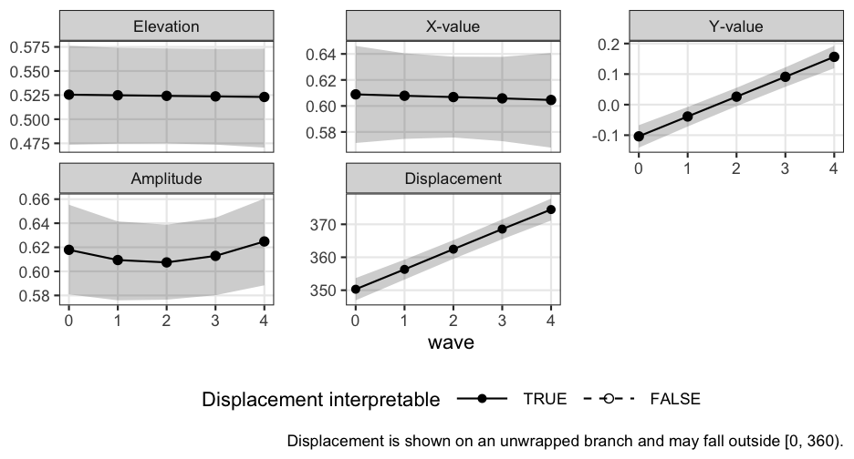
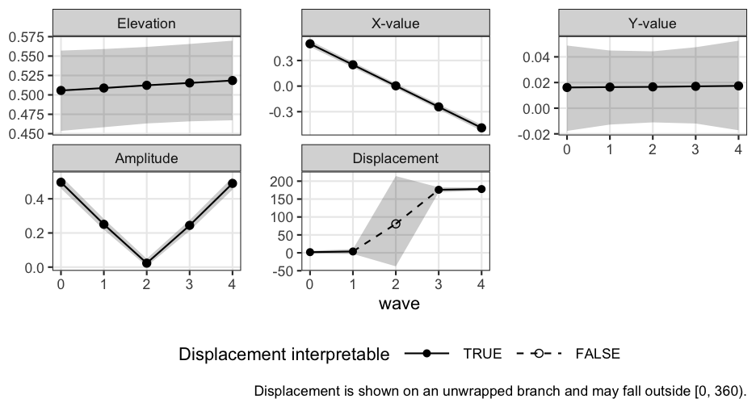

``` r
library(circumplex)
```

**Level:** Advanced. Read "Bayesian SSM Analysis" first, because this page
summarizes draws with the same tools.

## 1. Overview

This vignette fits a growth model to SSM parameters measured at several
waves. Section 2, "The question growth modeling answers", states the
question. Section 3, "From repeated measures to a long table", builds the
input with `ssm_growth_data()`. Section 4, "One joint model, not three
separate ones", writes the model with `ssm_growth_formula()` and fits it.
Section 5, "From fixed effects to $(a(t), d(t))$ with intervals", carries the
uncertainty through `ssm_trajectory()`. Section 6, "Certification: when
$d(t)$ intervals are not interpretable", and Section 7, "A caution about REML
intervals at small samples", state the limits. Section 8, "The unwrap
alternative: `angle_unwrap()`", fits a second recipe. Section 9, "Caveats and
upgrades", closes the recipe. Section 10, "The same model in nlme and brms",
shows the two other engines. The Wrap-up lists what the page covered and
says that no page follows, and the References list the sources cited.

## 2. The question growth modeling answers

A single Structural Summary Method (SSM) analysis describes one profile: an
elevation $e$, an amplitude $a$, and a displacement $d$.
`vignette("introduction-to-ssm-analysis")` defines these three parameters.
Repeated measurements assess the same persons at several waves. With them, a
new question opens up: *how does the profile change over time?* Does the
group's interpersonal style drift toward warmth, one of the directions on
the circle? Does its distinctiveness (amplitude) grow or fade?

Displacement is an angle, and angles resist ordinary growth modeling. A
trajectory drifting from 350° to 10° has moved 20°, not −340°. A linear
model fit directly to raw displacements will get this wrong whenever a
trajectory crosses the 0°/360° boundary.

This vignette presents the package's recommended recipe. The recipe avoids
the boundary entirely by modeling growth in the Cartesian coordinates
$(x, y)$. Here $x = a \cos d$ and $y = a \sin d$ place the profile as a
point on a plane. These are the same coordinates that the SSM estimator
itself uses. At the end, the recipe converts the fitted trajectories back to
amplitude and displacement at each time, $(a(t), d(t))$, with
circular-correct summaries.

The division of labor is deliberate and mirrors the package's Bayesian
vignette: **circumplex does not fit mixed models**. It builds the input on
the way in, with `ssm_growth_data()` and `ssm_growth_formula()`. It turns
the fitted model's estimates into a trajectory on the way out, with
`ssm_trajectory()`. The growth model itself belongs to a dedicated
mixed-modeling package. The reference recipe below uses **glmmTMB**.
Section 10 shows the same model in `nlme`, which ships with R, and in
`brms`.


## 3. From repeated measures to a long table

The input to the growth model is a long table with one row per person,
wave and coordinate. `ssm_growth_data()` builds it. It scores each input
row as its own profile through `ssm_parameters_id()`. Then it
stacks the three coordinates $(e, x, y)$ under an outcome indicator `dv`.

The package ships a simulated data set, `simulated_growth`, with five waves
(0 to 4) of octant scores for 150 persons. Octant scores are scores on eight
scales placed 45° apart around the circle. The data frame has one row per
person per wave, with columns `person`, `wave` and the eight `PANO()` scales.
The group-level displacement drifts from 350° to 10°, deliberately crossing
the 0°/360° boundary. The group-level amplitude stays near 0.6 throughout.
`?simulated_growth` states how the data were simulated.


``` r
data("simulated_growth")
long <- ssm_growth_data(
  simulated_growth,
  scales = PANO(),
  id = "person",
  time = "wave"
)
head(long, 6)
#>   person wave dv      value
#> 1      1    0  e  0.4595363
#> 2      1    0  x  0.5697631
#> 3      1    0  y -0.1920113
#> 4      2    0  e  0.8644617
#> 5      2    0  x  0.9896316
#> 6      2    0  y  0.2426116
```

The table has four columns. `person` is a factor and `wave` is numeric,
both copied from the input. `dv` is a factor with levels `e`, `x` and `y`,
and it names the coordinate each row holds. `value` is that coordinate's
value. One input row gives three output rows, in that order, so the six rows
above are the first two persons at wave 0. The table carries no amplitude
and no displacement, because growth in displacement is modeled through $x$
and $y$ and never through the angle itself.

## 4. One joint model, not three separate ones

The growth model treats the three coordinates as a *multivariate* outcome.
Each coordinate gets its own intercept and its own slope on `wave`. Each
person gets a random intercept per coordinate, and the three person
intercepts are **correlated across outcomes**. Each coordinate keeps its own
residual variance. `ssm_growth_formula()` writes this one model in the
engine's dialect, and printing it shows the complete fit call:


``` r
f_glmmTMB <- ssm_growth_formula("glmmTMB", time = "wave", id = "person")
f_glmmTMB
#> Joint growth model on SSM coordinates, glmmTMB dialect.
#> Fit on the long table from ssm_growth_data(), then keep the fixed effects:
#> 
#> fit <- glmmTMB::glmmTMB(
#>   value ~ 0 + dv + dv:wave + us(0 + dv | person),
#>   dispformula = ~ 0 + dv,
#>   data = long,
#>   REML = TRUE
#> )
#> coef <- glmmTMB::fixef(fit)$cond
#> vcov <- as.matrix(vcov(fit)$cond)
```

The `time` and `id` arguments are the column names given to
`ssm_growth_data()`. In `ssm_growth_formula()` they default to `"wave"`
and `"person"`. The
object holds the two formulas as `f_glmmTMB$formula` and
`f_glmmTMB$dispformula`. The fit below is the printed call, with the two
formulas read from the object. The model has no options, because a
covariate or a quadratic time term changes the model whose interval
coverage the package validated.


``` r
fit <- glmmTMB::glmmTMB(
  f_glmmTMB$formula,
  dispformula = f_glmmTMB$dispformula,
  data = long,
  REML = TRUE
)
coef <- glmmTMB::fixef(fit)$cond
vcov <- as.matrix(vcov(fit)$cond)
coef
#>           dve           dvx           dvy      dve:wave      dvx:wave 
#>  0.5249198595  0.6085429795 -0.1036244260 -0.0007414075 -0.0010567782 
#>      dvy:wave 
#>  0.0649480442
```

The last two lines are the ones the printed call ends with. `coef` holds
the fixed effects, the group intercepts and slopes, and `vcov` holds their
covariance matrix. Both go to the next step.

The person block of the variance components is one place where the fit shows
that it is joint. Its
three standard deviations say how much the persons' stable shifts in $e$,
$x$, and $y$ vary. Its three correlations tie those shifts together across
the coordinates, and three separate fits could not estimate them. The
residual row shows `NA` because the per-coordinate residual variances live
in the dispersion model, not in this table.


``` r
glmmTMB::VarCorr(fit)
#> 
#> Conditional model:
#>  Groups   Name Std.Dev. Corr          
#>  person   dve  0.29987                
#>           dvx  0.16637  -0.222        
#>           dvy  0.16763   0.039 -0.032 
#>  Residual           NA
```

Why joint? The displacement $d(t)$ is derived from the estimated mean
coordinates at time $t$, $\hat{x}(t)$ and $\hat{y}(t)$, *together*. So its
uncertainty depends on their **joint** sampling distribution, including the
covariance $\mathrm{Cov}(\hat{x}(t), \hat{y}(t))$.

A tempting shortcut is to fit two (or three) univariate mixed models
instead. It produces valid-looking output and **wrong $d(t)$ intervals**.
Separate fits have independent covariance matrices, one per coordinate.
Neither matrix holds the covariance between $\hat{x}(t)$ and $\hat{y}(t)$.
So combining them silently sets $\mathrm{Cov}(\hat{x}(t), \hat{y}(t)) = 0$.

The $x$ and $y$ person effects are each person's stable shifts in $x$ and
$y$. Our validation simulations included a design with strongly correlated
$x$–$y$ person effects. In that design, the shortcut's pointwise $d(t)$
coverage drops from the nominal 95% to roughly 86%. Pointwise coverage is how
often the interval at one wave contains the true direction. The joint recipe
stays at nominal. Strongly correlated person effects are realistic, because
profile tilts are rarely aligned with an axis.
Do not fit the coordinates separately. Section 5 shows how
`ssm_trajectory()` refuses a covariance matrix assembled from separate fits.

## 5. From fixed effects to $(a(t), d(t))$ with intervals

`ssm_trajectory()` takes `coef`, `vcov` and the times at which to evaluate
the trajectory. It returns one row per time:


``` r
trajectory <- ssm_trajectory(coef, vcov, times = 0:4)
trajectory
#> 
#> # SSM Trajectory:
#> 
#>  wave e_est e_lci e_uci x_est x_lci x_uci y_est y_lci y_uci a_est a_lci
#>     0  0.53  0.47  0.58  0.61  0.57  0.65 -0.10 -0.14 -0.07  0.62  0.58
#>     1  0.52  0.47  0.57  0.61  0.57  0.64 -0.04 -0.07 -0.01  0.61  0.58
#>     2  0.52  0.47  0.57  0.61  0.58  0.64  0.03 -0.01  0.06  0.61  0.58
#>     3  0.52  0.47  0.57  0.61  0.57  0.64  0.09  0.06  0.12  0.61  0.58
#>     4  0.52  0.47  0.57  0.60  0.57  0.64  0.16  0.12  0.19  0.62  0.59
#>  a_uci  d_est  d_lci  d_uci
#>   0.66 350.30 346.93 353.69
#>   0.64 356.33 353.24 359.28
#>   0.64   2.46 359.52   5.18
#>   0.64   8.55   5.48  11.48
#>   0.66  14.48  11.14  17.80
#>   Caution: intervals from a fitted model's fixed-effect covariance condition
#>   on its estimated variance components, and are too narrow at small samples.
#>   See vignette("growth-ssm-analysis"), Section 7.
```

Three steps run inside the call. Together they carry uncertainty through
the nonlinear map from $(x, y)$ to $(a(t), d(t))$. First, the call draws
4000 coefficient vectors from the multivariate normal distribution with mean
`coef` and covariance `vcov`. This is the same large-sample (asymptotic)
step that the package's Monte Carlo engine takes. Second, it evaluates each
draw at each time. A draw's coordinate at wave 2 is its intercept plus 2
times its slope. Third, it hands each time's draws to `ssm_draws()`. That
function applies the package's circular-statistics machinery (medians and
circular means, equal-tailed intervals with correct wrapping at the
boundary). The table holds the estimate and interval of $e$, $x$, $y$, $a$
and $d$ at each time, plus the `certified` verdict that Section 6 explains.
Printing rounds the table to two decimals, and it ends with the caution
that Section 7 explains.

Before the second step, the call makes the check that Section 4 promised. It
reads the covariance that `vcov` implies between $\hat{x}(t)$ and
$\hat{y}(t)$ at each time in `times`. A joint fit estimates that covariance,
and it is almost never exactly zero. Separate fits produce one covariance matrix per
coordinate, and a full matrix assembled from them block by block implies
exactly zero at every time. `ssm_trajectory()` refuses such a matrix with an
error. The check is structural, not a test of size: a covariance that is
nonzero, however small, passes. A nonzero covariance does not show that the
model is right, because a misspecified joint model passes the check too.

The displacement estimates hug the 0°/360° boundary by design. The estimate
is near 350° at wave 0, crosses 0° between waves 1 and 2, and reaches about
14° at wave 4. The intervals wrap
correctly rather than spanning "the long way around."

`ssm_plot_trajectory()` plots the object directly, and it reads the name of
the time column from the object. A plain data frame with the same columns
plots too, with `time = "wave"` named:


``` r
ssm_plot_trajectory(trajectory)
```



The displacement panel is drawn on an *unwrapped* branch. An unwrapped
branch lets angles go past 360° (or below 0°) so that the line stays
continuous. So the trajectory crosses the boundary as one continuous path
instead of jumping a full turn. Values there may legitimately fall outside
$[0°, 360°)$. Each interval is placed on its estimate's branch and keeps the
width it was reported with. This holds even for an interval that straddles
the boundary, which is stored with `d_lci > d_uci`. It is stored that way because each
bound is wrapped onto the circle on its own.

Placing the intervals by hand is easy to get subtly wrong. The natural
recipe is to "shift each bound by its signed distance from the estimate."
That recipe silently cannot represent an interval wider than a half-turn. Such an interval is
exactly the near-origin case that Section 6 is about.
`ssm_plot_trajectory()` handles both cases: the interval that straddles the boundary and the interval wider
than a half-turn.

## 6. Certification: when $d(t)$ intervals are not interpretable

A direction is only meaningful when the trajectory is far enough from the
origin of the $(x, y)$ plane. As $a(t) \to 0$, the draws of $d(t)$
become diffuse or bimodal. A quantile interval of them is then not a
trustworthy statement about direction.

At each time, `ssm_draws()` applies the package's certification rule to the
amplitude interval. The rule requires the interval's lower bound to be at
least 0.35 times the interval's width. The rule is scale-free: it does not
depend on the units of the scores. `ssm_trajectory()` carries the verdict
into its `certified` column. **At any uncertified time, the $d(t)$ interval
is not interpretable.** It should be reported as such, not narrated as a
direction.

Every wave in our worked example is certified. Here is a trajectory where
that fails: the group crosses near the origin mid-study (its $x$
coordinate changes sign while $y$ stays near zero). The package ships these
data too, as `simulated_growth_origin`. It has the same persons, waves and
columns as `simulated_growth`, and `?simulated_growth` describes both. The
calls are the same, and the fit reads the same two formulas:


``` r
data("simulated_growth_origin")
long2 <- ssm_growth_data(
  simulated_growth_origin,
  scales = PANO(),
  id = "person",
  time = "wave"
)
```


``` r
fit2 <- glmmTMB::glmmTMB(
  f_glmmTMB$formula,
  dispformula = f_glmmTMB$dispformula,
  data = long2,
  REML = TRUE
)
coef2 <- glmmTMB::fixef(fit2)$cond
vcov2 <- as.matrix(vcov(fit2)$cond)
```


``` r
trajectory2 <- ssm_trajectory(coef2, vcov2, times = 0:4)
trajectory2
#> 
#> # SSM Trajectory:
#> 
#>   wave e_est e_lci e_uci x_est x_lci x_uci y_est y_lci y_uci a_est a_lci
#>      0  0.51  0.45  0.56  0.50  0.46  0.53  0.02 -0.02  0.05  0.50  0.46
#>      1  0.51  0.46  0.56  0.25  0.22  0.28  0.02 -0.01  0.04  0.25  0.22
#> *    2  0.51  0.46  0.56  0.00 -0.03  0.03  0.02 -0.01  0.04  0.02  0.00
#>      3  0.52  0.47  0.57 -0.24 -0.27 -0.21  0.02 -0.01  0.05  0.24  0.21
#>      4  0.52  0.47  0.57 -0.49 -0.53 -0.45  0.02 -0.02  0.05  0.49  0.45
#>   a_uci  d_est  d_lci  d_uci
#>    0.53   1.83 357.91   5.68
#>    0.28   3.72 357.01  10.26
#> *  0.05  80.71 322.34 214.10
#>    0.28 175.95 168.80 182.83
#>    0.53 177.94 173.83 181.97
#>   * Uncertified: the amplitude interval's lower bound is under 0.35
#>   interval-widths above zero, so the displacement interval at that time is
#>   not interpretable.
#>   Caution: intervals from a fitted model's fixed-effect covariance condition
#>   on its estimated variance components, and are too narrow at small samples.
#>   See vignette("growth-ssm-analysis"), Section 7.
```

The asterisk marks the uncertified row, and the note under the table
states the rule. At that wave, the amplitude interval sits too close to
zero. The displacement interval, which here spans more than half the
circle, is not a statement about direction. In our validation simulations
of this near-origin case, the uncertified mark appears at the degraded wave
in essentially every replicate. Meanwhile, the waves far from the origin remain
certified, and their intervals keep their nominal coverage.

The plot marks the verdict itself:


``` r
ssm_plot_trajectory(trajectory2)
```



Uncertified waves are drawn as **hollow** points on the displacement panel.
Read them as gaps in the argument, not as estimates with
wide intervals. The
amplitude panel shows why: its interval collapses toward zero as the group
passes the origin. The displacement interval at such a wave can cover most
of the circle. The panel draws it at that full width rather than flattening
it into something that looks precise.

The line segments on either side of the hollow point are drawn **dashed**.
A dashed segment touches a wave whose displacement is not interpretable, so
the direction of change along it is not to be read. Here the solid line
would have shown the group rotating smoothly through about 80° at wave 2.
The data cannot support that reading: at wave 2 the group sits so close to
the origin that its amplitude interval reaches zero, and the direction there
is not established. The dashed segments are kept rather than cut, so the reader
can still see that the unwrapped branch carries 0° across to 180° rather
than back to −180°. The legend shows the two marks together: a filled point
on a solid line where the displacement is interpretable, and a hollow point
on a dashed line where it is not.

The `certified` column is optional for a plain data frame. A table without
it plots the same way, minus the hollow marking, the dashed segments and
their legend. The figure then makes no claim about interpretability either
way. That is the honest default when the verdict was never computed.

## 7. A caution about REML intervals at small samples

The model is fit by REML (restricted maximum likelihood). Its variance
components are the variances and covariances of the random effects and the
residuals. The fixed-effect covariance matrix used for the draws conditions
on the estimated variance components. That is, it ignores their
uncertainty. At small sample sizes, this makes the resulting intervals
anticonservative (too narrow). This is a property of the mixed-model
machinery, not of the SSM transform, so the user must apply the remedy.

With modest N, prefer degrees-of-freedom-adjusted inference or a parametric
bootstrap of the fixed effects over raw normal-approximation draws. A
parametric bootstrap refits the model to data simulated from the fitted
model.
Degrees-of-freedom-adjusted inference includes the Kenward–Roger adjustment for
`lme4` fits via **pbkrtest**, the approximate denominator degrees of freedom
`nlme` supplies, or $t$-quantile-based intervals.

## 8. The unwrap alternative: `angle_unwrap()`

There is a second documented recipe. Compute each person's displacement at
each wave. **Unwrap** each person's sequence onto a continuous branch. Then
fit an ordinary univariate growth model to the unwrapped angles.


``` r
# One person's displacement over five waves, drifting across the boundary
d_person <- c(350, 355, 2, 8, 12)
angle_unwrap(d_person)
#> [1] 350 355 362 368 372
```

`angle_unwrap()` wraps its input into [0°, 360°). Then it accumulates the
shortest signed rotation between successive waves: it adds up each
wave-to-wave change, taking the shorter way around the circle. By the package's
half-turn convention, an exact 180° step ascends (it counts as +180°). An
`NA` makes the branch of every later wave ambiguous, so `NA` propagates
onward. The unwrapped values live on an ordinary line, so any
univariate mixed model applies. This framing models the *mean of the
person-level directions*. That is a legitimate (and different) estimand, or
target of estimation, from the direction of the mean trajectory in Section 5.

Its failure modes are sharp, though, and they are the reason the $(x, y)$
recipe is the reference:

* **Fast movement between waves.** Unwrapping assumes successive waves
  move less than a half-turn. A trajectory sampled too sparsely is
  unwrapped onto the wrong branch with no warning. So is a person who
  genuinely swings more than 180° between waves. Near-180° jumps are
  resolved by convention, not by information the data contain.
* **No common branch across persons.** Suppose persons occupy genuinely
  heterogeneous locations around the circle (e.g., half the sample near
  90°, half near 270°). Then their unwrapped branches are not comparable,
  and the fixed-effect "mean trajectory" averages numbers that do not share
  a scale. The $(x, y)$ framing has no such requirement.
* **Low amplitude.** Suppose a person's amplitude is near zero at some
  wave. Their observed displacement at that wave is mostly noise. One noisy
  wave can throw the rest of that person's sequence onto a wrong branch.
  This is the same reason that the Section 6 certification exists.

The two recipes agree closely in the concentrated, common-branch regime:
everyone well away from the origin, trajectories moving slowly, directions
clustered. In that regime, our validation simulations find mean trajectory
differences well under a degree. So the choice matters exactly
when the unwrap recipe's assumptions are in doubt.

## 9. Caveats and upgrades

Two statistical facts about the $(x, y)$ recipe deserve explicit
statement:

* **The derived $d(t)$ is the direction of the mean trajectory, not the
  mean of the person-level directions.** These differ whenever persons
  disperse directionally. Neither is wrong, but they answer different
  questions. Section 8's unwrap recipe targets the latter.
* **The derived $a(t)$ shrinks toward zero under directional
  dispersion.** The amplitude of an average profile is smaller than the
  average of individual amplitudes whenever persons point in different
  directions. This is the standard SSM aggregation fact, and the growth
  setting inherits it intact.

Finally, the multivariate normal (MVN) draw propagation used here is a
large-sample approximation. Draw propagation is the Section 5 method of
carrying uncertainty through random draws. It is defensible in the concentrated regime
(Section 8). Outside that regime, the Section 6 certification guards it.
The fully model-based upgrade is **projected-normal regression**, a
regression model for angle outcomes. The **bpnreg** package is one
implementation. The method models circular outcomes directly with
person-level structure and gives exact posterior inference for $d(t)$.
circumplex has no function that fits it. But `ssm_draws()` will happily
summarize posterior draws produced by any such model.

## 10. The same model in nlme and brms

`ssm_growth_formula()` writes the same joint model for two other engines.
Each dialect fits the same three intercepts and slopes, the same correlated
person intercepts and a separate residual variance for each coordinate.

**nlme** ships with every R installation. Its call sets
`na.action = na.omit`, because `nlme::lme()` otherwise stops on a row whose
`value` is `NA`. glmmTMB drops such a row by default. The nlme fixed
effects and their covariance go to `ssm_trajectory()` exactly as glmmTMB's
do. On the data of Section 3, the two engines' fixed effects and covariance
agree within the bounds the package's nlme parity test holds:


``` r
ssm_growth_formula("nlme", time = "wave", id = "person")
#> Joint growth model on SSM coordinates, nlme dialect.
#> Fit on the long table from ssm_growth_data(), then keep the fixed effects:
#> 
#> fit <- nlme::lme(
#>   fixed = value ~ 0 + dv + dv:wave,
#>   random = ~ 0 + dv | person,
#>   weights = nlme::varIdent(form = ~ 1 | dv),
#>   data = long,
#>   na.action = na.omit,
#>   method = "REML"
#> )
#> coef <- nlme::fixef(fit)
#> vcov <- as.matrix(vcov(fit))
```

**brms** fits the same likelihood by Markov chain Monte Carlo (MCMC)
sampling under its default priors. brms needs a Stan toolchain, so this
page does not run it, and the fit chunk below is shown and not evaluated.
The call is the one `ssm_growth_formula("brms")` prints, with the sampler
settings added:


``` r
f_brms <- ssm_growth_formula("brms", time = "wave", id = "person")
f_brms
#> Joint growth model on SSM coordinates, brms dialect.
#> Fit on the long table from ssm_growth_data(), then keep the draws:
#> 
#> fit <- brms::brm(
#>   brms::bf(
#>     value ~ 0 + dv + dv:wave + (0 + dv | person),
#>     sigma ~ 0 + dv
#>   ),
#>   data = long
#> )
#> draws <- as.matrix(fit)
```


``` r
bfit <- brms::brm(
  brms::bf(f_brms$formula, f_brms$sigma),
  data = long,
  chains = 4, iter = 2000, cores = 4, seed = 20260716
)
draws <- as.matrix(bfit)
```

The vignette ships the six fixed-effect columns of those draws as
`growth_brms_draws.rds`, written once by that call under that seed. The
page reads the file, which has one row per posterior draw:


``` r
draws <- readRDS("growth_brms_draws.rds")
dim(draws)
#> [1] 4000    6
```

`ssm_trajectory()` takes the matrix as `draws` in place of `coef` and
`vcov`. It drops the `b_` prefix from the column names, it ignores every
other column a full `as.matrix(bfit)` carries, and it draws nothing new.
Its second and third steps run on the posterior draws as given:


``` r
ssm_trajectory(times = 0:4, draws = draws)
#> 
#> # SSM Trajectory:
#> 
#>  wave e_est e_lci e_uci x_est x_lci x_uci y_est y_lci y_uci a_est a_lci
#>     0  0.53  0.48  0.58  0.61  0.57  0.65 -0.10 -0.14 -0.07  0.62  0.58
#>     1  0.53  0.48  0.58  0.61  0.57  0.64 -0.04 -0.07 -0.01  0.61  0.58
#>     2  0.53  0.48  0.57  0.61  0.58  0.64  0.03  0.00  0.06  0.61  0.58
#>     3  0.52  0.48  0.57  0.61  0.57  0.64  0.09  0.06  0.12  0.61  0.58
#>     4  0.52  0.48  0.57  0.60  0.57  0.64  0.16  0.12  0.19  0.62  0.59
#>  a_uci  d_est  d_lci  d_uci
#>   0.65 350.33 346.92 353.86
#>   0.64 356.36 353.39 359.47
#>   0.64   2.49 359.66   5.49
#>   0.65   8.59   5.56  11.73
#>   0.66  14.51  11.12  17.91
#>   Caution: intervals from a fitted model's fixed-effect covariance condition
#>   on its estimated variance components, and are too narrow at small samples.
#>   See vignette("growth-ssm-analysis"), Section 7.
```

At each wave, the posterior medians of $x$ and $y$ sit within 0.01 of the
glmmTMB table's estimates. The note under the table is written for the
`coef` and `vcov` shape, and it does not apply here. Posterior draws
average over the variance components rather than condition on their
estimates. A posterior interval from brms depends on its priors instead,
and the package's coverage validation ran the REML fit, not the brms fit. The `draws` shape is not checked for a joint fit, so the joint
model is the user's responsibility there.

## Wrap-up

A growth model on the $(e, x, y)$ coordinates describes how a group's mean
profile moves over time. `ssm_growth_data()` builds the long input table,
`ssm_growth_formula()` hands over the joint model's fit call, and one
mixed-model engine fits the three coordinates together. `ssm_trajectory()`
turns the fixed effects, or posterior draws, into $a(t)$ and $d(t)$ with
intervals, and `ssm_plot_trajectory()` draws them. The certification step
says when a direction interval is not interpretable. `angle_unwrap()` is
the alternative when person-level directions are the target. No page
follows this one. To draw the fitted trajectories across occasions on the
circumplex canvas, read "Advanced Circumplex Visualization".

## References

* Girard, J. M., Zimmermann, J., & Wright, A. G. C. (2018). New tools for
  circumplex data analysis and visualization in R. *Assessment, 25*(1),
  3–20.
* Zimmermann, J., & Wright, A. G. C. (2017). Beyond description in
  interpersonal construct validation: Methodological advances in the
  circumplex Structural Summary Approach. *Assessment, 24*(1), 3–23.
* Cremers, J., & Klugkist, I. (2018). One direction? A tutorial for
  circular data analysis using R with examples in cognitive psychology.
  *Frontiers in Psychology, 9*, 2040.
