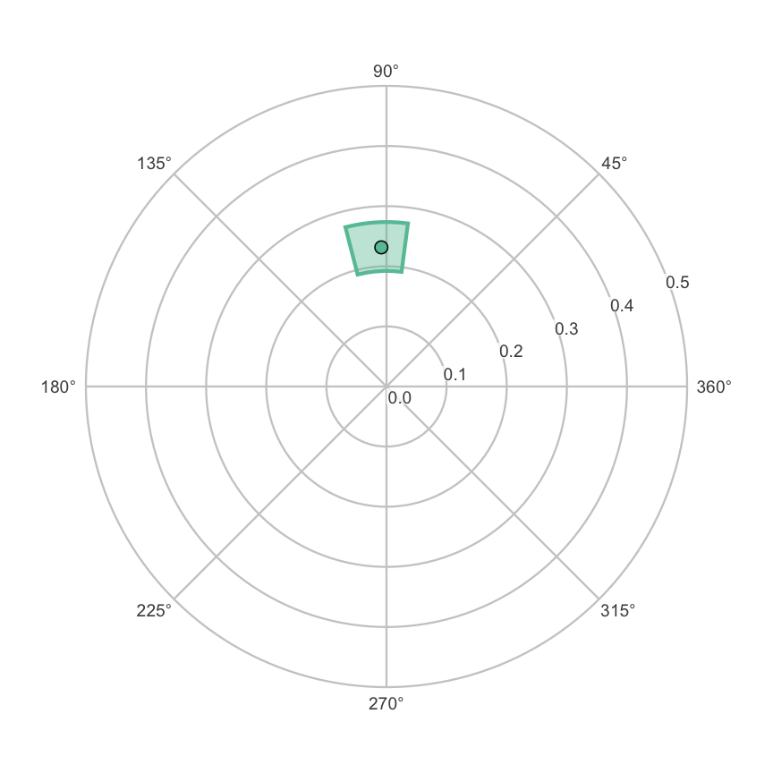
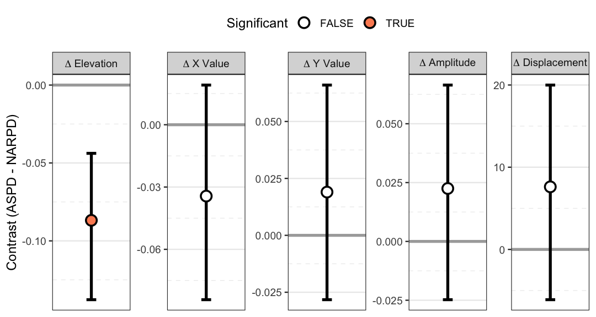

``` r
library(circumplex)
```


The other vignettes model *observed* circumplex scores. These are the mean
profile of a group, or the profile of correlations between the circumplex scales
and an external measure. This vignette introduces a **latent** (not directly
observed) counterpart, built on a structural equation model (SEM) of the
circumplex scales. `ssm_sem()` and its helpers expose it. The vignette teaches
two products: the latent profile of a measure, and the invariance-gated latent
contrast between groups (Section 7 explains invariance). It shows how
their confidence intervals are constructed, and the assumptions that make them
interpretable.

The latent-level Structural Summary Method appears to be new. A search of the
SEM–circumplex literature (2019 onward) found related work on the latent
structure of circumplex *scales* (e.g., Wendt et al., 2019). It also found work
on inference for disattenuated correlations, which are correlations corrected
for measurement error (Moss, 2026). But it found no prior work applying the SSM
decomposition (elevation, amplitude, displacement, and fit) to a measure's
*latent* profile with circular-aware intervals.
`vignette("introduction-to-ssm-analysis")` defines these four parameters. Treat
this layer as a research tool whose assumptions you should understand before
relying on it.

## 1. Why a latent SSM?

An observed correlation profile is *attenuated* by measurement error. Each
circumplex scale is imperfectly reliable, so the correlations between the scales
and an external measure are pulled toward zero. The scales are not equally
reliable, so the correlations are pulled toward zero by *different amounts*. The
observed SSM parameters inherit both effects. Amplitude is deflated by the
average unreliability. Displacement is rotated by the *heterogeneity* of
reliability around the circle.

The latent SSM estimates the profile that the measure would show against the
**latent circumplex content** of the scales. This profile is the disattenuated
analog of the observed correlation profile. Zimmermann and Wright (2017) defined
the observed version, and this is its latent counterpart. The latent SSM fits a
measurement model in which each scale loads on latent factors placed at that
scale's *fixed theoretical angle*. It then reads the measure's correlations with
the common circumplex content, and it summarizes them with the usual SSM
transform.

Two consequences are worth stating up front, because they shape everything
below:

- The latent profile is **model-conditional**. Every latent parameter is
  conditional on the fixed-angle measurement model being an adequate
  description of the data. A poorly fitting model does not make the latent
  parameters merely imprecise. It makes them uninterpretable. Global fit is
  therefore reported alongside every result.
- The angles are **theoretical claims, not estimates**. `ssm_sem()` never
  estimates an angle. If an instrument's real geometry departs from theory,
  that departure is absorbed into misfit, not into the angles. To *examine*
  circumplex geometry and let the angles be free, use `cpm_fit()`. It fits
  Browne's (1992) circumplex model. Examining geometry is a different question,
  and `cpm_fit()` is a different tool.

## 2. The measurement model

`ssm_sem()` builds and fits a lavaan measurement model for you, but it is
worth seeing the model it generates. `ssm_sem_syntax()` returns that model as
a string:


``` r
scales <- c("PA", "BC", "DE", "FG", "HI", "JK", "LM", "NO")
syntax <- ssm_sem_syntax(scales = scales, angles = octants(), measures = "NARPD")
cat(syntax)
#> # circumplex SSM measurement model (generated by ssm_sem_syntax())
#> # scales: PA, BC, DE, FG, HI, JK, LM, NO
#> # angles (degrees): 90, 135, 180, 225, 270, 315, 360, 45
#> # model tier: scaled
#> 
#> # general factor: free per-scale saturations
#> g =~ NA*PA + a1*PA + a2*BC + a3*DE + a4*FG + a5*HI + a6*JK + a7*LM + a8*NO
#> # circumplex plane: loadings free but with each scale's angle fixed
#> cx =~ NA*PA + lx1*PA + lx2*BC + lx3*DE + lx4*FG + lx5*HI + lx6*JK + lx7*LM + lx8*NO
#> cy =~ NA*PA + ly1*PA + ly2*BC + ly3*DE + ly4*FG + ly5*HI + ly6*JK + ly7*LM + ly8*NO
#> # fixed-angle direction constraints: sin(a)*lx - cos(a)*ly == 0
#> 0 == 1*lx1 - 0*ly1
#> 0 == 0.70710678118654757*lx2 - -0.70710678118654746*ly2
#> 0 == 0*lx3 - -1*ly3
#> 0 == -0.70710678118654746*lx4 - -0.70710678118654768*ly4
#> 0 == -1*lx5 - 0*ly5
#> 0 == -0.70710678118654768*lx6 - 0.70710678118654735*ly6
#> 0 == 0*lx7 - 1*ly7
#> 0 == 0.70710678118654746*lx8 - 0.70710678118654757*ly8
#> # isotropic orthonormal plane metric (plane scale absorbed by loadings)
#> g ~~ 1*g
#> cx ~~ 1*cx
#> cy ~~ 1*cy
#> cx ~~ 0*cy
#> # general-plane covariances fixed to zero: with free per-scale
#> # saturations, freeing these is locally unidentified exactly at
#> # phi_g = 0 (the trade a_i +/- d*c_i*cos/sin(angle_i) <-> phi_g is
#> # first-order flat there), so they cannot be estimated. To model a
#> # general factor leaning into the plane, use the strict tier, whose
#> # fixed loadings leave the full factor covariance matrix free.
#> g ~~ 0*cx
#> g ~~ 0*cy
#> 
#> # external measure(s): related to circumplex factors
#> NARPD ~~ mg1*g
#> NARPD ~~ mcx1*cx
#> NARPD ~~ mcy1*cy
#> 
#> # NOTE: amplitude (a) and displacement (d) are deliberately NOT defined
#> # here. They are nonlinear (sqrt / atan2) and their intervals must be
#> # built in-package through circular quantiles, never via lavaan := or
#> # delta-method CIs (which ignore the angular branch cut).
```

Three latent factors carry the structure: a general factor `g` and the two
plane axes `cx` and `cy`. Each scale loads on (has a weight on) all three. But
its plane loadings are tied to its **fixed angle** by a direction constraint
(`sin(θ)·lx − cos(θ)·ly == 0`). Here `lx` and `ly` are the scale's loadings on
`cx` and `cy`. So the scale's location in the plane is theoretical, while its
*saturation* (how strongly it expresses the circumplex) is free. This is the
default **`"scaled"`** tier, one of two versions of the model. A stricter
**`"strict"`** tier instead fixes every loading to the unit cosine pattern and
frees the full factor covariance matrix. It is the fully theoretical benchmark.
It is also what remains identified (the data pin down its parameters) when the number of
scales is small.

The header and comments in the generated syntax record two design decisions
that matter statistically:

- Under the scaled tier the general factor is fixed **orthogonal** to the
  plane (`g ~~ 0*cx`, `g ~~ 0*cy`). Freeing those covariances alongside free
  per-scale saturations is locally unidentified exactly at the null they would
  test. So they cannot be estimated in this tier. A general factor that leans
  into the plane is expressible only under the strict tier (or it surfaces as
  misfit under the scaled tier). This matters for real interpersonal data.
  Wendt et al. (2019) found a general–agency correlation of roughly −.3,
  replicated across four samples. So on instruments in the family of the
  Inventory of Interpersonal Problems (IIP), the
  orthogonality that the scaled tier assumes is known to be violated.
- The final `NOTE` says that amplitude and displacement are **deliberately not
  defined** in the lavaan syntax. That is the subject of Section 4.

You rarely call `ssm_sem_syntax()` directly, because `ssm_sem()` does. But it is
the escape hatch for respecifications that you then fit yourself and hand back
through `ssm_sem_parameters()`. One example is partial invariance, where only
some parameters are held equal across groups.

## 3. Estimating a latent profile

The everyday entry point is `ssm_sem()`. Its arguments mirror `ssm_analyze()`:
the data, the `scales` and their `angles`, and one or more `measures`. The
`measures` argument is required in the single-group case, because the
single-group latent SSM *is* the correlation path. (A single-group latent *mean*
profile is not identified, so it is not offered.)

Because the confidence intervals are simulated, set a seed immediately before
the call for reproducibility.


``` r
data("jz2017")
set.seed(12345)
latent <- ssm_sem(
  jz2017,
  scales = scales,
  angles = octants(),
  measures = "NARPD",
  boots = 500
)
latent
#> 
#> # Latent (SEM-based) SSM
#> 
#> Measurement model:	 scaled fixed-angle circumplex
#> Global fit (N = 1166, robust): chisq(17) = 300.546, p < 0.001 
#> 			CFI = 0.93, RMSEA = 0.13, SRMR = 0.072
#> 
#> # Profile [NARPD]:
#> 
#>                Estimate   Lower CI   Upper CI
#> Elevation         0.249      0.210      0.295
#> X-Value          -0.009     -0.054      0.033
#> Y-Value           0.231      0.189      0.273
#> Amplitude         0.232      0.192      0.274
#> Displacement     92.132     82.515    104.461
#> Model Fit         0.975
```

Compare this with the *observed* correlation profile of the same measure:


``` r
set.seed(12345)
observed <- ssm_analyze(
  jz2017,
  scales = scales,
  angles = octants(),
  measures = "NARPD"
)
observed
#> 
#> # Profile [NARPD]:
#> 
#>                Estimate   Lower CI   Upper CI
#> Elevation         0.202      0.169      0.238
#> X-Value          -0.062     -0.094     -0.029
#> Y-Value           0.179      0.145      0.213
#> Amplitude         0.189      0.154      0.227
#> Displacement    108.967     98.633    118.537
#> Model Fit         0.957
```

The two profiles tell the same broad story: narcissistic PD (personality
disorder) relates to the upper (dominant) region of the circumplex. But the
disattenuated profile has a **larger amplitude** and a **higher fit**, and its
displacement sits at a somewhat different angle. The amplitude increase is the
removal of attenuation. The latent correlations are not pulled toward zero by
scale unreliability. The displacement shift and the fit increase are the removal
of *reliability heterogeneity* around the circle. (Section 5 explains why each
moves.)

`ssm_sem()` returns a `circumplex_ssm_sem` object, a subclass of the ordinary
`circumplex_ssm` object, so the familiar table and plot functions work on it:


``` r
ssm_plot_circle(latent)
```



```r
ssm_table(latent, drop_xy = TRUE)
```


Table: Latent SSM profile of NARPD

|Profile |Elevation         |Amplitude         |Displacement       |Fit   |
|:-------|:-----------------|:-----------------|:------------------|:-----|
|NARPD   |0.25 (0.21, 0.29) |0.23 (0.19, 0.27) |92.1 (82.5, 104.5) |0.975 |


By default `ssm_sem()` fits with a robust estimator (`estimator = "MLR"`,
maximum likelihood with robust corrections) and reports robust global fit
indices. This is because circumplex scale scores are typically skewed, and the
naive chi-square over-rejects. The robust (sandwich) standard errors also feed
the confidence intervals. Section 4 explains
why that matters.

## 4. Where the confidence intervals come from

Amplitude and displacement are **nonlinear** functions of the model
parameters: amplitude is a square root and displacement is an `atan2`. lavaan
can attach a delta-method (linear approximation) or bootstrap-percentile interval to any derived
quantity. But for displacement those intervals are wrong in a way that is easy
to miss. `atan2` has a branch cut, a place on the circle where its output jumps
by a full turn. A displacement near 0°/360° can produce an interval that has
been unwrapped across the cut, or whose endpoints have sign-flipped. So a naive
percentile interval straddling the boundary points the wrong way around the
circle.

`circumplex` therefore **never delegates amplitude or displacement intervals
to lavaan**, which is why the generated syntax refuses to define them. Instead
it reuses the same machinery that the observed bootstrap uses:

1. lavaan supplies only the point estimates and their covariance (or bootstrap
   replicates) of the model's *free* parameters.
2. `ssm_sem()` draws from that covariance and maps each draw through the profile
   and the SSM transform. This gives a replicate of every SSM parameter.
3. Those replicates go through the package's existing interval assembly. The
   elevation, X value, Y value and amplitude get percentile intervals. Displacement gets **circular
   quantiles** (centered on the circular mean, unwrapped, quantiled, and
   re-wrapped), with contrast intervals aligned to the estimate's branch.

As a result, a latent displacement interval behaves correctly at the 0°/360°
pole. It can straddle the boundary contiguously, and the point estimate always
sits inside its own interval. This is the same architecture that the Monte Carlo
engine uses for observed profiles, with lavaan supplying the mean and covariance
rather than resampling.

Two engines feed step 2, selected by `ci_method`:

- **`"mvn"` (default):** draw from a multivariate normal centered at the
  estimates, with the model's (robust) covariance. It is fast: one model fit
  plus vectorized draws.
- **`"boot"`:** refit the model on each bootstrap resample. This is far more
  expensive, but it does not lean on asymptotic normality.

The package's design notes report a coverage study across constructed
populations. It found `"mvn"` well-calibrated at realistic sample sizes *when
the covariance is the robust sandwich*. That is why robust SEs are the default.
Under a misspecified fixed-angle model, plain (non-robust) SEs undercovered
displacement: their intervals held the true displacement less often than
nominal. The sandwich restored nominal coverage. If you supply your own lavaan
fit through `ssm_sem_parameters()` and intend to use `"mvn"`, fit it with
`se = "robust.huber.white"` so that the propagated covariance stays valid.

## 5. What the parameters mean now

Disattenuation changes what two of the parameters *mean*. The vignette would be
misleading if it did not say so.

**Fit.** Under the scaled tier the latent profile is not forced to be a perfect
cosine, because the scales have different saturations. So a latent fit below 1
is *informative*. It measures how far the measure's latent profile departs from
a pure cosine wave. Differential saturation across scales drives that departure.
Under the strict tier, anisotropy in the factor covariance (unequal spread in
different directions) drives it too. What the latent fit removes, relative to
the observed fit, is the contamination from **reliability heterogeneity**, not
sampling error. As population quantities, the observed and the latent fit
contain no sampling error at all. But their *estimates* at a finite sample size
both remain noisy. So a latent fit of, say, .85 in a modest sample is not
automatically substantive structure.

**Displacement.** Latent displacement is the first-harmonic direction (the peak
direction of the best-fitting cosine) of the *saturation-modulated*
disattenuated profile. It is **not** simply "the measure's angle in the latent
space." Heterogeneous saturations around the circle, or a general factor leaning
into the plane, rotate it, exactly as they rotate the observed displacement. Fit
can stay high while this happens. The latent layer's contribution is the removal
of the *reliability* modulation that additionally rotates the observed
displacement. It does not remove the saturation modulation. The removal of the
reliability modulation is why the observed and latent displacements in Section 3
differ. This account, with the reliability modulation removed and the saturation
modulation kept, is the honest description of what `d` estimates here.

The interpretation aids you already know carry over unchanged. Amplitude is the
gate for interpreting displacement. When the amplitude confidence interval's
lower bound sits too close to zero relative to its width, the profile has no
well-defined direction. Then the displacement is not interpretable. The low-fit
dashing on plots and the displacement caution in `print()` behave exactly as
they do for observed profiles.

## 6. Two questions about group differences

When you have groups, there are **two** distinct estimands (quantities to be
estimated), and `circumplex` keeps them separate on purpose.


Table: Two estimands for a group difference

|Question                                                                                    |Estimand          |Tool                         |Confounds                                                                                    |
|:-------------------------------------------------------------------------------------------|:-----------------|:----------------------------|:--------------------------------------------------------------------------------------------|
|Do the groups' *measured* profiles differ?                                                  |Observed contrast |ssm_analyze(contrast = TRUE) |Structural difference, differential reliability, and non-invariance are combined.            |
|Do the groups' *constructs* differ, granted the instrument measures the same thing in both? |Latent contrast   |ssm_sem(contrast = TRUE)     |Disattenuated and conditional on measurement invariance; not computed when invariance fails. |


Neither is more correct in the abstract. The observed contrast answers a
question about *scores* and is always available. The latent contrast answers a
question about *constructs*, but only *if* the instrument behaves the same way
in both groups. When it does not, the honest answer is that the groups cannot be
compared on the latent metric. That answer is not a number.

## 7. Invariance-gated latent contrasts

Before it computes a latent group contrast, `ssm_sem()` fits an invariance
ladder: configural, then metric, then scalar. It tests each rung against the
previous one with lavaan's own nested-model test (the scaled difference test
under the robust estimator). The latent *measure-profile* contrast requires
**metric** invariance (equal saturations across groups). The latent *mean*
contrast additionally requires scalar invariance. If the required rung is
rejected, the contrast is **not** computed.

On real data this gate does its job. Comparing the NARPD profile across the
`Gender` groups in `jz2017` rejects metric invariance. So `ssm_sem()` returns
each group's separate profile and an explicit non-comparison verdict, rather
than a contrast:


``` r
set.seed(12345)
by_gender <- ssm_sem(
  jz2017,
  scales = scales,
  angles = octants(),
  measures = "NARPD",
  grouping = "Gender",
  contrast = TRUE,
  boots = 300
)
by_gender
#> 
#> # Latent (SEM-based) SSM
#> 
#> Measurement model:	 scaled fixed-angle circumplex
#> Global fit (N = 1166, robust): chisq(34) = 287.272, p < 0.001 
#> 			CFI = 0.938, RMSEA = 0.123, SRMR = 0.06
#> 
#> Invariance ladder (gate: metric, alpha = 0.05):
#>        rung   chisq df   cfi rmsea dchisq ddf       p
#>  configural 287.272 34 0.938 0.123     NA  NA        
#>      metric 337.356 48 0.927 0.112 54.781  14 < 0.001
#> Verdict:    metric invariance rejected
#>   Test:     Δχ²(14) = 54.78, p < 0.0001, alpha = 0.05
#>   Result:   these groups cannot be compared on this instrument's latent
#>             metric
#>   Contrast: the requested latent contrast was not computed
#>   Profiles: the rows below are each group's separate (configural) latent
#>             profile
#>   Instead:  the observed-score contrast from ssm_analyze() answers a
#>             different question and remains available
#> 
#> # Profile [NARPD: Female]:
#> 
#>                Estimate   Lower CI   Upper CI
#> Elevation         0.198      0.141      0.252
#> X-Value          -0.023     -0.083      0.040
#> Y-Value           0.250      0.188      0.318
#> Amplitude         0.251      0.194      0.318
#> Displacement     95.206     81.443    110.519
#> Model Fit         0.966                      
#> 
#> 
#> # Profile [NARPD: Male]:
#> 
#>                Estimate   Lower CI   Upper CI
#> Elevation         0.313      0.243      0.376
#> X-Value           0.012     -0.046      0.076
#> Y-Value           0.199      0.146      0.250
#> Amplitude         0.199      0.147      0.257
#> Displacement     86.611     70.075    103.660
#> Model Fit         0.977
```

The invariance ladder is printed with the decision, and no contrast is rendered.
The `Verdict:` line names the decision. The labeled lines under it give the
nested test, what the decision means for comparing the groups, and what to use
instead. `ssm_plot_contrast()` on this object would have nothing to draw. This
is deliberate: there is no `force = TRUE`. If you have a principled
partial-invariance model, fit it yourself and pass it to `ssm_sem_parameters()`.
That function computes the contrast from whatever multi-group fit you supply,
and it leaves the comparability claim to you.

The ladder table in the returned object also carries `dcfi`, the change in the
comparative fit index (CFI) from the previous fitted rung. CFI compares the
model's fit with that of a baseline model in which the variables are
uncorrelated, and values near 1 mean good fit. `dcfi` is Cheung and Rensvold's
(2002) secondary criterion. Its general rule rejects an invariance step when
CFI falls by more than .01. It is **reported, never gating**. Comparability,
the verdict, and the model that the estimates are taken from are decided by the
nested test alone. The two criteria can disagree, and neither is a tiebreaker
for the other. A change in CFI is insensitive to sample size, but the nested
test is not. So in a large sample the nested test can reject a step whose CFI
barely moves.

The direction of the ΔCFI rule is worth stating carefully, because the article gives
it two ways. Its Table 5 reports critical values that are the 1% *lower* tails of the
simulated null distributions. So a ΔCFI at or below one of them is the 1%-level
evidence *against* invariance, which is the sense used here. The sentence
stating the general rule on the article's p. 251 reads the opposite way
relative to that same table. This package follows the simulation.

Read the retain/reject label narrowly on the occasions it appears. Cheung and
Rensvold simulated two groups, maximum likelihood (ML) estimation, and
multivariate normal data. They examined Type I error only, not power, and
robust CFI variants were not part of their study. `ssm_sem()` therefore prints
the `dcfi` and `cr` columns and a short ΔCFI note only for a two-group fit
estimated by ML whose CFI is the plain, non-robust one. Note that
`estimator = "ML"` is necessary but not sufficient. `missing = "fiml"` also
makes lavaan report a robust CFI, so a fit can be ML and still fall outside the
envelope. The default estimator is `"MLR"`. So the ladder above prints no
`dcfi` column and no ΔCFI note. The values are still in
`by_gender$invariance$table$dcfi` with no label, and
`by_gender$invariance$dcfi_scope` records the fields that show which condition
applies. The same withholding covers a non-ML estimator such as `"GLS"`. Its
CFI is plain-named, but its fit function is not the one that the criterion was
simulated under. That is a deliberate refusal rather than a gap. Extending the
cutoff to a robust index,
another estimator, or three or more groups would take simulation work that
nobody has done.

When invariance is not the obstacle, the contrast is computed. An example is a
contrast of **two measures** within one group, where no cross-group invariance
is at stake. That contrast behaves like the observed contrast (second measure
minus first, displacement differences via the circular branch machinery):


``` r
set.seed(12345)
contrast <- ssm_sem(
  jz2017,
  scales = scales,
  angles = octants(),
  measures = c("NARPD", "ASPD"),
  contrast = TRUE,
  boots = 500
)
contrast
#> 
#> # Latent (SEM-based) SSM
#> 
#> Measurement model:	 scaled fixed-angle circumplex
#> Global fit (N = 1166, robust): chisq(22) = 317.867, p < 0.001 
#> 			CFI = 0.935, RMSEA = 0.114, SRMR = 0.068
#> 
#> # Profile [NARPD]:
#> 
#>                Estimate   Lower CI   Upper CI
#> Elevation         0.248      0.210      0.295
#> X-Value          -0.009     -0.052      0.032
#> Y-Value           0.231      0.191      0.272
#> Amplitude         0.231      0.193      0.272
#> Displacement     92.119     82.715    103.513
#> Model Fit         0.974                      
#> 
#> 
#> # Profile [ASPD]:
#> 
#>                Estimate   Lower CI   Upper CI
#> Elevation         0.161      0.115      0.207
#> X-Value          -0.043     -0.092     -0.002
#> Y-Value           0.250      0.208      0.295
#> Amplitude         0.254      0.216      0.298
#> Displacement     99.732     90.351    111.188
#> Model Fit         0.978                      
#> 
#> 
#> # Contrast [ASPD - NARPD]:
#> 
#>                  Estimate   Lower CI   Upper CI
#> Δ Elevation        -0.087     -0.138     -0.044
#> Δ X-Value          -0.034     -0.084      0.019
#> Δ Y-Value           0.019     -0.028      0.066
#> Δ Amplitude         0.022     -0.025      0.066
#> Δ Displacement      7.613     -6.113     19.993
#> Δ Model Fit         0.003
```


``` r
ssm_plot_contrast(contrast)
```



The contrast block reports the difference in each SSM parameter with its
confidence interval. As with the observed contrast, an elevation or amplitude
difference whose interval excludes zero is a difference in that parameter. The
displacement difference is reported on the estimate's angular branch. So its
interval endpoints can legitimately fall outside ±180° near the boundary, while
still containing the estimate.

## 8. When to trust it: limitations

The latent layer buys disattenuation at the price of a set of assumptions. The
documentation states them, and the vignette should too.

- **Model-conditional.** Every latent quantity is conditional on the
  fixed-angle model being adequate. Read the global fit first. Wendt et al.
  (2019) give a real-data benchmark. They reported RMSEA (a misfit index, where
  lower is better) between .075 and .111 across four large samples. Their model
  was the fixed-loading circumplex confirmatory factor analysis (CFA), and
  these values show a real but imperfect approximation. Their model targets the
  octants' own latent structure, not an external measure's profile. So the
  number is a benchmark, not a like-for-like comparison. The example fits here
  are of the same order (RMSEA around .12). They should likewise be read as
  approximations, not exact structure.
- **Fixed angles are theoretical.** Departures from the theoretical geometry
  load into misfit, not into the angles. Use `cpm_fit()` to examine geometry.
- **The scaled tier assumes latent-plane stationarity and does not test it.**
  That tier fixes the plane factors isotropic and orthogonal, so anisotropic
  latent dispersion surfaces only as global misfit. The strict tier frees the
  factor variances and covariances.
- **The scaled tier assumes the general factor is orthogonal to the plane.**
  A true general-factor lean surfaces as misfit under the scaled tier. Use the
  strict tier to model it.
- **Displacement and fit have the disattenuated meanings of Section 5**, not
  the naive "angle in latent space" and "cosine-ness" readings.
- **Disattenuated correlations can be large.** Removing attenuation moves
  correlations toward ±1. Values at or beyond 1 signal misspecification and are
  refused rather than summarized.
- **Invariance gating is a modeling decision** with a default test, not an
  oracle. The observed contrast remains available and answers its own
  question. The secondary `dcfi` criterion gates nothing, and it prints beside
  the nested test only for a two-group fit estimated by ML with a plain CFI,
  and only when a rung has a `dcfi` value. Its .01 cutoff is validated only
  for two-group, ML, multivariate-normal fits, for Type I error only. The
  package withholds the verdict everywhere else rather than extrapolating it.

## 9. Relation to the literature

The nearest published models are the confirmatory factor analyses of the
interpersonal circumplex itself. Wendt et al. (2019) fit a three-factor
circumplex CFA with fixed unit-cosine plane loadings, which is the shape of this
package's strict tier. They fit it across four large samples. They found the
fully dimensional model competitive with categorical (types of people) and
hybrid (types and dimensions together) alternatives.
Their estimand, though, is the latent structure of the *octant scales* and
persons' factor scores, not an external measure's disattenuated profile. Their
model is context for the strict tier, not a validation target for the SSM
estimand.

At the level of a single disattenuated correlation, Moss (2026) showed the
following. Treating reliability as a *known* constant collapses interval
coverage (to roughly .35 in one scenario). Propagating reliability uncertainty
instead restores nominal coverage. That is exactly the logic behind fitting the
model and propagating its full covariance, rather than plugging in reliability
point estimates. One estimand caveat applies. Moss's disattenuated correlation
corrects *both* variables for unreliability. The latent SSM here corrects only
the *scale* side, and the external measure remains an observed variable. So the
two are relatives, not the same quantity.

Finally, the two model families in this package meet at a single point. At
that point the general factor is orthogonal to the plane, the saturations are
equal, and the angles are equally spaced. At that point, the fixed-loading circumplex CFA coincides with the
one-harmonic, equal-communality version of Browne's (1992) circumplex model that
`cpm_fit()` estimates. The SEM-based SSM sits on the fixed-angle side of that
boundary. To cross to freely estimated angles, use `cpm_fit()`.

## References

* Browne, M. W. (1992). Circumplex models for correlation matrices.
  _Psychometrika, 57_(4), 469–497.

* Cheung, G. W., & Rensvold, R. B. (2002). Evaluating goodness-of-fit indexes
  for testing measurement invariance. _Structural Equation Modeling, 9_(2),
  233–255.

* Moss, J. (2026). Inference for disattenuated correlations.
  _Applied Psychological Measurement_. Advance online publication.
  https://doi.org/10.1177/01466216261440511

* Wendt, L. P., Wright, A. G. C., Pilkonis, P. A., Nolte, T., Fonagy, P.,
  Montague, P. R., Benecke, C., Krieger, T., & Zimmermann, J. (2019). The
  latent structure of interpersonal problems: Validity of dimensional,
  categorical, and hybrid models. _Journal of Abnormal Psychology, 128_(8),
  823–839.

* Zimmermann, J., & Wright, A. G. C. (2017). Beyond description in
  interpersonal construct validation: Methodological advances in the
  circumplex Structural Summary Approach. _Assessment, 24_(1), 3–23.
